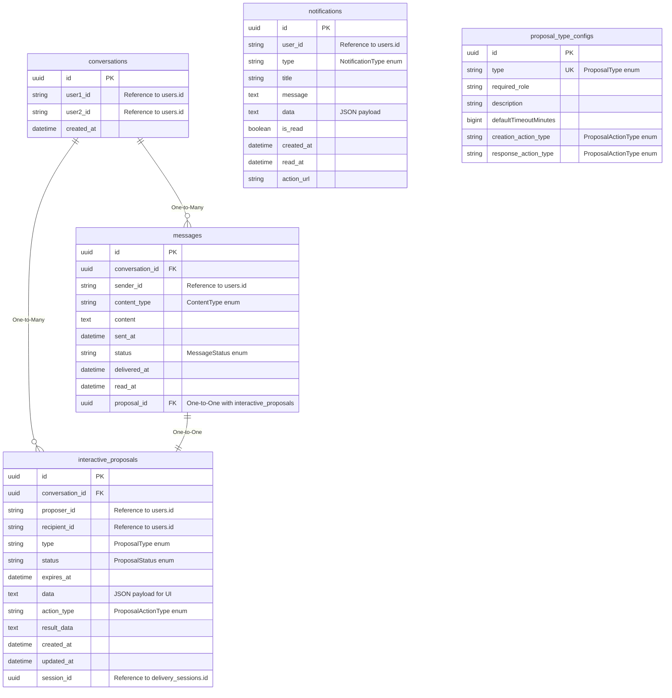

# ERD - Communication Service

## Database: ds_communication_service

## Tổng Quan

Communication Service quản lý giao tiếp giữa người dùng, bao gồm cuộc hội thoại, tin nhắn, thông báo, và các đề nghị tương tác (interactive proposals).

## ERD Diagram



## Chi Tiết Các Bảng

### 1. conversations

**Mô tả**: Bảng lưu cuộc hội thoại giữa 2 người dùng. Mỗi cặp user chỉ có một conversation.

**Khóa chính**: `id` (UUID)

**Các trường**:
- `id` (UUID, PK): ID của conversation
- `user1_id` (String, Not Null): ID người dùng thứ nhất, tham chiếu đến `user_service.users.id`
- `user2_id` (String, Not Null): ID người dùng thứ hai, tham chiếu đến `user_service.users.id`
- `created_at` (DateTime, Not Null): Thời gian tạo conversation

**Unique Constraints**:
- `(user1_id, user2_id)` - Unique constraint (một cặp user chỉ có một conversation)

**Check Constraints**:
- `user1_id < user2_id` - Đảm bảo user1_id luôn nhỏ hơn user2_id để tránh duplicate

**Quan hệ**:
- One-to-Many với `messages`
- One-to-Many với `interactive_proposals`
- Cross-service references:
  - `user1_id` → `user_service.users.id`
  - `user2_id` → `user_service.users.id`

**Lưu ý**:
- Check constraint đảm bảo `user1_id < user2_id` để tránh tạo duplicate conversation cho cùng một cặp user
- Sử dụng `@CreationTimestamp` để tự động set `created_at`

---

### 2. messages

**Mô tả**: Bảng lưu tin nhắn trong cuộc hội thoại. Mỗi tin nhắn có thể liên kết với một interactive proposal.

**Khóa chính**: `id` (UUID)

**Các trường**:
- `id` (UUID, PK): ID của tin nhắn
- `conversation_id` (UUID, FK, Not Null): Tham chiếu đến `conversations.id`
- `sender_id` (String, Not Null): ID người gửi, tham chiếu đến `user_service.users.id`
- `content_type` (ContentType, Not Null): Loại nội dung
- `content` (TEXT): Nội dung tin nhắn
- `sent_at` (DateTime, Not Null): Thời gian gửi
- `status` (MessageStatus, Not Null, Default: SENT): Trạng thái tin nhắn
- `delivered_at` (DateTime, Optional): Thời gian giao đến
- `read_at` (DateTime, Optional): Thời gian đọc
- `proposal_id` (UUID, FK, Unique, Optional): Tham chiếu đến `interactive_proposals.id` (One-to-One)

**Quan hệ**:
- Many-to-One với `conversations`
- One-to-One với `interactive_proposals` (optional)
- Cross-service reference:
  - `sender_id` → `user_service.users.id`

**Lưu ý**:
- Sử dụng `@JsonBackReference` để tránh circular reference khi serialize
- `proposal_id` là unique để đảm bảo One-to-One relationship với `interactive_proposals`
- Sử dụng `@CreationTimestamp` để tự động set `sent_at`

---

### 3. notifications

**Mô tả**: Bảng lưu thông báo trong ứng dụng. Hỗ trợ nhiều loại thông báo và persistence.

**Khóa chính**: `id` (UUID)

**Các trường**:
- `id` (UUID, PK): ID của thông báo
- `user_id` (String, Not Null, 36 chars): ID người dùng, tham chiếu đến `user_service.users.id`
- `type` (NotificationType, Not Null, 50 chars): Loại thông báo
- `title` (String, Not Null): Tiêu đề thông báo
- `message` (TEXT, Not Null): Nội dung thông báo
- `data` (TEXT, Optional): JSON data payload
- `is_read` (Boolean, Not Null, Default: false): Đã đọc chưa
- `created_at` (DateTime, Not Null): Thời gian tạo
- `read_at` (DateTime, Optional): Thời gian đọc
- `action_url` (String, Optional): URL để thực hiện action

**Indexes**:
- `idx_notifications_user_id`: Index trên `user_id`
- `idx_notifications_read`: Index trên `is_read`
- `idx_notifications_created_at`: Index trên `created_at`

**Quan hệ**:
- Cross-service reference:
  - `user_id` → `user_service.users.id`

**Lưu ý**:
- Sử dụng `@CreationTimestamp` để tự động set `created_at`
- Có method `toDto()` và `fromDto()` để convert sang DTO

---

### 4. interactive_proposals

**Mô tả**: Bảng lưu các đề nghị tương tác (proposal) trong cuộc hội thoại. Proposal có thể được gửi bởi Shipper hoặc Customer và yêu cầu phản hồi.

**Khóa chính**: `id` (UUID)

**Các trường**:
- `id` (UUID, PK): ID của proposal
- `conversation_id` (UUID, FK, Not Null): Tham chiếu đến `conversations.id`
- `proposer_id` (String, Not Null): ID người gửi đề nghị (Shipper hoặc Customer), tham chiếu đến `user_service.users.id`
- `recipient_id` (String, Not Null): ID người nhận đề nghị, tham chiếu đến `user_service.users.id`
- `type` (ProposalType, Not Null, 100 chars): Loại đề nghị (e.g., "CONFIRM_REFUSAL", "POSTPONE_REQUEST")
- `status` (ProposalStatus, Not Null, 50 chars): Trạng thái hiện tại của đề nghị
- `expires_at` (DateTime, Optional): Thời điểm đề nghị hết hạn (nếu không được phản hồi)
- `data` (TEXT, Optional): JSON payload để render UI
  - Ví dụ cho DATE_PICKER: `{"title": "Vui lòng chọn ngày giao mới", "min_date": "2025-10-31"}`
  - Ví dụ cho TEXT_INPUT: `{"title": "Vui lòng nhập lý do:", "placeholder": "Nhập lý do..."}`
- `action_type` (ProposalActionType, Not Null, 50 chars): Loại action
- `result_data` (TEXT, Optional): Kết quả của tương tác
  - Ví dụ: "2025-11-01" (nếu là DATE_PICKER) hoặc "Hàng bị ướt" (nếu là TEXT_INPUT)
- `created_at` (DateTime, Not Null): Thời gian tạo
- `updated_at` (DateTime, Not Null): Thời gian cập nhật
- `session_id` (UUID, Optional): ID của delivery session mà proposal này liên quan đến, tham chiếu đến `session_service.delivery_sessions.id`

**Quan hệ**:
- Many-to-One với `conversations`
- One-to-One với `messages` (qua `proposal_id` trong messages)
- Cross-service references:
  - `proposer_id` → `user_service.users.id`
  - `recipient_id` → `user_service.users.id`
  - `session_id` → `session_service.delivery_sessions.id`

**Lưu ý**:
- Proposal có thể được tạo trong context của một delivery session
- Nếu proposal được tạo trong context của session, nó sẽ ảnh hưởng đến tất cả assignments trong session đó
- Sử dụng `@CreationTimestamp` và `@UpdateTimestamp` để tự động set timestamps

---

### 5. proposal_type_configs

**Mô tả**: Bảng cấu hình cho các loại proposal. Định nghĩa UI và business rules cho mỗi loại proposal.

**Khóa chính**: `id` (UUID)

**Các trường**:
- `id` (UUID, PK): ID của config
- `type` (ProposalType, Unique, Not Null, 100 chars): Loại proposal (unique)
- `required_role` (String, Not Null, 50 chars): Role yêu cầu để tạo proposal này
- `description` (String, Not Null): Mô tả proposal
- `defaultTimeoutMinutes` (BigInt, Optional): Timeout mặc định (phút)
- `creation_action_type` (ProposalActionType, Not Null, 50 chars): UI cho người TẠO (Sender)
- `response_action_type` (ProposalActionType, Not Null, 50 chars): UI cho người PHẢN HỒI (Receiver)

**Unique Constraints**:
- `type` - Unique constraint

**Quan hệ**: Không có quan hệ với bảng khác

**Lưu ý**:
- Config này định nghĩa cách render UI cho mỗi loại proposal
- `creation_action_type` và `response_action_type` có thể khác nhau
- Ví dụ: Sender có thể tạo proposal với DATE_PICKER, nhưng Receiver phản hồi với BUTTON_GROUP

---

## Enums

### ContentType
```java
public enum ContentType {
    // Loại nội dung tin nhắn
    // (Cần xem code để biết chi tiết các giá trị)
}
```

Lưu trong database dưới dạng String.

### MessageStatus
```java
public enum MessageStatus {
    SENT,       // Đã gửi (default)
    DELIVERED,  // Đã giao đến
    READ        // Đã đọc
}
```

Lưu trong database dưới dạng String.

### NotificationType
```java
public enum NotificationType {
    // Loại thông báo
    // (Cần xem code để biết chi tiết các giá trị)
}
```

Lưu trong database dưới dạng String.

### ProposalType
```java
public enum ProposalType {
    // Loại proposal
    // Ví dụ: CONFIRM_REFUSAL, POSTPONE_REQUEST
    // (Cần xem code để biết chi tiết các giá trị)
}
```

Lưu trong database dưới dạng String.

### ProposalStatus
```java
public enum ProposalStatus {
    // Trạng thái proposal
    // (Cần xem code để biết chi tiết các giá trị)
}
```

Lưu trong database dưới dạng String.

### ProposalActionType
```java
public enum ProposalActionType {
    // Loại action cho UI
    // Ví dụ: DATE_PICKER, TEXT_INPUT, BUTTON_GROUP
    // (Cần xem code để biết chi tiết các giá trị)
}
```

Lưu trong database dưới dạng String.

---

## Cross-Service References

### Tham chiếu đến các service khác:

1. **conversations.user1_id** → `user_service.users.id`
   - Tham chiếu đến người dùng thứ nhất
   - Không có FK constraint (cross-service)

2. **conversations.user2_id** → `user_service.users.id`
   - Tham chiếu đến người dùng thứ hai
   - Không có FK constraint (cross-service)

3. **messages.sender_id** → `user_service.users.id`
   - Tham chiếu đến người gửi tin nhắn
   - Không có FK constraint (cross-service)

4. **notifications.user_id** → `user_service.users.id`
   - Tham chiếu đến người dùng nhận thông báo
   - Không có FK constraint (cross-service)

5. **interactive_proposals.proposer_id** → `user_service.users.id`
   - Tham chiếu đến người gửi proposal
   - Không có FK constraint (cross-service)

6. **interactive_proposals.recipient_id** → `user_service.users.id`
   - Tham chiếu đến người nhận proposal
   - Không có FK constraint (cross-service)

7. **interactive_proposals.session_id** → `session_service.delivery_sessions.id`
   - Tham chiếu đến delivery session liên quan
   - Không có FK constraint (cross-service)

---

## Business Logic

### Conversation Management
- Mỗi cặp user chỉ có một conversation
- Check constraint `user1_id < user2_id` đảm bảo không có duplicate
- Khi tạo conversation mới, cần đảm bảo `user1_id < user2_id`

### Message Status Flow
1. **SENT**: Tin nhắn được gửi (default)
2. **DELIVERED**: Tin nhắn đã được giao đến người nhận
3. **READ**: Tin nhắn đã được đọc

### Proposal Workflow
1. **Creation**: Proposal được tạo bởi proposer với `status = PENDING`
2. **Expiration**: Nếu `expires_at` đạt đến mà chưa được phản hồi, proposal có thể expire
3. **Response**: Recipient phản hồi proposal, cập nhật `status` và `result_data`
4. **Session Context**: Nếu proposal liên quan đến session, nó ảnh hưởng đến tất cả assignments trong session

### Notification Management
- Notifications được tạo cho user cụ thể
- User có thể đánh dấu đã đọc (`is_read = true`)
- Có thể có `action_url` để thực hiện action khi click vào notification

---

## Tổng Kết

- **Tổng số bảng**: 5 bảng
- **Quan hệ nội bộ**: 3 quan hệ (One-to-Many, One-to-One)
- **Cross-service references**: 7 tham chiếu ra ngoài
- **Đặc điểm**: Service quản lý giao tiếp giữa người dùng và tích hợp với Session Service để xử lý proposals trong context của delivery sessions
