# ERD Tổng Quát - Delivery System Backend

## Tổng Quan

Biểu đồ ERD này bao gồm tất cả các bảng trong các service của hệ thống Delivery System, loại trừ các snapshot tables.

## Cấu Trúc Services

1. **User Service** (ds_user_service) - MySQL
2. **Settings Service** (ds_settings_service) - MySQL
3. **Zone Service** (ds_zone_service) - MySQL (Prisma)
4. **Parcel Service** (ds_parcel_service) - MySQL
5. **Communication Service** (ds_communication_service) - MySQL
6. **Session Service** (ds_session_service) - MySQL

---

## ERD Diagram

```mermaid
erDiagram
    %% ============================================
    %% USER SERVICE (ds_user_service)
    %% ============================================
    users {
        string id PK "UUID (Keycloak ID)"
        string firstName
        string lastName
        string email
        string phone
        string address
        string identityNumber
        string username UK "Unique"
        int status "UserStatus enum"
        datetime createdAt
        datetime updatedAt
    }

    delivery_mans {
        uuid id PK
        string user_id FK "One-to-One with users"
        string vehicleType
        double capacityKg
        datetime createdAt
        datetime updatedAt
    }

    user_addresses {
        string id PK
        string user_id FK
        string destinationId "Reference to zone_service.addresses"
        string note
        string tag
        boolean isPrimary
        datetime createdAt
        datetime updatedAt
    }

    %% ============================================
    %% SETTINGS SERVICE (ds_settings_service)
    %% ============================================
    system_settings {
        string setting_key PK
        string setting_group
        string description
        string value_type "SettingType enum"
        text setting_value
        int level "SettingLevel enum"
        boolean is_read_only
        string display_mode "DisplayMode enum"
        datetime created_at
        datetime updated_at
        string updated_by
    }

    %% ============================================
    %% ZONE SERVICE (ds_zone_service)
    %% ============================================
    centers {
        string center_id PK
        string code UK "Unique"
        string name
        string address
        float lat
        float lon
        json polygon
    }

    zones {
        string zone_id PK
        string code UK "Unique"
        string name
        json polygon
        string center_id FK
    }

    addresses {
        string address_id PK
        string name
        string name_en
        string address_text
        float lat
        float lon
        string geohash
        string segment_id FK
        float segment_position
        float distance_to_segment
        float projected_lat
        float projected_lon
        string zone_id FK
        string ward_name
        string district_name
        string address_type "AddressType enum"
        datetime created_at
        datetime updated_at
    }

    roads {
        string road_id PK
        string osm_id UK "Unique"
        string name
        string name_en
        string road_type "RoadType enum"
        float max_speed
        float avg_speed
        boolean one_way
        int lanes
        string surface
        json geometry
        string zone_id FK
        datetime created_at
        datetime updated_at
    }

    road_nodes {
        string node_id PK
        string osm_id UK "Unique"
        float lat
        float lon
        string node_type "NodeType enum"
        string zone_id FK
        datetime created_at
        datetime updated_at
    }

    road_segments {
        string segment_id PK
        bigint osm_way_id
        string from_node_id FK
        string to_node_id FK
        string road_id FK
        json geometry
        geometry geom
        float length_meters
        string name
        string road_type "RoadType enum"
        float max_speed
        float avg_speed
        boolean one_way
        float base_weight
        float current_weight
        float delta_weight
        string zone_id FK
        datetime created_at
        datetime updated_at
        datetime weight_updated_at
    }

    destination {
        string destination_id PK
        float lat
        float lon
        string address_text
        string geohash_cell_id FK
    }

    working_places {
        string working_places_id PK
        string delivery_man_id "Reference to User_service.delivery_mans"
        datetime start_at
        datetime end_at
        string zone_id FK
    }

    user_feedback {
        string feedback_id PK
        string segment_id FK
        string user_id
        string feedback_type "FeedbackType enum"
        string severity "FeedbackSeverity enum"
        string description
        float suggested_weight_adj
        string status "FeedbackStatus enum"
        string reviewed_by
        datetime reviewed_at
        boolean applied
        datetime applied_at
        float weight_adjustment
        datetime created_at
        datetime updated_at
    }

    traffic_conditions {
        string traffic_condition_id PK
        string segment_id FK
        string traffic_level "TrafficLevel enum"
        float congestion_score
        float current_speed
        float speed_ratio
        float weight_multiplier
        string source
        datetime source_timestamp
        datetime created_at
        datetime expires_at
    }

    poi_priorities {
        string priority_id PK
        string poi_id UK "Unique"
        string poi_name
        string poi_type
        int priority
        json time_windows
        decimal latitude
        decimal longitude
        string updated_by
        datetime updated_at
        datetime created_at
    }

    road_overrides {
        string override_id PK
        string segment_id FK
        bigint osm_way_id
        string block_level "BlockLevel enum"
        float delta
        float point_score
        boolean recommend_enabled
        float soft_penalty_factor
        float min_penalty_factor
        string updated_by
        datetime updated_at
        datetime created_at
    }

    osrm_builds {
        string build_id PK
        string instance_name
        int build_number UK "Unique, Auto-increment"
        string status "OsrmBuildStatus enum"
        datetime data_snapshot_time
        int total_segments
        float avg_weight
        datetime started_at
        datetime completed_at
        datetime deployed_at
        string error_message
        string pbf_file_path
        string osrm_output_path
        string lua_script_version
        datetime created_at
        datetime updated_at
    }

    weight_history {
        string history_id PK
        string segment_id "No FK (historical data)"
        float base_weight
        float delta_weight
        float current_weight
        float traffic_multiplier
        float user_feedback_adj
        json other_adjustments
        datetime calculated_at
        string calculation_trigger
    }

    zone_geohash_cells {
        string geohash_cell_id PK
        string geohash
        int level
        string parent
        json polygon
        string zone_id FK
    }

    %% ============================================
    %% PARCEL SERVICE (ds_parcel_service)
    %% ============================================
    parcels {
        uuid id PK
        string code UK "Unique"
        string senderId "Reference to users.id"
        string receiverId "Reference to users.id"
        string deliveryType "DeliveryType enum"
        string receiveFrom "Address reference"
        string sendTo "Address reference"
        string status "ParcelStatus enum"
        double weight
        decimal value
        datetime createdAt
        datetime updatedAt
        datetime deliveredAt
        time windowStart
        time windowEnd
        int priority
        boolean isDelayed
        datetime delayedUntil
    }

    parcel_destinations {
        uuid id PK
        uuid parcel_id FK
        string destinationId "Reference to zone_service.addresses or destination"
        string destinationType "DestinationType enum"
        boolean isCurrent
        boolean isOriginal
    }

    %% ============================================
    %% COMMUNICATION SERVICE (ds_communication_service)
    %% ============================================
    conversations {
        uuid id PK
        string user1_id "Reference to users.id"
        string user2_id "Reference to users.id"
        datetime created_at
    }

    messages {
        uuid id PK
        uuid conversation_id FK
        string sender_id "Reference to users.id"
        string content_type "ContentType enum"
        text content
        datetime sent_at
        string status "MessageStatus enum"
        datetime delivered_at
        datetime read_at
        uuid proposal_id FK "One-to-One with interactive_proposals"
    }

    notifications {
        uuid id PK
        string user_id "Reference to users.id"
        string type "NotificationType enum"
        string title
        text message
        text data "JSON payload"
        boolean is_read
        datetime created_at
        datetime read_at
        string action_url
    }

    interactive_proposals {
        uuid id PK
        uuid conversation_id FK
        string proposer_id "Reference to users.id"
        string recipient_id "Reference to users.id"
        string type "ProposalType enum"
        string status "ProposalStatus enum"
        datetime expires_at
        text data "JSON payload for UI"
        string action_type "ProposalActionType enum"
        text result_data
        datetime created_at
        datetime updated_at
        uuid session_id "Reference to delivery_sessions.id"
    }

    proposal_type_configs {
        uuid id PK
        string type UK "Unique, ProposalType enum"
        string required_role
        string description
        bigint defaultTimeoutMinutes
        string creation_action_type "ProposalActionType enum"
        string response_action_type "ProposalActionType enum"
    }

    %% ============================================
    %% SESSION SERVICE (ds_session_service)
    %% ============================================
    delivery_sessions {
        uuid id PK
        string deliveryManId "Reference to delivery_mans.id"
        string status "SessionStatus enum"
        datetime startTime
        datetime endTime
    }

    delivery_assignments {
        uuid id PK
        uuid session_id FK
        string parcel_id "Reference to parcels.id"
        datetime scaned_at
        double distanceM
        long durationS
        string fail_reason
        json waypoints
        string status "AssignmentStatus enum"
        datetime updated_at
    }

    %% ============================================
    %% RELATIONSHIPS - USER SERVICE
    %% ============================================
    users ||--o| delivery_mans : "One-to-One"
    users ||--o{ user_addresses : "One-to-Many"

    %% ============================================
    %% RELATIONSHIPS - ZONE SERVICE
    %% ============================================
    centers ||--o{ zones : "One-to-Many"
    zones ||--o{ addresses : "One-to-Many"
    zones ||--o{ roads : "One-to-Many"
    zones ||--o{ road_nodes : "One-to-Many"
    zones ||--o{ road_segments : "One-to-Many"
    zones ||--o{ working_places : "One-to-Many"
    zones ||--o{ zone_geohash_cells : "One-to-Many"
    
    roads ||--o{ road_segments : "One-to-Many"
    road_nodes ||--o{ road_segments : "One-to-Many (from_node)"
    road_nodes ||--o{ road_segments : "One-to-Many (to_node)"
    road_segments ||--o{ addresses : "One-to-Many"
    road_segments ||--o{ user_feedback : "One-to-Many"
    road_segments ||--o{ traffic_conditions : "One-to-Many"
    road_segments ||--o{ road_overrides : "One-to-Many"
    
    zone_geohash_cells ||--o{ destination : "One-to-Many"

    %% ============================================
    %% RELATIONSHIPS - PARCEL SERVICE
    %% ============================================
    parcels ||--o{ parcel_destinations : "One-to-Many"

    %% ============================================
    %% RELATIONSHIPS - COMMUNICATION SERVICE
    %% ============================================
    conversations ||--o{ messages : "One-to-Many"
    conversations ||--o{ interactive_proposals : "One-to-Many"
    messages ||--|| interactive_proposals : "One-to-One"

    %% ============================================
    %% RELATIONSHIPS - SESSION SERVICE
    %% ============================================
    delivery_sessions ||--o{ delivery_assignments : "One-to-Many"

    %% ============================================
    %% CROSS-SERVICE REFERENCES (No FK constraints)
    %% ============================================
    %% user_addresses.destinationId -> addresses.address_id
    %% parcels.senderId -> users.id
    %% parcels.receiverId -> users.id
    %% working_places.delivery_man_id -> delivery_mans.id
    %% conversations.user1_id -> users.id
    %% conversations.user2_id -> users.id
    %% messages.sender_id -> users.id
    %% notifications.user_id -> users.id
    %% interactive_proposals.proposer_id -> users.id
    %% interactive_proposals.recipient_id -> users.id
    %% delivery_sessions.deliveryManId -> delivery_mans.id
    %% delivery_assignments.parcel_id -> parcels.id
    %% interactive_proposals.session_id -> delivery_sessions.id
```

---

## Chi Tiết Các Bảng

### 1. USER SERVICE (ds_user_service)

#### users
- **Mô tả**: Bảng lưu thông tin người dùng, ID được đồng bộ từ Keycloak
- **Khóa chính**: `id` (String UUID từ Keycloak)
- **Quan hệ**:
  - One-to-One với `delivery_mans`
  - One-to-Many với `user_addresses`

#### delivery_mans
- **Mô tả**: Bảng lưu thông tin shipper/delivery man
- **Khóa chính**: `id` (UUID)
- **Quan hệ**:
  - One-to-One với `users` (qua `user_id`)

#### user_addresses
- **Mô tả**: Bảng lưu địa chỉ của người dùng, tham chiếu đến `zone_service.addresses`
- **Khóa chính**: `id` (String UUID)
- **Quan hệ**:
  - Many-to-One với `users` (qua `user_id`)
  - Tham chiếu đến `zone_service.addresses` (qua `destinationId`)

---

### 2. SETTINGS SERVICE (ds_settings_service)

#### system_settings
- **Mô tả**: Bảng lưu cấu hình hệ thống và secrets
- **Khóa chính**: `setting_key` (String)
- **Không có quan hệ với bảng khác**

---

### 3. ZONE SERVICE (ds_zone_service)

#### centers
- **Mô tả**: Bảng lưu thông tin các trung tâm phân phối
- **Khóa chính**: `center_id` (String UUID)
- **Quan hệ**:
  - One-to-Many với `zones`

#### zones
- **Mô tả**: Bảng lưu thông tin các khu vực giao hàng
- **Khóa chính**: `zone_id` (String UUID)
- **Quan hệ**:
  - Many-to-One với `centers`
  - One-to-Many với `addresses`, `roads`, `road_nodes`, `road_segments`, `working_places`, `zone_geohash_cells`

#### addresses
- **Mô tả**: Bảng lưu địa điểm (POI) và địa chỉ dọc theo các đoạn đường
- **Khóa chính**: `address_id` (String UUID)
- **Quan hệ**:
  - Many-to-One với `zones`
  - Many-to-One với `road_segments` (optional)

#### roads
- **Mô tả**: Bảng master lưu thông tin đường
- **Khóa chính**: `road_id` (String UUID)
- **Quan hệ**:
  - Many-to-One với `zones`
  - One-to-Many với `road_segments`

#### road_nodes
- **Mô tả**: Bảng lưu các điểm giao lộ và nút đường
- **Khóa chính**: `node_id` (String UUID)
- **Quan hệ**:
  - Many-to-One với `zones`
  - One-to-Many với `road_segments` (từ `from_node_id` và `to_node_id`)

#### road_segments
- **Mô tả**: Bảng lưu các đoạn đường (arcs) giữa các nút - đơn vị routing cốt lõi
- **Khóa chính**: `segment_id` (String UUID)
- **Quan hệ**:
  - Many-to-One với `zones`
  - Many-to-One với `roads`
  - Many-to-One với `road_nodes` (from_node)
  - Many-to-One với `road_nodes` (to_node)
  - One-to-Many với `addresses`
  - One-to-Many với `user_feedback`
  - One-to-Many với `traffic_conditions`
  - One-to-Many với `road_overrides`

#### destination
- **Mô tả**: Bảng lưu điểm đích
- **Khóa chính**: `destination_id` (String UUID)
- **Quan hệ**:
  - Many-to-One với `zone_geohash_cells`

#### working_places
- **Mô tả**: Bảng lưu nơi làm việc của shipper theo zone
- **Khóa chính**: `working_places_id` (String UUID)
- **Quan hệ**:
  - Many-to-One với `zones`
  - Tham chiếu đến `User_service.delivery_mans` (qua `delivery_man_id`)

#### user_feedback
- **Mô tả**: Bảng lưu phản hồi và gợi ý cải thiện tuyến đường từ người dùng
- **Khóa chính**: `feedback_id` (String UUID)
- **Quan hệ**:
  - Many-to-One với `road_segments`

#### traffic_conditions
- **Mô tả**: Bảng lưu điều kiện giao thông cho các đoạn đường
- **Khóa chính**: `traffic_condition_id` (String UUID)
- **Quan hệ**:
  - Many-to-One với `road_segments`

#### poi_priorities
- **Mô tả**: Bảng lưu độ ưu tiên của POI cho việc sắp xếp waypoint
- **Khóa chính**: `priority_id` (String UUID)
- **Không có quan hệ với bảng khác**

#### road_overrides
- **Mô tả**: Bảng lưu các override động cho điều chỉnh routing
- **Khóa chính**: `override_id` (String UUID)
- **Quan hệ**:
  - Many-to-One với `road_segments` (optional)

#### osrm_builds
- **Mô tả**: Bảng theo dõi rebuild OSRM model (cho alternating OSRM instances)
- **Khóa chính**: `build_id` (String UUID)
- **Không có quan hệ với bảng khác**

#### weight_history
- **Mô tả**: Bảng lưu lịch sử tính toán weight và audit log
- **Khóa chính**: `history_id` (String UUID)
- **Lưu ý**: Không có FK đến `road_segments` để cho phép lưu dữ liệu lịch sử ngay cả khi segment bị xóa

#### zone_geohash_cells
- **Mô tả**: Bảng lưu các cell geohash của zone
- **Khóa chính**: `geohash_cell_id` (String UUID)
- **Quan hệ**:
  - Many-to-One với `zones`
  - One-to-Many với `destination`

---

### 4. PARCEL SERVICE (ds_parcel_service)

#### parcels
- **Mô tả**: Bảng lưu thông tin bưu kiện
- **Khóa chính**: `id` (UUID)
- **Quan hệ**:
  - One-to-Many với `parcel_destinations`
  - Tham chiếu đến `users.id` (qua `senderId` và `receiverId`)

#### parcel_destinations
- **Mô tả**: Bảng lưu các điểm đích của bưu kiện (có thể có nhiều điểm đích)
- **Khóa chính**: `id` (UUID)
- **Quan hệ**:
  - Many-to-One với `parcels`
  - Tham chiếu đến `zone_service.addresses` hoặc `destination` (qua `destinationId`)

---

### 5. COMMUNICATION SERVICE (ds_communication_service)

#### conversations
- **Mô tả**: Bảng lưu cuộc hội thoại giữa 2 người dùng
- **Khóa chính**: `id` (UUID)
- **Quan hệ**:
  - One-to-Many với `messages`
  - One-to-Many với `interactive_proposals`
  - Tham chiếu đến `users.id` (qua `user1_id` và `user2_id`)

#### messages
- **Mô tả**: Bảng lưu tin nhắn trong cuộc hội thoại
- **Khóa chính**: `id` (UUID)
- **Quan hệ**:
  - Many-to-One với `conversations`
  - One-to-One với `interactive_proposals`
  - Tham chiếu đến `users.id` (qua `sender_id`)

#### notifications
- **Mô tả**: Bảng lưu thông báo trong ứng dụng
- **Khóa chính**: `id` (UUID)
- **Quan hệ**:
  - Tham chiếu đến `users.id` (qua `user_id`)

#### interactive_proposals
- **Mô tả**: Bảng lưu các đề nghị tương tác (proposal) trong cuộc hội thoại
- **Khóa chính**: `id` (UUID)
- **Quan hệ**:
  - Many-to-One với `conversations`
  - One-to-One với `messages`
  - Tham chiếu đến `users.id` (qua `proposer_id` và `recipient_id`)
  - Tham chiếu đến `delivery_sessions.id` (qua `session_id`)

#### proposal_type_configs
- **Mô tả**: Bảng cấu hình cho các loại proposal
- **Khóa chính**: `id` (UUID)
- **Không có quan hệ với bảng khác**

---

### 6. SESSION SERVICE (ds_session_service)

#### delivery_sessions
- **Mô tả**: Bảng lưu phiên giao hàng của shipper
- **Khóa chính**: `id` (UUID)
- **Quan hệ**:
  - One-to-Many với `delivery_assignments`
  - Tham chiếu đến `delivery_mans.id` (qua `deliveryManId`)

#### delivery_assignments
- **Mô tả**: Bảng lưu các lượt giao hàng (task) thuộc phiên giao hàng
- **Khóa chính**: `id` (UUID)
- **Quan hệ**:
  - Many-to-One với `delivery_sessions`
  - Tham chiếu đến `parcels.id` (qua `parcel_id`)

---

## Ghi Chú Quan Trọng

### Cross-Service References
Các tham chiếu giữa các service được lưu dưới dạng String/UUID, không có foreign key constraints:
- `user_addresses.destinationId` → `zone_service.addresses.address_id`
- `parcels.senderId` / `parcels.receiverId` → `users.id`
- `working_places.delivery_man_id` → `delivery_mans.id`
- `conversations.user1_id` / `user2_id` → `users.id`
- `messages.sender_id` → `users.id`
- `notifications.user_id` → `users.id`
- `interactive_proposals.proposer_id` / `recipient_id` → `users.id`
- `delivery_sessions.deliveryManId` → `delivery_mans.id`
- `delivery_assignments.parcel_id` → `parcels.id`
- `interactive_proposals.session_id` → `delivery_sessions.id`

### Enums
Các enum được sử dụng trong các bảng:
- **UserStatus**: BLOCKED, ACTIVE, PENDING
- **AddressType**: GENERAL, SCHOOL, HOSPITAL, GOVERNMENT, SHOPPING, RESTAURANT, HOTEL, BANK, GAS_STATION, PARKING, BUS_STOP, LANDMARK
- **RoadType**: MOTORWAY, TRUNK, PRIMARY, SECONDARY, TERTIARY, RESIDENTIAL, SERVICE, UNCLASSIFIED, LIVING_STREET, PEDESTRIAN, TRACK, PATH
- **NodeType**: INTERSECTION, TRAFFIC_LIGHT, STOP_SIGN, ROUNDABOUT, ENDPOINT, WAYPOINT
- **FeedbackType**: ROAD_CLOSED, CONSTRUCTION, ACCIDENT, POOR_CONDITION, TRAFFIC_ALWAYS_BAD, BETTER_ROUTE, INCORRECT_INFO, OTHER
- **FeedbackSeverity**: MINOR, MODERATE, MAJOR, CRITICAL
- **FeedbackStatus**: PENDING, REVIEWING, APPROVED, REJECTED, RESOLVED
- **TrafficLevel**: FREE_FLOW, NORMAL, SLOW, CONGESTED, BLOCKED
- **BlockLevel**: none, soft, min, hard
- **OsrmBuildStatus**: PENDING, BUILDING, TESTING, READY, DEPLOYED, FAILED, DEPRECATED
- **DeliveryType**: (trong ParcelService)
- **ParcelStatus**: (trong ParcelService)
- **DestinationType**: (trong ParcelService)
- **ContentType**: (trong CommunicationService)
- **MessageStatus**: (trong CommunicationService)
- **NotificationType**: (trong CommunicationService)
- **ProposalType**: (trong CommunicationService)
- **ProposalStatus**: (trong CommunicationService)
- **ProposalActionType**: (trong CommunicationService)
- **SessionStatus**: (trong SessionService)
- **AssignmentStatus**: (trong SessionService)
- **SettingType**: STRING, INTEGER, DECIMAL, BOOLEAN, JSON
- **SettingLevel**: SYSTEM, APPLICATION, SERVICE, FEATURE, USER
- **DisplayMode**: TEXT, PASSWORD, CODE, NUMBER, TOGGLE, TEXTAREA, URL, EMAIL

---

## Tổng Kết

- **Tổng số bảng**: 30 bảng (không tính snapshots)
- **User Service**: 3 bảng
- **Settings Service**: 1 bảng
- **Zone Service**: 14 bảng
- **Parcel Service**: 2 bảng
- **Communication Service**: 5 bảng
- **Session Service**: 2 bảng

Tất cả các bảng đều sử dụng UUID làm primary key (trừ `system_settings` dùng `setting_key` là string).
