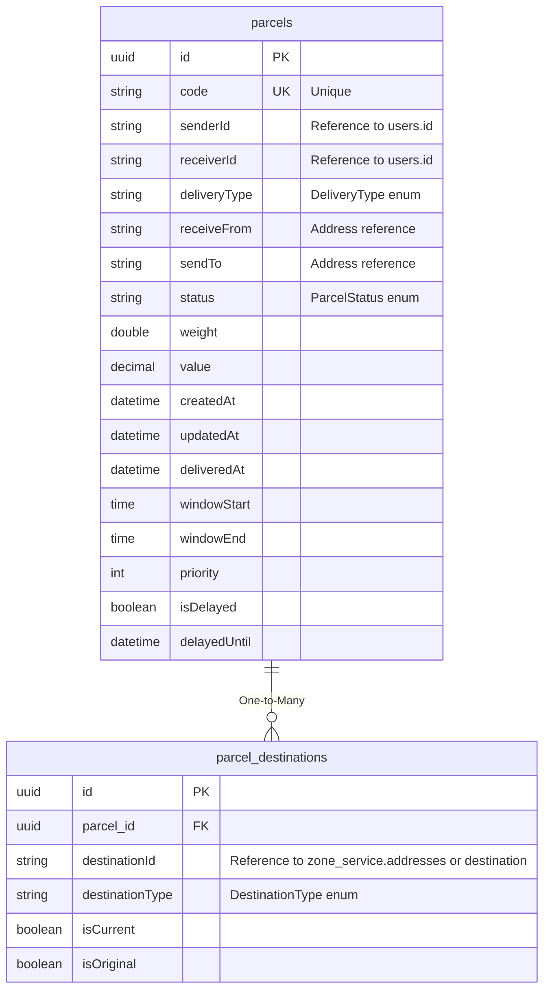

# ERD - Parcel Service

## Database: ds_parcel_service

## Tổng Quan

Parcel Service quản lý thông tin bưu kiện và các điểm đích của bưu kiện. Service này tích hợp với User Service và Zone Service để lấy thông tin người gửi/nhận và địa chỉ.

## ERD Diagram



## Chi Tiết Các Bảng

### 1. parcels

**Mô tả**: Bảng lưu thông tin bưu kiện.

**Khóa chính**: `id` (UUID)

**Các trường**:
- `id` (UUID, PK): ID của bưu kiện
- `code` (String, Unique, Not Null): Mã bưu kiện (unique)
- `senderId` (String, Not Null): ID người gửi, tham chiếu đến `user_service.users.id`
- `receiverId` (String, Not Null): ID người nhận, tham chiếu đến `user_service.users.id`
- `deliveryType` (DeliveryType, Not Null): Loại giao hàng
- `receiveFrom` (String, Not Null): Địa chỉ nhận (tham chiếu đến address)
- `sendTo` (String, Not Null): Địa chỉ gửi (tham chiếu đến address)
- `status` (ParcelStatus, Not Null): Trạng thái bưu kiện
- `weight` (Double, Not Null): Trọng lượng (kg)
- `value` (BigDecimal, Not Null): Giá trị bưu kiện
- `createdAt` (DateTime, Not Null): Thời gian tạo
- `updatedAt` (DateTime, Not Null): Thời gian cập nhật
- `deliveredAt` (DateTime, Optional): Thời gian giao hàng
- `windowStart` (Time, Optional): Thời gian bắt đầu cửa sổ giao hàng
- `windowEnd` (Time, Optional): Thời gian kết thúc cửa sổ giao hàng
- `priority` (Integer, Optional): Độ ưu tiên cho routing giao hàng (cao hơn = khẩn cấp hơn)
  - Maps to DeliveryType priorities: URGENT=10, EXPRESS=4, FAST=3, NORMAL=2, ECONOMY=1
- `isDelayed` (Boolean, Not Null, Default: false): Cờ delay/hoãn - khi true, bưu kiện tạm thời ẩn khỏi routing
- `delayedUntil` (DateTime, Optional): Thời điểm bưu kiện sẽ có sẵn lại cho routing

**Unique Constraints**:
- `code` - Unique constraint

**Quan hệ**:
- One-to-Many với `parcel_destinations`
- Cross-service references:
  - `senderId` → `user_service.users.id`
  - `receiverId` → `user_service.users.id`
  - `receiveFrom` → Address reference (có thể là `zone_service.addresses` hoặc `destination`)
  - `sendTo` → Address reference (có thể là `zone_service.addresses` hoặc `destination`)

**Lưu ý**:
- Sử dụng `@PrePersist` và `@PreUpdate` để tự động set timestamps
- Priority được tính tự động dựa trên `deliveryType`
- Khi `isDelayed = true`, bưu kiện sẽ không xuất hiện trong routing cho đến khi `delayedUntil` đạt đến

---

### 2. parcel_destinations

**Mô tả**: Bảng lưu các điểm đích của bưu kiện. Một bưu kiện có thể có nhiều điểm đích (ví dụ: thay đổi địa chỉ giao hàng).

**Khóa chính**: `id` (UUID)

**Các trường**:
- `id` (UUID, PK): ID của destination record
- `parcel_id` (UUID, FK, Not Null): Tham chiếu đến `parcels.id`
- `destinationId` (String, Not Null): ID điểm đích, tham chiếu đến `zone_service.addresses.address_id` hoặc `zone_service.destination.destination_id`
- `destinationType` (DestinationType, Not Null): Loại điểm đích
- `isCurrent` (Boolean, Not Null): Có phải điểm đích hiện tại không (chỉ một điểm đích có thể là current)
- `isOriginal` (Boolean, Not Null): Có phải điểm đích gốc không

**Quan hệ**:
- Many-to-One với `parcels`
- Cross-service reference đến `zone_service.addresses` hoặc `zone_service.destination` (qua `destinationId`)

**Lưu ý**:
- Business logic: Chỉ một destination có thể là `isCurrent = true` cho mỗi parcel
- Logic này nên được enforce ở service layer
- `isOriginal = true` cho điểm đích ban đầu khi tạo parcel
- Khi thay đổi địa chỉ giao hàng, tạo destination mới với `isCurrent = true` và set destination cũ thành `isCurrent = false`

---

## Enums

### DeliveryType
```java
public enum DeliveryType {
    URGENT,    // Giao khẩn cấp (priority = 10)
    EXPRESS,   // Giao nhanh (priority = 4)
    FAST,      // Giao nhanh (priority = 3)
    NORMAL,    // Giao thường (priority = 2)
    ECONOMY    // Giao tiết kiệm (priority = 1)
}
```

Lưu trong database dưới dạng String.

### ParcelStatus
```java
public enum ParcelStatus {
    // Các trạng thái của bưu kiện
    // (Cần xem code để biết chi tiết các giá trị)
}
```

Lưu trong database dưới dạng String.

### DestinationType
```java
public enum DestinationType {
    // Loại điểm đích
    // (Cần xem code để biết chi tiết các giá trị)
}
```

Lưu trong database dưới dạng String.

---

## Cross-Service References

### Tham chiếu đến các service khác:

1. **parcels.senderId** → `user_service.users.id`
   - Tham chiếu đến người gửi
   - Không có FK constraint (cross-service)

2. **parcels.receiverId** → `user_service.users.id`
   - Tham chiếu đến người nhận
   - Không có FK constraint (cross-service)

3. **parcels.receiveFrom** → Address reference
   - Có thể tham chiếu đến `zone_service.addresses.address_id` hoặc `zone_service.destination.destination_id`
   - Không có FK constraint (cross-service)

4. **parcels.sendTo** → Address reference
   - Có thể tham chiếu đến `zone_service.addresses.address_id` hoặc `zone_service.destination.destination_id`
   - Không có FK constraint (cross-service)

5. **parcel_destinations.destinationId** → Address reference
   - Tham chiếu đến `zone_service.addresses.address_id` hoặc `zone_service.destination.destination_id`
   - Không có FK constraint (cross-service)

### Được tham chiếu bởi các service khác:

1. **parcels.id** được tham chiếu bởi:
   - `session_service.delivery_assignments.parcel_id`
   - Không có FK constraint (cross-service)

---

## Business Logic

### Priority Calculation
Priority được tính tự động dựa trên `deliveryType`:
- `URGENT`: priority = 10
- `EXPRESS`: priority = 4
- `FAST`: priority = 3
- `NORMAL`: priority = 2
- `ECONOMY`: priority = 1

### Delay/Postpone Logic
- Khi `isDelayed = true`, bưu kiện tạm thời ẩn khỏi routing
- Bưu kiện sẽ có sẵn lại cho routing khi:
  - `isDelayed = false`, hoặc
  - `delayedUntil` đạt đến (nếu được set)

### Destination Management
- Một parcel có thể có nhiều destinations (lịch sử thay đổi địa chỉ)
- Chỉ một destination có thể có `isCurrent = true` tại một thời điểm
- Destination đầu tiên có `isOriginal = true`
- Khi thay đổi địa chỉ:
  1. Tạo destination mới với `isCurrent = true`, `isOriginal = false`
  2. Set destination cũ thành `isCurrent = false`

---

## Tổng Kết

- **Tổng số bảng**: 2 bảng
- **Quan hệ nội bộ**: 1 quan hệ (One-to-Many)
- **Cross-service references**: 5 tham chiếu ra ngoài, 1 tham chiếu vào từ Session Service
- **Đặc điểm**: Service quản lý lifecycle của bưu kiện và tích hợp chặt chẽ với User Service và Zone Service
