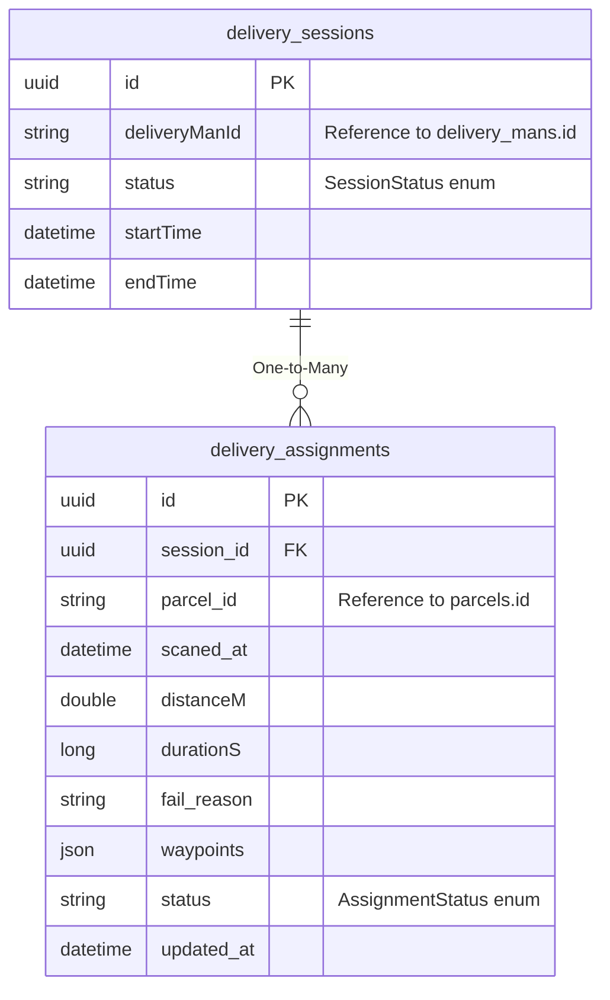

# ERD - Session Service

## Database: ds_session_service

## Tổng Quan

Session Service quản lý phiên giao hàng của shipper và các lượt giao hàng (assignments) trong mỗi phiên. Service này tích hợp với Parcel Service và User Service.

## ERD Diagram



## Chi Tiết Các Bảng

### 1. delivery_sessions

**Mô tả**: Bảng lưu phiên giao hàng của shipper. Một phiên bắt đầu khi shipper scan đơn đầu tiên và kết thúc khi shipper kết thúc phiên.

**Khóa chính**: `id` (UUID)

**Các trường**:
- `id` (UUID, PK): ID của delivery session
- `deliveryManId` (String, Not Null, Not Updatable): ID của delivery man, tham chiếu đến `user_service.delivery_mans.id`
- `status` (SessionStatus, Not Null, 20 chars): Trạng thái phiên
- `startTime` (DateTime, Not Null, Not Updatable): Thời gian bắt đầu phiên (được đặt khi shipper bắt đầu phiên - scan đơn)
- `endTime` (DateTime, Optional): Thời gian kết thúc phiên (được đặt khi phiên kết thúc)

**Quan hệ**:
- One-to-Many với `delivery_assignments` (mappedBy = "session", cascade = ALL, orphanRemoval = true)
- Cross-service reference:
  - `deliveryManId` → `user_service.delivery_mans.id`

**Lưu ý**:
- Sử dụng `@OneToMany` với `cascade = CascadeType.ALL` và `orphanRemoval = true`
- Khi session bị xóa, tất cả assignments sẽ tự động bị xóa
- Có method `addAssignment()` để thêm assignment vào session và set relationship hai chiều

---

### 2. delivery_assignments

**Mô tả**: Bảng lưu các lượt giao hàng (task) thuộc phiên giao hàng. Mỗi assignment đại diện cho một bưu kiện được giao trong phiên.

**Khóa chính**: `id` (UUID)

**Các trường**:
- `id` (UUID, PK): ID của assignment
- `session_id` (UUID, FK, Not Null, Not Updatable): Tham chiếu đến `delivery_sessions.id`
- `parcel_id` (String, Not Null, Not Updatable): ID của bưu kiện, tham chiếu đến `parcel_service.parcels.id`
- `scaned_at` (DateTime, Not Null): Thời gian scan đơn (khi shipper scan bưu kiện vào phiên)
- `distanceM` (Double): Khoảng cách (meters)
- `durationS` (Long): Thời gian dự kiến (seconds)
- `fail_reason` (String, Optional): Lý do thất bại (nếu giao hàng thất bại)
- `waypoints` (JSON, Optional): Danh sách waypoints cho routing (JSON format)
- `status` (AssignmentStatus, Not Null): Trạng thái assignment
- `updated_at` (DateTime, Not Null): Thời gian cập nhật

**Unique Constraints**:
- `(session_id, parcel_id)` - Unique constraint (một parcel chỉ có thể được assign một lần trong một session)

**Quan hệ**:
- Many-to-One với `delivery_sessions` (qua `session_id`)
- Cross-service reference:
  - `parcel_id` → `parcel_service.parcels.id`

**Lưu ý**:
- Sử dụng `@ManyToOne` với `fetch = FetchType.LAZY`
- Sử dụng `@LastModifiedDate` để tự động cập nhật `updated_at`
- `waypoints` lưu dưới dạng JSON, có thể chứa danh sách các điểm dừng cho routing
- Unique constraint đảm bảo một parcel chỉ có thể được assign một lần trong một session

---

## Enums

### SessionStatus
```java
public enum SessionStatus {
    // Trạng thái phiên giao hàng
    // (Cần xem code để biết chi tiết các giá trị)
    // Ví dụ: CREATED, ACTIVE, COMPLETED, CANCELLED
}
```

Lưu trong database dưới dạng String.

### AssignmentStatus
```java
public enum AssignmentStatus {
    // Trạng thái assignment
    // (Cần xem code để biết chi tiết các giá trị)
    // Ví dụ: PENDING, IN_PROGRESS, COMPLETED, FAILED, CANCELLED
}
```

Lưu trong database dưới dạng String.

---

## Cross-Service References

### Tham chiếu đến các service khác:

1. **delivery_sessions.deliveryManId** → `user_service.delivery_mans.id`
   - Tham chiếu đến delivery man trong User Service
   - Không có FK constraint (cross-service)

2. **delivery_assignments.parcel_id** → `parcel_service.parcels.id`
   - Tham chiếu đến bưu kiện trong Parcel Service
   - Không có FK constraint (cross-service)

### Được tham chiếu bởi các service khác:

1. **delivery_sessions.id** được tham chiếu bởi:
   - `communication_service.interactive_proposals.session_id`
   - Không có FK constraint (cross-service)

---

## Business Logic

### Session Lifecycle
1. **Creation**: Session được tạo khi shipper bắt đầu phiên (scan đơn đầu tiên)
   - `startTime` được set
   - `status` = CREATED hoặc ACTIVE
2. **Active**: Session đang hoạt động, shipper đang giao hàng
   - Có thể thêm assignments vào session
3. **Completion**: Session kết thúc
   - `endTime` được set
   - `status` = COMPLETED

### Assignment Management
1. **Scan**: Khi shipper scan một bưu kiện, assignment được tạo
   - `scaned_at` được set
   - `status` = PENDING hoặc IN_PROGRESS
   - Assignment được thêm vào session
2. **Routing**: Waypoints được tính toán và lưu vào `waypoints` (JSON)
   - `distanceM` và `durationS` được tính toán
3. **Delivery**: Assignment được hoàn thành hoặc thất bại
   - `status` = COMPLETED hoặc FAILED
   - Nếu thất bại, `fail_reason` được set

### Relationship Management
- Sử dụng bidirectional relationship giữa `DeliverySession` và `DeliveryAssignment`
- Method `addAssignment()` trong `DeliverySession` đảm bảo relationship được set đúng cả hai chiều
- Cascade và orphanRemoval đảm bảo khi session bị xóa, tất cả assignments cũng bị xóa

---

## Tổng Kết

- **Tổng số bảng**: 2 bảng
- **Quan hệ nội bộ**: 1 quan hệ (One-to-Many)
- **Cross-service references**: 2 tham chiếu ra ngoài, 1 tham chiếu vào từ Communication Service
- **Đặc điểm**: Service quản lý lifecycle của delivery sessions và assignments, tích hợp chặt chẽ với Parcel Service và User Service
