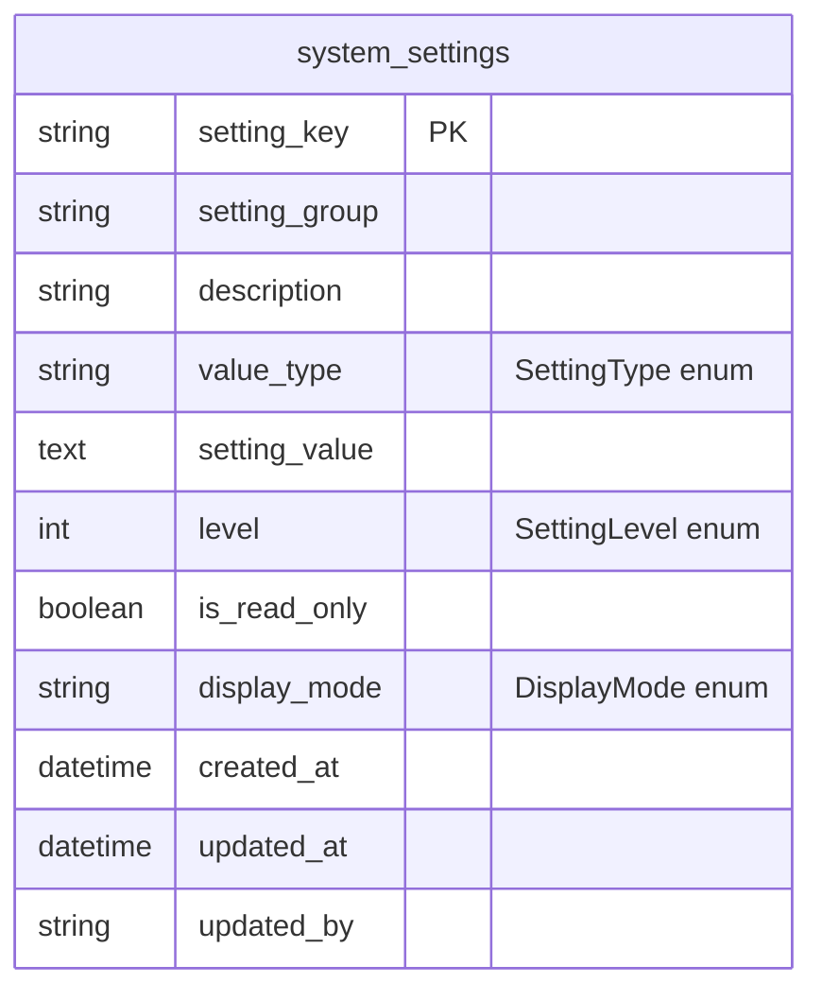

# ERD - Settings Service

## Database: ds_settings_service

## Tổng Quan

Settings Service quản lý cấu hình hệ thống và secrets. Tất cả các service khác có thể đọc/ghi settings thông qua REST API.

## ERD Diagram



## Chi Tiết Bảng

### system_settings

**Mô tả**: Bảng lưu cấu hình hệ thống và secrets. Hỗ trợ nhiều loại giá trị và mức độ bảo mật khác nhau.

**Khóa chính**: `setting_key` (String, 100 chars)

**Các trường**:
- `setting_key` (String, PK, 100 chars, Not Null): Khóa cấu hình (format: `AAA_BBBB_CCCC` - uppercase snake_case)
- `setting_group` (String, 50 chars, Not Null): Nhóm cấu hình (e.g., "KEYCLOAK", "DATABASE", "ZONE")
- `description` (String, 500 chars): Mô tả cấu hình
- `value_type` (String, 20 chars, Not Null): Loại giá trị
  - `STRING`: Chuỗi ký tự
  - `INTEGER`: Số nguyên
  - `DECIMAL`: Số thập phân
  - `BOOLEAN`: Boolean
  - `JSON`: JSON object
- `setting_value` (TEXT): Giá trị cấu hình (lưu dưới dạng text, parse theo `value_type`)
- `level` (Integer, Not Null): Mức độ quan trọng/phạm vi
  - `0`: SYSTEM (System-wide settings, highest priority)
  - `1`: APPLICATION (Application-level settings)
  - `2`: SERVICE (Service-specific settings)
  - `3`: FEATURE (Feature-specific settings)
  - `4`: USER (User-level settings, lowest priority)
- `is_read_only` (Boolean, Not Null): Có phải read-only không
- `display_mode` (String, 20 chars, Not Null, Default: "TEXT"): Cách hiển thị trong UI
  - `TEXT`: Plain text
  - `PASSWORD`: Masked password (****)
  - `CODE`: Code editor (JSON, XML, etc.)
  - `NUMBER`: Number input
  - `TOGGLE`: Boolean toggle
  - `TEXTAREA`: Multi-line text
  - `URL`: URL/Link
  - `EMAIL`: Email address
- `created_at` (DateTime, Not Null): Thời gian tạo
- `updated_at` (DateTime): Thời gian cập nhật
- `updated_by` (String, 100 chars): Người cập nhật

**Indexes**:
- `idx_setting_group`: Index trên `setting_group`
- `idx_setting_level`: Index trên `level`

**Quan hệ**: Không có quan hệ với bảng khác

**Lưu ý**:
- Setting key phải tuân theo format uppercase snake_case: `AAA_BBBB_CCCC`
- Giá trị được lưu dưới dạng TEXT và parse theo `value_type`
- Settings có thể được cache với TTL configurable
- Read-only settings không thể cập nhật qua API

---

## Enums

### SettingType
```java
public enum SettingType {
    STRING,    // Chuỗi ký tự
    INTEGER,   // Số nguyên
    DECIMAL,   // Số thập phân
    BOOLEAN,   // Boolean
    JSON       // JSON object
}
```

Lưu trong database dưới dạng String.

### SettingLevel
```java
public enum SettingLevel {
    SYSTEM(0),      // System-wide settings (highest priority)
    APPLICATION(1), // Application-level settings
    SERVICE(2),     // Service-specific settings
    FEATURE(3),     // Feature-specific settings
    USER(4)         // User-level settings (lowest priority)
}
```

Lưu trong database dưới dạng Integer (ORDINAL).

### DisplayMode
```java
public enum DisplayMode {
    TEXT,      // Plain text
    PASSWORD,  // Masked password (****)
    CODE,      // Code editor (JSON, XML, etc.)
    NUMBER,    // Number input
    TOGGLE,    // Boolean toggle
    TEXTAREA,  // Multi-line text
    URL,       // URL/Link
    EMAIL      // Email address
}
```

Lưu trong database dưới dạng String.

---

## Key Settings Examples

### Keycloak Settings
- `KEYCLOAK_AUTH_SERVER_URL`: URL của Keycloak server
- `KEYCLOAK_REALM_BACKEND`: Tên realm backend
- `KEYCLOAK_CLIENT_BACKEND_SECRET`: Client secret cho backend

### Zone Settings
- `ZONE_MAX_RADIUS`: Bán kính tối đa của zone (future)

### Database Settings
- `DB_HOST`: Database host
- `DB_PORT`: Database port
- `DB_USERNAME`: Database username
- `DB_PASSWORD`: Database password (PASSWORD display mode)

---

## Tổng Kết

- **Tổng số bảng**: 1 bảng
- **Quan hệ**: Không có quan hệ với bảng khác
- **Đặc điểm**: Centralized configuration management cho toàn bộ hệ thống
