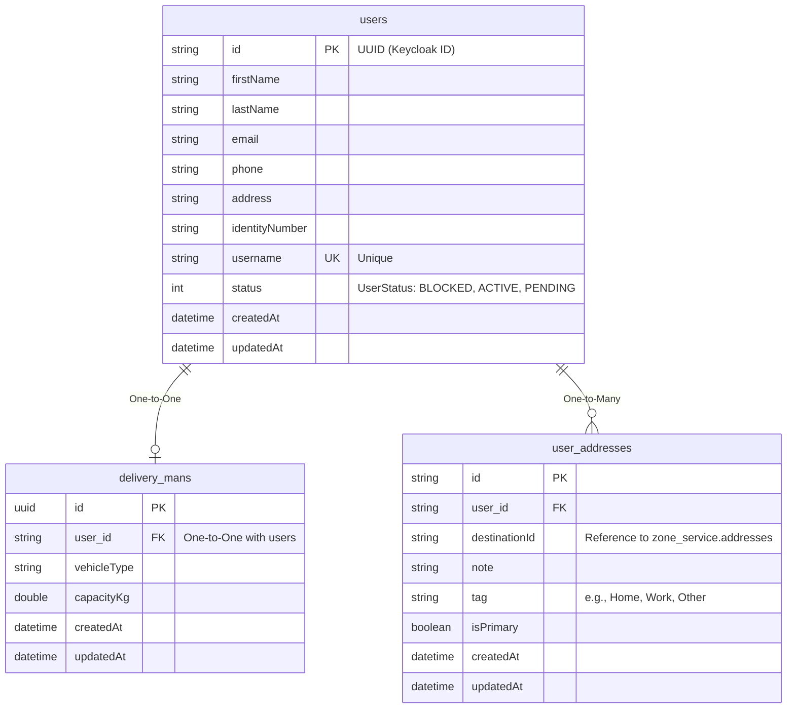

# ERD - User Service

## Database: ds_user_service

## Tổng Quan

User Service quản lý thông tin người dùng, shipper (delivery man), và địa chỉ của người dùng. Service này tích hợp với Keycloak để quản lý authentication và authorization.

## ERD Diagram



## Chi Tiết Các Bảng

### 1. users

**Mô tả**: Bảng lưu thông tin người dùng. ID được đồng bộ từ Keycloak (UUID format).

**Khóa chính**: `id` (String, 36 chars) - Keycloak user ID

**Các trường**:
- `id` (String, PK): Keycloak user ID (UUID format)
- `firstName` (String): Tên
- `lastName` (String): Họ
- `email` (String): Email
- `phone` (String): Số điện thoại
- `address` (String): Địa chỉ
- `identityNumber` (String): Số CMND/CCCD
- `username` (String, Unique, Not Null): Tên đăng nhập (unique)
- `status` (Integer): Trạng thái người dùng
  - `0`: BLOCKED
  - `1`: ACTIVE (default)
  - `2`: PENDING
- `createdAt` (DateTime, Not Null): Thời gian tạo
- `updatedAt` (DateTime): Thời gian cập nhật

**Unique Constraints**:
- `(email, username)` - Unique constraint
- `username` - Unique constraint

**Quan hệ**:
- One-to-One với `delivery_mans` (mappedBy = "user")
- One-to-Many với `user_addresses`

**Lưu ý**: 
- ID phải được set từ Keycloak ID trước khi persist
- Sử dụng `@PrePersist` để validate và set timestamps

---

### 2. delivery_mans

**Mô tả**: Bảng lưu thông tin shipper/delivery man. Mỗi delivery man phải liên kết với một user account.

**Khóa chính**: `id` (UUID)

**Các trường**:
- `id` (UUID, PK): ID của delivery man
- `user_id` (String, FK, Unique, Not Null): Tham chiếu đến `users.id`
- `vehicleType` (String, Not Null): Loại phương tiện (xe máy, xe tải, etc.)
- `capacityKg` (Double, Not Null): Tải trọng tối đa (kg)
- `createdAt` (DateTime, Not Null): Thời gian tạo
- `updatedAt` (DateTime): Thời gian cập nhật

**Unique Constraints**:
- `user_id` - Unique constraint (một user chỉ có thể là một delivery man)

**Quan hệ**:
- One-to-One với `users` (qua `user_id`)

**Lưu ý**:
- Mỗi user chỉ có thể có một delivery man record
- Sử dụng `@PrePersist` để generate UUID và set timestamps

---

### 3. user_addresses

**Mô tả**: Bảng lưu địa chỉ của người dùng. Tham chiếu đến `zone_service.addresses` để lấy thông tin địa chỉ chi tiết.

**Khóa chính**: `id` (String UUID)

**Các trường**:
- `id` (String UUID, PK): ID của địa chỉ
- `user_id` (String, FK, Not Null): Tham chiếu đến `users.id`
- `destinationId` (String, Not Null): Tham chiếu đến `zone_service.addresses.address_id`
- `note` (String, 500 chars): Ghi chú về địa chỉ
- `tag` (String, 50 chars): Nhãn địa chỉ (e.g., "Home", "Work", "Other")
- `isPrimary` (Boolean, Not Null, Default: false): Địa chỉ chính
- `createdAt` (DateTime, Not Null): Thời gian tạo
- `updatedAt` (DateTime): Thời gian cập nhật

**Indexes**:
- `idx_user_addresses_user_id`: Index trên `user_id`
- `idx_user_addresses_destination_id`: Index trên `destination_id`
- `idx_user_addresses_is_primary`: Composite index trên `(user_id, is_primary)`

**Quan hệ**:
- Many-to-One với `users` (qua `user_id`)
- Cross-service reference đến `zone_service.addresses` (qua `destinationId`)

**Lưu ý**:
- `destinationId` tham chiếu đến bảng `addresses` trong Zone Service
- Không có foreign key constraint với Zone Service (cross-service reference)
- Sử dụng `@PreUpdate` để tự động cập nhật `updatedAt`

---

## Cross-Service References

### Tham chiếu đến các service khác:

1. **user_addresses.destinationId** → `zone_service.addresses.address_id`
   - Tham chiếu đến địa chỉ chi tiết trong Zone Service
   - Không có FK constraint (cross-service)

2. **delivery_mans.id** được tham chiếu bởi:
   - `zone_service.working_places.delivery_man_id`
   - `session_service.delivery_sessions.deliveryManId`
   - Không có FK constraint (cross-service)

3. **users.id** được tham chiếu bởi:
   - `parcel_service.parcels.senderId`
   - `parcel_service.parcels.receiverId`
   - `communication_service.conversations.user1_id`
   - `communication_service.conversations.user2_id`
   - `communication_service.messages.sender_id`
   - `communication_service.notifications.user_id`
   - `communication_service.interactive_proposals.proposer_id`
   - `communication_service.interactive_proposals.recipient_id`
   - Không có FK constraint (cross-service)

---

## Enums

### UserStatus
```java
public enum UserStatus {
    BLOCKED(0),  // Bị khóa
    ACTIVE(1),   // Hoạt động (default)
    PENDING(2)   // Chờ xử lý
}
```

Lưu trong database dưới dạng Integer (ORDINAL).

---

## Tổng Kết

- **Tổng số bảng**: 3 bảng
- **Quan hệ nội bộ**: 2 quan hệ (One-to-One, One-to-Many)
- **Cross-service references**: 3 tham chiếu ra ngoài, nhiều tham chiếu vào từ các service khác
