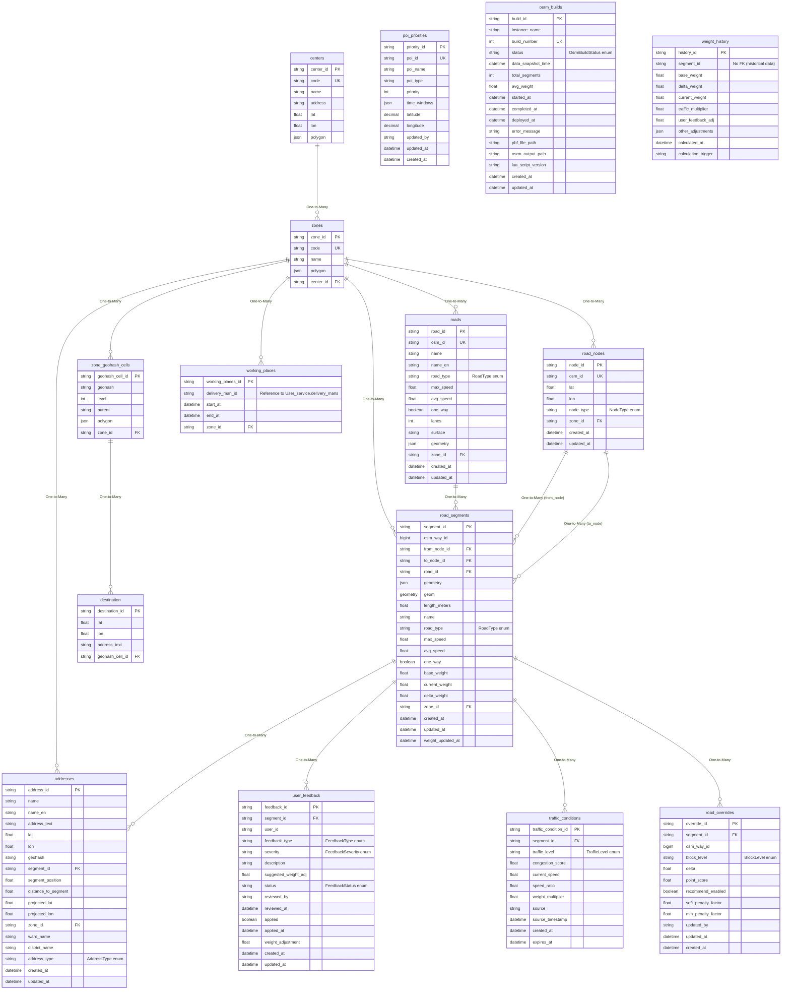

# ERD - Zone Service

## Database: ds_zone_service

## Tổng Quan

Zone Service quản lý dữ liệu địa lý, routing, và các khu vực giao hàng. Service này sử dụng Prisma ORM và MySQL database.

## ERD Diagram



## Chi Tiết Các Bảng

### 1. centers

**Mô tả**: Bảng lưu thông tin các trung tâm phân phối.

**Khóa chính**: `center_id` (String UUID)

**Các trường**:
- `center_id` (String UUID, PK): ID của trung tâm
- `code` (String, Unique): Mã trung tâm
- `name` (String): Tên trung tâm
- `address` (String, Optional): Địa chỉ
- `lat` (Float, Optional): Vĩ độ
- `lon` (Float, Optional): Kinh độ
- `polygon` (JSON, Optional): Polygon geometry (GeoJSON)

**Quan hệ**:
- One-to-Many với `zones`

---

### 2. zones

**Mô tả**: Bảng lưu thông tin các khu vực giao hàng.

**Khóa chính**: `zone_id` (String UUID)

**Các trường**:
- `zone_id` (String UUID, PK): ID của zone
- `code` (String, Unique): Mã zone
- `name` (String): Tên zone
- `polygon` (JSON, Optional): Polygon geometry (GeoJSON)
- `center_id` (String, FK): Tham chiếu đến `centers.center_id`

**Quan hệ**:
- Many-to-One với `centers`
- One-to-Many với `addresses`, `roads`, `road_nodes`, `road_segments`, `working_places`, `zone_geohash_cells`

---

### 3. addresses

**Mô tả**: Bảng lưu địa điểm (POI) và địa chỉ dọc theo các đoạn đường.

**Khóa chính**: `address_id` (String UUID)

**Các trường**:
- `address_id` (String UUID, PK): ID của địa chỉ
- `name` (String, Not Null): Tên địa chỉ (e.g., "Học viện Công nghệ Bưu chính Viễn thông")
- `name_en` (String, Optional): Tên tiếng Anh
- `address_text` (String, Optional): Địa chỉ đầy đủ
- `lat` (Float, Not Null): Vĩ độ
- `lon` (Float, Not Null): Kinh độ
- `geohash` (String, Optional): Geohash cho tìm kiếm proximity nhanh (precision 7-8)
- `segment_id` (String, FK, Optional): Tham chiếu đến `road_segments.segment_id`
- `segment_position` (Float, Optional): Vị trí dọc theo segment (0.0 = start, 1.0 = end)
- `distance_to_segment` (Float, Optional): Khoảng cách vuông góc từ address đến segment (meters)
- `projected_lat` (Float, Optional): Vĩ độ của điểm chiếu lên segment
- `projected_lon` (Float, Optional): Kinh độ của điểm chiếu lên segment
- `zone_id` (String, FK, Optional): Tham chiếu đến `zones.zone_id`
- `ward_name` (String, Optional): Phường/Xã (e.g., "Phường Tăng Nhơn Phú")
- `district_name` (String, Optional): Quận/Huyện (e.g., "Thủ Đức", "Quận 1")
- `address_type` (AddressType, Not Null, Default: GENERAL): Loại địa chỉ
- `created_at` (DateTime, Not Null, Default: now()): Thời gian tạo
- `updated_at` (DateTime, Auto-update): Thời gian cập nhật

**Indexes**:
- Index trên `segment_id`
- Index trên `zone_id`
- Index trên `name`
- Index trên `geohash` (Fast proximity pre-filtering)
- Index trên `(lat, lon)` (Fallback spatial index)
- Unique constraint trên `(lat, lon, name)`

**Quan hệ**:
- Many-to-One với `zones` (optional)
- Many-to-One với `road_segments` (optional)

**Lưu ý**: Được tham chiếu bởi `user_service.user_addresses.destinationId`

---

### 4. roads

**Mô tả**: Bảng master lưu thông tin đường.

**Khóa chính**: `road_id` (String UUID)

**Các trường**:
- `road_id` (String UUID, PK): ID của đường
- `osm_id` (String, Unique, Optional): Original OSM way ID
- `name` (String, Not Null): Tên đường
- `name_en` (String, Optional): Tên tiếng Anh
- `road_type` (RoadType, Not Null): Loại đường
- `max_speed` (Float, Optional): Tốc độ tối đa (km/h)
- `avg_speed` (Float, Optional): Tốc độ trung bình (km/h)
- `one_way` (Boolean, Default: false): Đường một chiều
- `lanes` (Int, Optional): Số làn đường
- `surface` (String, Optional): Loại mặt đường (asphalt, concrete, unpaved, etc.)
- `geometry` (JSON, Optional): GeoJSON LineString của toàn bộ đường
- `zone_id` (String, FK, Optional): Tham chiếu đến `zones.zone_id`
- `created_at` (DateTime, Not Null, Default: now()): Thời gian tạo
- `updated_at` (DateTime, Auto-update): Thời gian cập nhật

**Indexes**:
- Index trên `name`
- Index trên `road_type`
- Index trên `zone_id`

**Quan hệ**:
- Many-to-One với `zones` (optional)
- One-to-Many với `road_segments`

---

### 5. road_nodes

**Mô tả**: Bảng lưu các điểm giao lộ và nút đường.

**Khóa chính**: `node_id` (String UUID)

**Các trường**:
- `node_id` (String UUID, PK): ID của node
- `osm_id` (String, Unique, Optional): Original OSM node ID
- `lat` (Float, Not Null): Vĩ độ
- `lon` (Float, Not Null): Kinh độ
- `node_type` (NodeType, Not Null, Default: INTERSECTION): Loại node
- `zone_id` (String, FK, Optional): Tham chiếu đến `zones.zone_id`
- `created_at` (DateTime, Not Null, Default: now()): Thời gian tạo
- `updated_at` (DateTime, Auto-update): Thời gian cập nhật

**Indexes**:
- Index trên `(lat, lon)`
- Index trên `zone_id`

**Quan hệ**:
- Many-to-One với `zones` (optional)
- One-to-Many với `road_segments` (từ `from_node_id`)
- One-to-Many với `road_segments` (từ `to_node_id`)

---

### 6. road_segments

**Mô tả**: Bảng lưu các đoạn đường (arcs) giữa các nút - đơn vị routing cốt lõi.

**Khóa chính**: `segment_id` (String UUID)

**Các trường**:
- `segment_id` (String UUID, PK): ID của segment
- `osm_way_id` (BigInt, Optional): OSM way ID để mapping
- `from_node_id` (String, FK, Not Null): Tham chiếu đến `road_nodes.node_id`
- `to_node_id` (String, FK, Not Null): Tham chiếu đến `road_nodes.node_id`
- `road_id` (String, FK, Not Null): Tham chiếu đến `roads.road_id`
- `geometry` (JSON, Not Null): GeoJSON LineString cho segment này
- `geom` (Geometry, Optional): Spatial geometry (MySQL geometry type)
- `length_meters` (Float, Not Null): Chiều dài vật lý (meters)
- `name` (String, Not Null): Tên segment (kế thừa từ road)
- `road_type` (RoadType, Not Null): Loại đường (kế thừa từ road)
- `max_speed` (Float, Optional): Tốc độ tối đa (km/h) (kế thừa từ road)
- `avg_speed` (Float, Optional): Tốc độ trung bình (km/h) (kế thừa từ road)
- `one_way` (Boolean, Default: false): Đường một chiều (kế thừa từ road)
- `base_weight` (Float, Not Null): Weight cơ bản (tính từ length, speed, road_type - static)
- `current_weight` (Float, Not Null): Weight hiện tại (base_weight + delta_weight - updated periodically)
- `delta_weight` (Float, Default: 0): Điều chỉnh động dựa trên traffic
- `zone_id` (String, FK, Optional): Tham chiếu đến `zones.zone_id`
- `created_at` (DateTime, Not Null, Default: now()): Thời gian tạo
- `updated_at` (DateTime, Auto-update): Thời gian cập nhật
- `weight_updated_at` (DateTime, Default: now()): Thời gian cập nhật weight cuối cùng

**Indexes**:
- Index trên `from_node_id`
- Index trên `to_node_id`
- Index trên `road_id`
- Index trên `zone_id`
- Index trên `current_weight`
- Index trên `osm_way_id`

**Quan hệ**:
- Many-to-One với `zones` (optional)
- Many-to-One với `roads`
- Many-to-One với `road_nodes` (from_node)
- Many-to-One với `road_nodes` (to_node)
- One-to-Many với `addresses`
- One-to-Many với `user_feedback`
- One-to-Many với `traffic_conditions`
- One-to-Many với `road_overrides`

---

### 7. destination

**Mô tả**: Bảng lưu điểm đích.

**Khóa chính**: `destination_id` (String UUID)

**Các trường**:
- `destination_id` (String UUID, PK): ID của điểm đích
- `lat` (Float, Not Null): Vĩ độ
- `lon` (Float, Not Null): Kinh độ
- `address_text` (String, Optional): Địa chỉ text
- `geohash_cell_id` (String, FK, Optional): Tham chiếu đến `zone_geohash_cells.geohash_cell_id`

**Quan hệ**:
- Many-to-One với `zone_geohash_cells` (optional)

---

### 8. working_places

**Mô tả**: Bảng lưu nơi làm việc của shipper theo zone.

**Khóa chính**: `working_places_id` (String UUID)

**Các trường**:
- `working_places_id` (String UUID, PK): ID của working place
- `delivery_man_id` (String, Not Null): Tham chiếu đến `user_service.delivery_mans.id`
- `start_at` (DateTime, Not Null): Thời gian bắt đầu
- `end_at` (DateTime, Optional): Thời gian kết thúc
- `zone_id` (String, FK, Not Null): Tham chiếu đến `zones.zone_id`

**Quan hệ**:
- Many-to-One với `zones`
- Cross-service reference đến `user_service.delivery_mans` (qua `delivery_man_id`)

**Lưu ý**: 
- Nên validate `delivery_man_id` qua API call hoặc gRPC khi tạo/cập nhật
- Cảnh báo shipper khi được assign zone sai (chỉ cảnh báo, không block)

---

### 9. user_feedback

**Mô tả**: Bảng lưu phản hồi và gợi ý cải thiện tuyến đường từ người dùng.

**Khóa chính**: `feedback_id` (String UUID)

**Các trường**:
- `feedback_id` (String UUID, PK): ID của feedback
- `segment_id` (String, FK, Not Null): Tham chiếu đến `road_segments.segment_id`
- `user_id` (String, Not Null): ID người dùng gửi feedback
- `feedback_type` (FeedbackType, Not Null): Loại feedback
- `severity` (FeedbackSeverity, Not Null, Default: MINOR): Mức độ nghiêm trọng
- `description` (String, Optional): Mô tả chi tiết
- `suggested_weight_adj` (Float, Optional): Đề xuất điều chỉnh weight
- `status` (FeedbackStatus, Not Null, Default: PENDING): Trạng thái
- `reviewed_by` (String, Optional): Người review
- `reviewed_at` (DateTime, Optional): Thời gian review
- `applied` (Boolean, Default: false): Đã áp dụng chưa
- `applied_at` (DateTime, Optional): Thời gian áp dụng
- `weight_adjustment` (Float, Optional): Điều chỉnh weight thực tế đã áp dụng
- `created_at` (DateTime, Not Null, Default: now()): Thời gian tạo
- `updated_at` (DateTime, Auto-update): Thời gian cập nhật

**Indexes**:
- Index trên `segment_id`
- Index trên `user_id`
- Index trên `status`
- Index trên `created_at`

**Quan hệ**:
- Many-to-One với `road_segments`

---

### 10. traffic_conditions

**Mô tả**: Bảng lưu điều kiện giao thông cho các đoạn đường (từ tracking-asia hoặc nguồn khác).

**Khóa chính**: `traffic_condition_id` (String UUID)

**Các trường**:
- `traffic_condition_id` (String UUID, PK): ID của traffic condition
- `segment_id` (String, FK, Not Null): Tham chiếu đến `road_segments.segment_id`
- `traffic_level` (TrafficLevel, Not Null, Default: NORMAL): Mức độ giao thông
- `congestion_score` (Float, Default: 0): Điểm tắc nghẽn (0-100, cao hơn = tắc nghẽn hơn)
- `current_speed` (Float, Optional): Tốc độ trung bình hiện tại (km/h)
- `speed_ratio` (Float, Optional): Tỷ lệ tốc độ (current_speed / normal_speed, 0-1)
- `weight_multiplier` (Float, Default: 1): Hệ số nhân cho base_weight
- `source` (String, Default: "tracking-asia"): Nguồn dữ liệu
- `source_timestamp` (DateTime, Not Null): Thời gian thu thập dữ liệu traffic
- `created_at` (DateTime, Not Null, Default: now()): Thời gian tạo
- `expires_at` (DateTime, Not Null): Thời gian hết hạn (khi dữ liệu trở nên cũ)

**Indexes**:
- Unique constraint trên `(segment_id, source)`
- Index trên `segment_id`
- Index trên `source_timestamp`
- Index trên `expires_at`

**Quan hệ**:
- Many-to-One với `road_segments`

---

### 11. poi_priorities

**Mô tả**: Bảng lưu độ ưu tiên của POI cho việc sắp xếp waypoint.

**Khóa chính**: `priority_id` (String UUID)

**Các trường**:
- `priority_id` (String UUID, PK): ID của priority
- `poi_id` (String, Unique, Not Null): ID của POI
- `poi_name` (String, Optional): Tên POI
- `poi_type` (String, Optional): Loại POI
- `priority` (Int, Not Null, Default: 3): Mức độ ưu tiên (1 = cao nhất, 5 = thấp nhất)
- `time_windows` (JSON, Optional): Cửa sổ thời gian (JSON array của {start, end, days} objects)
  - Ví dụ: `[{"start": "08:00", "end": "18:00", "days": [1,2,3,4,5]}]`
- `latitude` (Decimal(10,7), Optional): Vĩ độ (để lookup)
- `longitude` (Decimal(10,7), Optional): Kinh độ (để lookup)
- `updated_by` (String, Optional): Người cập nhật
- `updated_at` (DateTime, Auto-update): Thời gian cập nhật
- `created_at` (DateTime, Not Null, Default: now()): Thời gian tạo

**Indexes**:
- Index trên `priority`
- Index trên `poi_type`
- Index trên `(latitude, longitude)`

**Quan hệ**: Không có quan hệ với bảng khác

---

### 12. road_overrides

**Mô tả**: Bảng lưu các override động cho điều chỉnh routing.

**Khóa chính**: `override_id` (String UUID)

**Các trường**:
- `override_id` (String UUID, PK): ID của override
- `segment_id` (String, FK, Optional): Tham chiếu đến `road_segments.segment_id`
- `osm_way_id` (BigInt, Optional): OSM way ID
- `block_level` (BlockLevel, Not Null, Default: none): Mức độ block
- `delta` (Float, Optional): Điều chỉnh weight delta bổ sung
- `point_score` (Float, Optional): Điểm chất lượng đường (0-1, cao hơn = tốt hơn)
- `recommend_enabled` (Boolean, Default: true): Bật/tắt recommendation cho đường này
- `soft_penalty_factor` (Float, Optional): Hệ số penalty tùy chỉnh cho soft block
- `min_penalty_factor` (Float, Optional): Hệ số penalty tùy chỉnh cho min block
- `updated_by` (String, Optional): Người cập nhật
- `updated_at` (DateTime, Auto-update): Thời gian cập nhật
- `created_at` (DateTime, Not Null, Default: now()): Thời gian tạo

**Indexes**:
- Index trên `segment_id`
- Index trên `osm_way_id`
- Index trên `block_level`
- Index trên `updated_at`

**Quan hệ**:
- Many-to-One với `road_segments` (optional, onDelete: Cascade)

**Lưu ý**: Ít nhất một trong `segment_id` hoặc `osm_way_id` phải được cung cấp

---

### 13. osrm_builds

**Mô tả**: Bảng theo dõi rebuild OSRM model (cho alternating OSRM instances).

**Khóa chính**: `build_id` (String UUID)

**Các trường**:
- `build_id` (String UUID, PK): ID của build
- `instance_name` (String, Not Null): Tên instance ("osrm-instance-1" hoặc "osrm-instance-2")
- `build_number` (Int, Not Null, Unique, Auto-increment): Số build
- `status` (OsrmBuildStatus, Not Null, Default: PENDING): Trạng thái build
- `data_snapshot_time` (DateTime, Not Null): Thời gian snapshot dữ liệu weight
- `total_segments` (Int, Not Null): Tổng số segments
- `avg_weight` (Float, Optional): Weight trung bình
- `started_at` (DateTime, Optional): Thời gian bắt đầu build
- `completed_at` (DateTime, Optional): Thời gian hoàn thành build
- `deployed_at` (DateTime, Optional): Thời gian deploy
- `error_message` (String, Optional): Thông báo lỗi
- `pbf_file_path` (String, Optional): Đường dẫn file PBF
- `osrm_output_path` (String, Optional): Đường dẫn output OSRM
- `lua_script_version` (String, Optional): Phiên bản script tính weight
- `created_at` (DateTime, Not Null, Default: now()): Thời gian tạo
- `updated_at` (DateTime, Auto-update): Thời gian cập nhật

**Indexes**:
- Index trên `instance_name`
- Index trên `status`
- Index trên `created_at`

**Quan hệ**: Không có quan hệ với bảng khác

---

### 14. weight_history

**Mô tả**: Bảng lưu lịch sử tính toán weight và audit log.

**Khóa chính**: `history_id` (String UUID)

**Các trường**:
- `history_id` (String UUID, PK): ID của history record
- `segment_id` (String, Not Null): Tham chiếu đến `road_segments.segment_id` (không có FK để cho phép lưu dữ liệu lịch sử ngay cả khi segment bị xóa)
- `base_weight` (Float, Not Null): Base weight tại thời điểm này
- `delta_weight` (Float, Not Null): Delta weight tại thời điểm này
- `current_weight` (Float, Not Null): Current weight tại thời điểm này
- `traffic_multiplier` (Float, Default: 1): Hệ số nhân traffic
- `user_feedback_adj` (Float, Default: 0): Điều chỉnh từ user feedback
- `other_adjustments` (JSON, Optional): Các yếu tố bổ sung trong JSON
- `calculated_at` (DateTime, Not Null, Default: now()): Thời gian tính toán
- `calculation_trigger` (String, Optional): Nguyên nhân kích hoạt tính toán lại

**Indexes**:
- Index trên `segment_id`
- Index trên `calculated_at`

**Quan hệ**: Không có FK đến `road_segments` (để cho phép lưu dữ liệu lịch sử)

---

### 15. zone_geohash_cells

**Mô tả**: Bảng lưu các cell geohash của zone.

**Khóa chính**: `geohash_cell_id` (String UUID)

**Các trường**:
- `geohash_cell_id` (String UUID, PK): ID của geohash cell
- `geohash` (String, Not Null): Geohash string
- `level` (Int, Not Null): Mức độ geohash
- `parent` (String, Optional): Geohash parent
- `polygon` (JSON, Optional): Polygon geometry
- `zone_id` (String, FK, Not Null): Tham chiếu đến `zones.zone_id`

**Quan hệ**:
- Many-to-One với `zones`
- One-to-Many với `destination`

---

## Enums

### AddressType
```prisma
enum AddressType {
  GENERAL           // Địa chỉ chung
  SCHOOL            // Trường học
  HOSPITAL          // Bệnh viện
  GOVERNMENT        // Cơ quan chính phủ
  SHOPPING          // Trung tâm mua sắm
  RESTAURANT        // Nhà hàng
  HOTEL             // Khách sạn
  BANK              // Ngân hàng
  GAS_STATION       // Trạm xăng
  PARKING           // Bãi đậu xe
  BUS_STOP          // Trạm xe buýt
  LANDMARK          // Địa danh nổi tiếng
}
```

### RoadType
```prisma
enum RoadType {
  MOTORWAY      // Cao tốc
  TRUNK         // Đường huyết mạch
  PRIMARY       // Đường chính
  SECONDARY     // Đường phụ
  TERTIARY      // Đường cấp 3
  RESIDENTIAL   // Đường dân cư
  SERVICE       // Đường dịch vụ
  UNCLASSIFIED  // Chưa phân loại
  LIVING_STREET // Đường khu dân cư
  PEDESTRIAN    // Đường dành cho người đi bộ
  TRACK         // Đường mòn
  PATH          // Lối đi
}
```

### NodeType
```prisma
enum NodeType {
  INTERSECTION      // Giao lộ
  TRAFFIC_LIGHT     // Đèn giao thông
  STOP_SIGN         // Biển dừng
  ROUNDABOUT        // Vòng xuyến
  ENDPOINT          // Điểm cuối đường
  WAYPOINT          // Điểm trên đường
}
```

### FeedbackType
```prisma
enum FeedbackType {
  ROAD_CLOSED           // Đường đóng
  CONSTRUCTION          // Đang thi công
  ACCIDENT              // Tai nạn
  POOR_CONDITION        // Đường xấu
  TRAFFIC_ALWAYS_BAD    // Giao thông luôn tệ
  BETTER_ROUTE          // Có đường tốt hơn
  INCORRECT_INFO        // Thông tin sai
  OTHER                 // Khác
}
```

### FeedbackSeverity
```prisma
enum FeedbackSeverity {
  MINOR     // Nhỏ
  MODERATE  // Vừa
  MAJOR     // Lớn
  CRITICAL  // Nghiêm trọng
}
```

### FeedbackStatus
```prisma
enum FeedbackStatus {
  PENDING   // Chờ xử lý
  REVIEWING // Đang xem xét
  APPROVED  // Đã duyệt
  REJECTED  // Từ chối
  RESOLVED  // Đã giải quyết
}
```

### TrafficLevel
```prisma
enum TrafficLevel {
  FREE_FLOW       // Thông thoáng (green)
  NORMAL          // Bình thường (yellow)
  SLOW            // Chậm (orange)
  CONGESTED       // Ùn tắc (red)
  BLOCKED         // Tắc nghẽn hoàn toàn (dark red)
}
```

### BlockLevel
```prisma
enum BlockLevel {
  none    // Không block
  soft    // Block nhẹ
  min     // Block tối thiểu
  hard    // Block cứng
}
```

### OsrmBuildStatus
```prisma
enum OsrmBuildStatus {
  PENDING       // Chờ build
  BUILDING      // Đang build
  TESTING       // Đang test
  READY         // Sẵn sàng deploy
  DEPLOYED      // Đã deploy
  FAILED        // Thất bại
  DEPRECATED    // Đã cũ
}
```

---

## Cross-Service References

### Tham chiếu đến các service khác:

1. **working_places.delivery_man_id** → `user_service.delivery_mans.id`
   - Tham chiếu đến delivery man trong User Service
   - Không có FK constraint (cross-service)
   - Nên validate qua API call hoặc gRPC

### Được tham chiếu bởi các service khác:

1. **addresses.address_id** được tham chiếu bởi:
   - `user_service.user_addresses.destinationId`
   - `parcel_service.parcel_destinations.destinationId` (có thể)
   - Không có FK constraint (cross-service)

2. **destination.destination_id** được tham chiếu bởi:
   - `parcel_service.parcel_destinations.destinationId` (có thể)
   - Không có FK constraint (cross-service)

---

## Tổng Kết

- **Tổng số bảng**: 14 bảng
- **Quan hệ nội bộ**: 15 quan hệ
- **Cross-service references**: 1 tham chiếu ra ngoài, 2 tham chiếu vào từ các service khác
- **Đặc điểm**: Service quản lý dữ liệu địa lý và routing phức tạp nhất trong hệ thống
