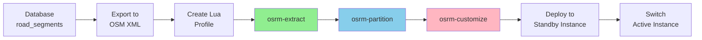
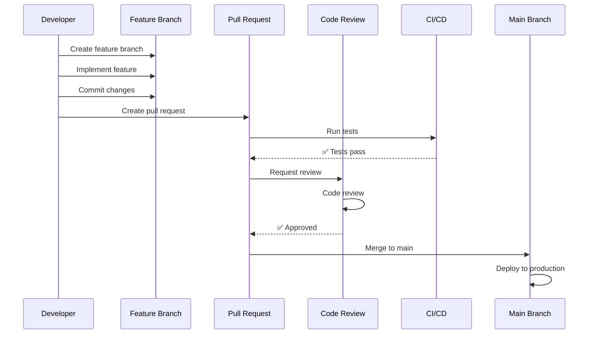
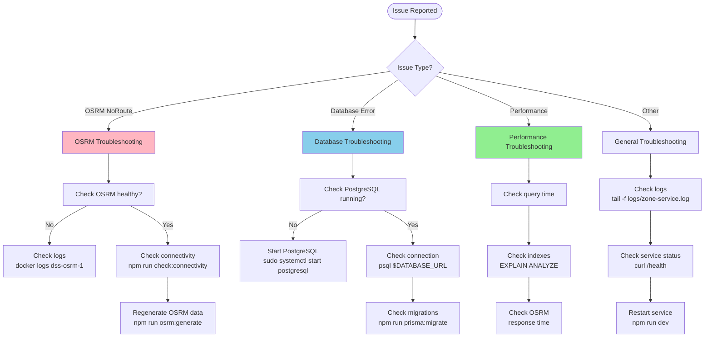

# Development Workflows

**Daily development practices and workflows for Zone Service**

---

## Table of Contents

1. [Code Workflow](#code-workflow)
2. [Test Workflow](#test-workflow)
3. [Data Workflow](#data-workflow)
4. [OSRM Workflow](#osrm-workflow)
5. [Git Workflow](#git-workflow)
6. [Release Workflow](#release-workflow)
7. [Troubleshooting Workflow](#troubleshooting-workflow)

---

## Code Workflow

### Adding a New Feature

#### 1. Create Feature Branch

```bash
# Always branch from main
git checkout main
git pull origin main

# Create feature branch
git checkout -b feature/your-feature-name

# Examples:
# - feature/add-distance-matrix
# - feature/optimize-multi-stop
# - fix/routing-timeout
```

#### 2. Understand the Module Structure

```
src/modules/your-feature/
├── your-feature.controller.ts    # HTTP endpoints
├── your-feature.service.ts       # Business logic
├── your-feature.model.ts         # Data access
├── your-feature.interface.ts     # TypeScript types
├── your-feature.router.ts        # Express routes
└── __tests__/                    # Tests
    ├── your-feature.controller.test.ts
    └── your-feature.service.test.ts
```

#### 3. Implement the Feature

**Example: Add Distance Matrix Endpoint**

**Step 1: Define Types** (`routing.interface.ts`)

```typescript
export interface DistanceMatrixRequest {
  origins: Coordinate[]
  destinations: Coordinate[]
  travelMode?: 'driving' | 'walking'
}

export interface DistanceMatrixResponse {
  origins: Coordinate[]
  destinations: Coordinate[]
  rows: DistanceMatrixRow[]
}

export interface DistanceMatrixRow {
  elements: DistanceMatrixElement[]
}

export interface DistanceMatrixElement {
  distance: number // meters
  duration: number // seconds
  status: 'OK' | 'ZERO_RESULTS' | 'NOT_FOUND'
}
```

**Step 2: Implement Service** (`routing.service.ts`)

```typescript
export class RoutingService {
  constructor(
    private osrmRouter: OSRMRouterService,
    private logger: LoggerService
  ) {}

  async getDistanceMatrix(
    request: DistanceMatrixRequest
  ): Promise<DistanceMatrixResponse> {
    this.logger.info('Getting distance matrix', {
      origins: request.origins.length,
      destinations: request.destinations.length
    })

    const rows: DistanceMatrixRow[] = []

    // Calculate distance for each origin-destination pair
    for (const origin of request.origins) {
      const elements: DistanceMatrixElement[] = []

      for (const destination of request.destinations) {
        try {
          const route = await this.osrmRouter.queryRoute(
            [origin, destination],
            { overview: false }
          )

          elements.push({
            distance: route.distance,
            duration: route.duration,
            status: 'OK'
          })
        } catch (error) {
          this.logger.warn('Route not found', { origin, destination })
          elements.push({
            distance: 0,
            duration: 0,
            status: 'NOT_FOUND'
          })
        }
      }

      rows.push({ elements })
    }

    return {
      origins: request.origins,
      destinations: request.destinations,
      rows
    }
  }
}
```

**Step 3: Add Controller** (`routing.controller.ts`)

```typescript
export class RoutingController {
  constructor(private routingService: RoutingService) {}

  async getDistanceMatrix(
    req: Request,
    res: Response,
    next: NextFunction
  ): Promise<void> {
    try {
      // Validate request
      const { origins, destinations, travelMode } = req.body

      if (!origins || !Array.isArray(origins) || origins.length === 0) {
        throw new ValidationError('Origins array is required')
      }

      if (!destinations || !Array.isArray(destinations) || destinations.length === 0) {
        throw new ValidationError('Destinations array is required')
      }

      // Call service
      const result = await this.routingService.getDistanceMatrix({
        origins,
        destinations,
        travelMode: travelMode || 'driving'
      })

      // Return response
      res.json({
        success: true,
        data: result
      })
    } catch (error) {
      next(error)
    }
  }
}
```

**Step 4: Register Route** (`routing.router.ts`)

```typescript
import { Router } from 'express'
import { RoutingController } from './routing.controller'

const router = Router()
const controller = new RoutingController()

// Existing routes
router.post('/route', controller.getRoute)
router.post('/multi-route', controller.getMultiRoute)

// New route
router.post('/distance-matrix', controller.getDistanceMatrix)

export default router
```

#### 4. Test Your Code

```bash
# Run development server
npm run dev

# In another terminal, test the endpoint
curl -X POST http://localhost:21503/api/v1/routing/distance-matrix \
  -H "Content-Type: application/json" \
  -d '{
    "origins": [
      {"lat": 10.8505, "lon": 106.7718},
      {"lat": 10.8550, "lon": 106.7800}
    ],
    "destinations": [
      {"lat": 10.8623, "lon": 106.8032},
      {"lat": 10.8700, "lon": 106.8100}
    ]
  }'
```

#### 5. Document Your Feature

Update `.docs/route/routing.md`:

```markdown
### Distance Matrix

Get distances and durations between multiple origins and destinations.

**Endpoint:** `POST /api/v1/routing/distance-matrix`

**Request Body:**
\`\`\`json
{
  "origins": [
    {"lat": 10.8505, "lon": 106.7718}
  ],
  "destinations": [
    {"lat": 10.8623, "lon": 106.8032}
  ]
}
\`\`\`

**Response:**
\`\`\`json
{
  "success": true,
  "data": {
    "origins": [...],
    "destinations": [...],
    "rows": [...]
  }
}
\`\`\`
```

#### 6. Commit and Push

```bash
# Stage changes
git add .

# Commit with clear message
git commit -m "Add: Distance matrix endpoint for routing

- Added DistanceMatrix types
- Implemented getDistanceMatrix in RoutingService
- Added POST /distance-matrix endpoint
- Updated routing documentation"

# Push to remote
git push origin feature/your-feature-name
```

#### 7. Create Pull Request

1. Go to GitHub repository
2. Click "Compare & pull request"
3. Fill in PR template:
   - **Title**: Brief description
   - **Description**: What does this PR do?
   - **Testing**: How to test it
   - **Screenshots**: If UI changes

---

## Test Workflow

### Running Tests

```bash
# Run all tests (when implemented)
npm test

# Run specific test file
npm test -- routing.service.test.ts

# Run tests in watch mode
npm test -- --watch

# Run tests with coverage
npm test -- --coverage
```

### Manual Testing

#### 1. Health Check Test

```bash
curl http://localhost:21503/api/v1/health

# Expected response:
# {
#   "status": "healthy",
#   "service": "zone-service",
#   "version": "1.0.0"
# }
```

#### 2. Routing Test

```bash
# Test single route
curl -X POST http://localhost:21503/api/v1/routing/route \
  -H "Content-Type: application/json" \
  -d '{
    "waypoints": [
      {"lat": 10.8505, "lon": 106.7718},
      {"lat": 10.8623, "lon": 106.8032}
    ]
  }'
```

#### 3. OSRM Stress Test

```bash
# Run hard routing test (Phạm Văn Đồng → Man Thiện)
npx tsx test-osrm-hard-routes.ts

# Expected: 100% success rate
```

#### 4. Connectivity Test

```bash
# Analyze road network connectivity
npm run check:connectivity

# Expected output:
# - Connected components count
# - Largest component percentage
# - Network statistics
```

### Performance Testing

```bash
# Test route query performance
time curl -X POST http://localhost:21503/api/v1/routing/route \
  -H "Content-Type: application/json" \
  -d '{
    "waypoints": [
      {"lat": 10.8505, "lon": 106.7718},
      {"lat": 10.8623, "lon": 106.8032}
    ]
  }'

# Target: < 100ms response time
```

### Load Testing (with Apache Bench)

```bash
# Install Apache Bench
sudo apt-get install apache2-utils  # Ubuntu
brew install httpd  # macOS

# Create request body file
echo '{
  "waypoints": [
    {"lat": 10.8505, "lon": 106.7718},
    {"lat": 10.8623, "lon": 106.8032}
  ]
}' > request.json

# Run load test (100 requests, 10 concurrent)
ab -n 100 -c 10 -p request.json -T application/json \
  http://localhost:21503/api/v1/routing/route

# Target:
# - 100% success rate
# - < 100ms average response time
# - > 50 requests/second
```

---

## Data Workflow

### Initial Data Seeding

```bash
# Step 1: Seed zones (Thu Duc districts)
npm run seed:zones

# Expected: 8 zones created in ~30 seconds

# Step 2: Seed roads (FAST - 70x optimized!)
npm run seed:roads

# Expected: ~4,957 roads, 6,588 nodes in ~51 seconds

# Step 3: Verify data
npm run prisma:studio
# Browse to http://localhost:5555
```

### Updating Road Data

#### Scenario: New roads added to OSM

```bash
# Step 1: Download fresh OSM data
cd raw_data/new_hochiminh_city
wget https://download.geofabrik.de/asia/vietnam-latest.osm.pbf

# Step 2: Extract Thu Duc area
osmium extract vietnam-latest.osm.pbf \
  --polygon ../old_thuduc_city/thuduc_cu.poly \
  --output hochiminh_city.osm.pbf

# Step 3: Clear old road data
npx prisma migrate reset --force
# Warning: This deletes ALL data!

# Step 4: Re-seed
npm run seed:zones
npm run seed:roads

# Step 5: Regenerate OSRM data
npm run osrm:generate

# Step 6: Restart OSRM instances
docker-compose restart osrm-instance-1 osrm-instance-2
```

### Incremental Road Updates (Advanced)

```typescript
// Script: update-roads.ts
import { PrismaClient } from '@prisma/client'
import { parseOSM } from './utils/osm-parser'

async function updateRoads() {
  const prisma = new PrismaClient()

  // Step 1: Parse new OSM data
  const newRoads = await parseOSM('path/to/new-data.osm.pbf')

  // Step 2: Find new roads (not in database)
  const existingOsmIds = await prisma.roads.findMany({
    select: { osm_id: true }
  })

  const existingIds = new Set(existingOsmIds.map(r => r.osm_id))
  const roadsToAdd = newRoads.filter(r => !existingIds.has(r.osm_id))

  // Step 3: Insert new roads
  console.log(`Adding ${roadsToAdd.length} new roads...`)
  // ... batch insert logic

  // Step 4: Regenerate OSRM data
  console.log('Regenerating OSRM data...')
  // ... trigger osrm:generate
}
```

### Traffic Data Updates

Traffic updates happen automatically via cron (every 30 minutes):

```typescript
// src/services/traffic/traffic-integration.service.ts

export class TrafficIntegrationService {
  async updateTrafficData(): Promise<void> {
    // Step 1: Fetch traffic from TrackAsia API
    const trafficData = await this.fetchTrackAsiaTraffic()

    // Step 2: Update segment weights
    for (const data of trafficData) {
      await this.weightCalculator.updateWeight(
        data.segment_id,
        data.traffic_level
      )
    }

    // Step 3: Check if OSRM rebuild needed
    const changedSegments = await this.countChangedSegments()
    if (changedSegments > 0.2 * totalSegments) {
      await this.osrmGenerator.rebuild()
    }
  }
}
```

**Manual traffic update:**

```bash
# Trigger traffic update manually
curl -X POST http://localhost:21503/api/v1/traffic/update \
  -H "Authorization: Bearer ${ADMIN_TOKEN}"
```

---

## OSRM Workflow

### Generating OSRM Data



#### Full Generation

```bash
# Generate OSRM data from database
npm run osrm:generate

# This does:
# 1. Export road_segments → network.osm.xml
# 2. Create custom_car.lua profile
# 3. Run osrm-extract (5-15 sec)
# 4. Run osrm-partition (10-30 sec)
# 5. Run osrm-customize (5-10 sec)
# Total: ~2 minutes

# Expected output files in osrm_data/osrm-instance-1/:
# - network.osrm (~5 MB)
# - network.osrm.edges (~1 MB)
# - network.osrm.cells (~500 KB)
# - network.osrm.mldgr (~3 MB)
```

#### Deploying to Second Instance

```bash
# Copy data to instance 2
cp -r osrm_data/osrm-instance-1/* osrm_data/osrm-instance-2/

# Restart instance 2
docker-compose restart osrm-instance-2

# Wait for healthy status
docker ps | grep osrm

# Switch active instance in code
# Update OSRM_ACTIVE_INSTANCE=2 in .env
```

### Testing OSRM Instances

```bash
# Test Instance 1 directly
curl "http://localhost:5000/route/v1/driving/106.7718,10.8505;106.8032,10.8623?overview=false"

# Test Instance 2 directly
curl "http://localhost:5001/route/v1/driving/106.7718,10.8505;106.8032,10.8623?overview=false"

# Expected response:
# {
#   "code": "Ok",
#   "routes": [{
#     "distance": 6400.5,
#     "duration": 510.2
#   }]
# }
```

### OSRM Troubleshooting Workflow

```bash
# 1. Check container status
docker ps | grep osrm

# 2. Check logs
docker logs dss-osrm-1 --tail 50
docker logs dss-osrm-2 --tail 50

# 3. Check data files exist
docker exec dss-osrm-1 ls -lh /data/
# Should show:
# - network.osrm
# - network.osrm.edges
# - network.osrm.cells
# - etc.

# 4. Test healthcheck manually
docker exec dss-osrm-1 timeout 2 bash -c '</dev/tcp/localhost/5000'
# Exit code 0 = healthy

# 5. If unhealthy, regenerate data
npm run osrm:generate
docker-compose restart osrm-instance-1 osrm-instance-2
```

---

## Git Workflow

### Branch Strategy

```
main (protected)
├── develop
│   ├── feature/add-distance-matrix
│   ├── feature/optimize-traffic
│   └── fix/routing-bug
└── hotfix/critical-bug
```

### Commit Message Convention

```bash
# Format: <Type>: <Description>

# Types:
# - Add: New feature
# - Update: Modify existing feature
# - Fix: Bug fix
# - Refactor: Code restructuring
# - Docs: Documentation changes
# - Test: Add or modify tests
# - Chore: Maintenance tasks

# Examples:
git commit -m "Add: Distance matrix endpoint"
git commit -m "Fix: OSRM routing timeout for long routes"
git commit -m "Update: Improve seeding performance by 70x"
git commit -m "Docs: Add WORKFLOWS.md with development practices"
```

### Pull Request Process



### Before Creating PR

```bash
# 1. Update from main
git checkout main
git pull origin main
git checkout feature/your-feature
git merge main
# Resolve any conflicts

# 2. Run tests
npm run check:connectivity
npx tsx test-osrm-hard-routes.ts

# 3. Check code quality
npm run build
# Fix any TypeScript errors

# 4. Clean up commits (optional)
git rebase -i HEAD~3
# Squash/reword commits

# 5. Push to remote
git push origin feature/your-feature
```

---

## Release Workflow

### Version Numbering

Follow [Semantic Versioning](https://semver.org/):

- **Major** (1.0.0 → 2.0.0): Breaking changes
- **Minor** (1.0.0 → 1.1.0): New features (backward compatible)
- **Patch** (1.0.0 → 1.0.1): Bug fixes

### Release Process

```bash
# 1. Update version
npm version minor  # or major/patch
# This updates package.json and creates a git tag

# 2. Update CHANGELOG.md
nano CHANGELOG.md
# Add:
# ## [1.1.0] - 2025-01-15
# ### Added
# - Distance matrix endpoint
# ### Fixed
# - Routing timeout for long routes

# 3. Commit changes
git add .
git commit -m "Release: v1.1.0"

# 4. Push with tags
git push origin main --tags

# 5. Create GitHub Release
# - Go to GitHub → Releases → New Release
# - Select tag v1.1.0
# - Add release notes from CHANGELOG
# - Publish release

# 6. Deploy to production
# (See deployment workflow below)
```

### Production Deployment

```bash
# 1. SSH to production server
ssh user@production-server

# 2. Navigate to zone service
cd /opt/ds/BE/zone_service

# 3. Pull latest code
git fetch --tags
git checkout v1.1.0

# 4. Install dependencies
npm install --production

# 5. Run migrations
npm run prisma:migrate:deploy

# 6. Build application
npm run build

# 7. Restart service
pm2 restart zone-service

# 8. Verify deployment
curl http://localhost:21503/api/v1/health
pm2 logs zone-service --lines 20
```

---

## Troubleshooting Workflow

### Common Issues Checklist



### Debugging Steps

#### 1. OSRM Returns "NoRoute"

```bash
# Step 1: Verify OSRM is healthy
docker ps | grep osrm
# Both should show (healthy)

# Step 2: Test OSRM directly
curl "http://localhost:5000/route/v1/driving/106.7718,10.8505;106.8032,10.8623"

# Step 3: Check connectivity
npm run check:connectivity
# Should show 29%+ connected

# Step 4: Verify coordinates are in Thu Duc
# Bounds: lat 10.8-10.9, lon 106.7-106.8

# Step 5: Regenerate if needed
npm run osrm:generate
docker-compose restart osrm-instance-1 osrm-instance-2
```

#### 2. Slow Query Performance

```bash
# Step 1: Enable query logging
# Add to .env:
# LOG_LEVEL=debug

# Step 2: Identify slow queries
tail -f logs/zone-service.log | grep "Query took"

# Step 3: Analyze with EXPLAIN
psql $DATABASE_URL
# \x
# EXPLAIN ANALYZE
# SELECT * FROM road_segments WHERE zone_id = 'xxx';

# Step 4: Add missing indexes
CREATE INDEX idx_missing ON table_name(column);

# Step 5: Vacuum database
VACUUM ANALYZE;
```

#### 3. Memory Issues

```bash
# Check memory usage
docker stats

# Check Node.js heap
node --max-old-space-size=4096 dist/index.js

# Check PostgreSQL connections
psql $DATABASE_URL -c "SELECT count(*) FROM pg_stat_activity;"

# Close idle connections
# Set in postgresql.conf:
# idle_in_transaction_session_timeout = 60000
```

---

## Daily Development Checklist

### Morning

```bash
☐ Pull latest code: git pull origin main
☐ Check service status: docker ps
☐ Check logs for errors: tail -f logs/zone-service.log
☐ Run health check: curl http://localhost:21503/api/v1/health
```

### Before Committing

```bash
☐ Run build: npm run build
☐ Run tests: npx tsx test-osrm-hard-routes.ts
☐ Check connectivity: npm run check:connectivity
☐ Review changes: git diff
☐ Write clear commit message
```

### Before Going Home

```bash
☐ Push all commits: git push
☐ Update documentation if needed
☐ Check CI/CD status
☐ Close terminal gracefully (Ctrl+C for npm run dev)
```

---

## Useful Commands Reference

```bash
# Development
npm run dev              # Start with hot reload
npm run build            # Build for production
npm run start            # Start production

# Database
npm run prisma:studio    # Visual database browser
npm run prisma:migrate   # Run migrations
npm run prisma:generate  # Generate Prisma client

# Data
npm run seed:zones       # Seed zones (~30 sec)
npm run seed:roads       # Seed roads (~51 sec)
npm run check:connectivity  # Network analysis

# OSRM
npm run osrm:generate    # Generate OSRM data (~2 min)
docker-compose restart osrm-instance-1  # Restart OSRM

# Testing
npx tsx test-osrm-hard-routes.ts  # Stress test
curl http://localhost:21503/api/v1/health  # Health check

# Git
git status               # Check status
git add .                # Stage all changes
git commit -m "msg"      # Commit
git push                 # Push to remote

# Docker
docker ps                # List containers
docker logs dss-osrm-1   # View logs
docker exec -it dss-osrm-1 bash  # Enter container
docker-compose up -d     # Start all services
docker-compose down      # Stop all services
```

---

## Next Steps

- **API Reference**: See [API.md](./API.md) for endpoint details
- **Architecture**: See [ARCHITECTURE.md](./ARCHITECTURE.md) for system design
- **Troubleshooting**: See [TROUBLESHOOTING.md](./TROUBLESHOOTING.md) for issues
- **Setup**: See [SETUP.md](./SETUP.md) for initial setup

---

**Last Updated:** 2025-01-15
**Version:** 1.0.0
