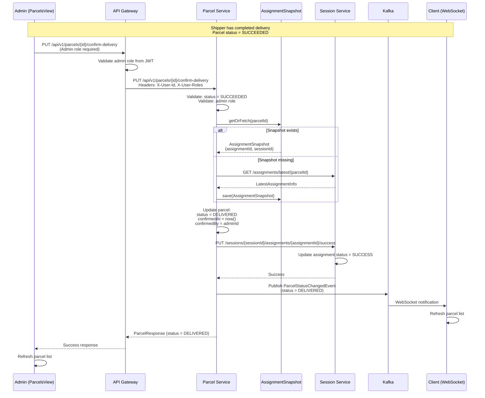
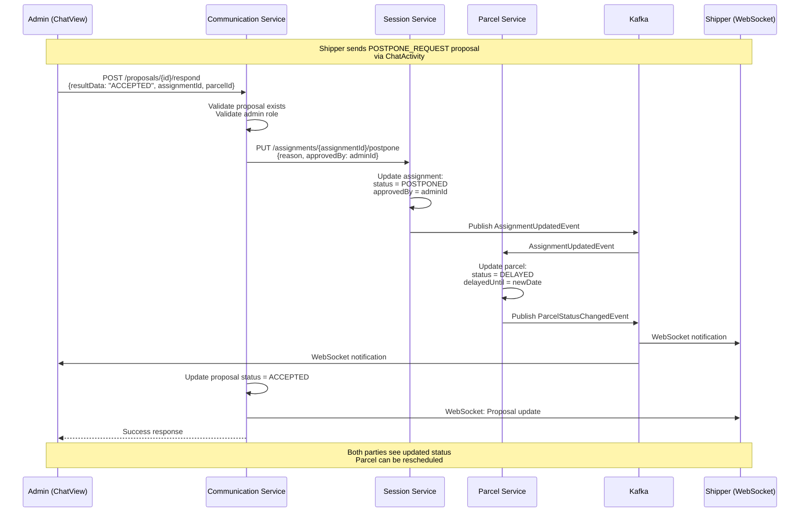

## Admin Feature Book

This page captures the management console capabilities that live in `ManagementSystem/`. Each activity flow lists the UI entry point, backend services touched, and pending improvements.

### Core responsibilities

1. **Account & role administration** – module `src/modules/Users`, backed by `User_service`.
2. **Delivery oversight** – module `src/modules/Delivery`, consuming `Session Service`, `Parcel Service`, `Communication Service`.
3. **Zone & routing configuration** – module `src/modules/Zones`, integrated with `zone_service`.
4. **System settings** – module `src/modules/Settings`, reading/writing `Settings_service`.
5. **Operations confirmation** – confirm deliveries, delays, disputes after shipper updates.

### Activity – Confirm delivery completion (v1)

```mermaid
flowchart TD
    A[Parcel list in ManagementSystem] -->|Select parcel| B[Open parcel detail drawer]
    B --> C{Parcel status == SUCCEEDED?}
    C -- No --> D[Wait for shipper update via Communication Service]
    D -->|Receive event| C
    C -- Yes --> E[Admin clicks Confirm Receipt]
    E --> F[Call API Gateway /v1/parcels/{id}/confirm-delivery]
    F --> G[Parcel Service sets parcel=DELIVERED]
    G --> H[Session Service updates assignment=SUCCESS]
    H --> I[Communication Service broadcasts notification]
    I --> J[ManagementSystem refreshes list + audit log]
```

### Sequence – Admin confirm delivery (v1)



**Implementation notes**

- UI hook: add action button to `ParcelsView.vue` (admin scope) and to chat sidebar when conversing with the shipper (proposal confirmation).
- Backend: expose `PUT /v1/parcels/{id}/confirm-delivery` in Parcel Service + propagate assignment update through Session Service.
- Audit: reuse `AUDIT_LOGGING_GUIDE.md` patterns (BE).
- Uses `AssignmentSnapshot` for efficient cross-service communication (same pattern as client confirmation).

### Activity – Approve postpone request (v1)

```mermaid
flowchart TD
    A[Interactive proposal popup] --> B[Admin reviews task metadata]
    B --> C{Contains assignmentId + parcelId?}
    C -- No --> D[Request shipper to resend proposal]
    C -- Yes --> E[Admin selects Accept / Decline]
    E --> F[Call Session Service /assignments/{assignmentId}/postpone]
    F --> G[Parcel Service sets status=DELAYED]
    G --> H[Communication Service sends confirmation message]
    H --> I[ManagementSystem updates Delivery Session detail]
```

### Sequence – Approve postpone request (v1)



**Fixes required**

- DeliveryApp must send both `assignmentId` + `parcelId` when responding to postpone proposals (see `ChatActivity#onProposalRespond`).
- Session Service should expose idempotent postpone endpoint tied to assignment.

### Module checkpoints

| Module | Status | Gaps |
| --- | --- | --- |
| Users | CRUD complete | Missing V2 filter wiring on UI (API ready in BE) |
| Parcels | Basic CRUD | No admin confirmation action, no tie-in with chat events |
| Delivery | Session list + detail | Need dual session APIs (active vs history) and shipper-client filter |
| Communication | Chat UI with websocket | No inline parcel confirmation controls |
| Settings | CRUD skeleton | Missing validation + secrets guard |

### TODOs for admins

- Add dashboard widgets that combine `Session Service` KPIs + Kafka consumer lag.
- Include “current shipper vs client parcel list” fix: extend `/v1/parcels/client-view` with `shipperId` filters to support dispute resolution.
- Document monitoring hooks in `reports/2_BACKEND` once Kafka tracing is wired.
