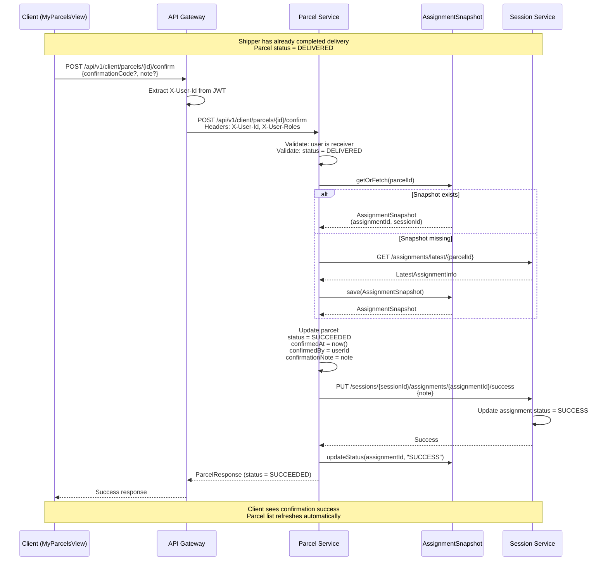

## Client Feature Book

Client personas use the same ManagementSystem frontend but with `CLIENT` roles (see `src/modules/Client/`). These journeys focus on self-service parcel management and collaboration with shippers.

### Primary flows

1. **Create parcel** – `CreateParcelView.vue` posts to Parcel Service via API Gateway.
2. **Manage addresses** – `MyAddressesView.vue` writes to `User_service` / `Addresses`.
3. **Track parcels** – `MyParcelsView.vue` consumes `/api/v1/client/parcels/received` (client-scoped API).
4. **Chat & proposals** – `Communication/ChatView.vue` for live updates and confirmations.
5. **Confirm receipt** – `MyParcelsView.vue` allows clients to confirm parcel receipt after shipper delivery.

### Activity – Create & assign parcel (v1)

```mermaid
flowchart TD
    A[Client selects Create Parcel] --> B[Fill form + pick sender/receiver addresses]
    B --> C[POST /v1/parcels (API Gateway → Parcel Service)]
    C --> D[Parcel status = IN_WAREHOUSE]
    D --> E[Admin schedules via Session Service or shipper scans QR]
    E --> F[Client receives notification + chat thread]
```

### Activity – Confirm delivery & dispute (v1)

```mermaid
flowchart TD
    A[MyParcelsView shows parcel list] --> B{Parcel status = DELIVERED?}
    B -- No --> C[Wait for shipper to complete delivery]
    C -->|Shipper completes| D[Parcel status = DELIVERED]
    D --> B
    B -- Yes --> E[Client taps Confirm Received button]
    E --> F[POST /api/v1/client/parcels/{id}/confirm]
    F --> G[Parcel Service validates receiver + status]
    G --> H[Parcel Service uses AssignmentSnapshot]
    H --> I[Update parcel status = SUCCEEDED]
    I --> J[Update Session Service assignment = SUCCESS]
    J --> K[Client sees success banner]
```

### Sequence – Client confirm parcel receipt (v1)



### Implementation details

**Client-scoped parcel API** (`/api/v1/client/parcels/*`):
- Automatically filters parcels by `receiverId` from JWT (`X-User-Id` header).
- Enforces authorization: clients can only view/confirm their own received parcels.
- Uses V2 paging/filtering for advanced queries.

**Snapshot strategy for cross-service queries**:
- `AssignmentSnapshot` entity in Parcel Service caches assignment metadata locally.
- Reduces synchronous calls to Session Service during confirmation flow.
- Snapshot is populated via:
  1. Initial fetch from Session Service when needed.
  2. Future: Kafka events from Session Service (to be implemented).
- Used in `confirmParcelByClient()` to retrieve `assignmentId` and `sessionId` without blocking on Session Service.

**Code references**:
- Frontend: `ManagementSystem/src/modules/Client/MyParcelsView.vue`
- API Gateway: `BE/api-gateway/src/main/java/com/ds/gateway/application/controllers/v1/ClientParcelController.java`
- Parcel Service: `BE/parcel-service/src/main/java/com/ds/parcel_service/application/controllers/client/ClientParcelController.java`
- Business logic: `BE/parcel-service/src/main/java/com/ds/parcel_service/business/v1/services/ParcelService.java#confirmParcelByClient`
- Snapshot service: `BE/parcel-service/src/main/java/com/ds/parcel_service/application/services/AssignmentSnapshotService.java`

### Backlog

- Add filter chips (delivered, on-route, delayed) with V2 filter syntax.
- Provide "exclude current parcel" parameter when fetching sessions (bug mentioned in report).
- Support quick actions from chat to open `ParcelDetail` drawer (link `currentParcel` state to router).
- Implement Kafka consumer for `AssignmentSnapshot` updates (event-driven sync from Session Service).
- Add confirmation code validation (if provided by shipper during delivery).
