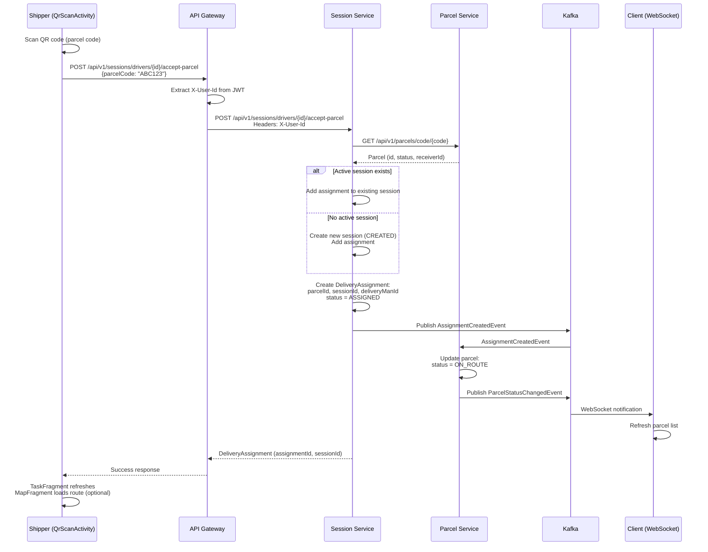
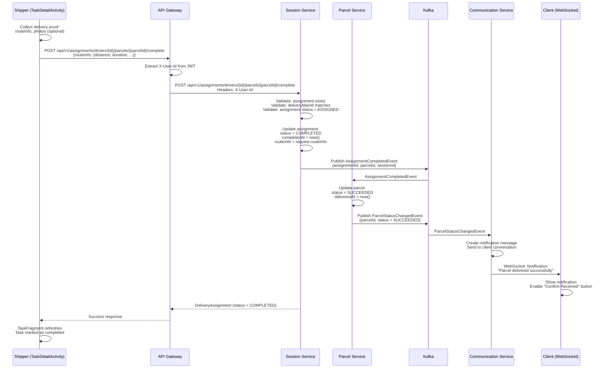

## Shipper Feature Book

DeliveryApp (`DeliveryApp/app/src/main/java/com/ds/deliveryapp`) drives these journeys. Pair each activity with the fragments/activities listed below to keep implementation and documentation synced.

### Key surfaces

- `TaskFragment` + `TaskDetailActivity` – assignment list + status updates.
- `QrScanActivity` – scan-to-accept flow.
- `SessionDashboardFragment` – session bootstrap (create/start/finish).
- `ChatActivity` + `GlobalChatService` – realtime comms + proposals.
- `MapFragment` – routing and navigation preview.

### Activity – Scan & accept parcel (v0/v1)

```mermaid
flowchart TD
    A[Driver taps Scan in TaskFragment] --> B[QrScanActivity opens camera]
    B --> C{QR decoded?}
    C -- No --> B
    C -- Yes --> D[Send POST /sessions/drivers/{id}/accept-parcel]
    D --> E[Session Service returns assignmentId]
    E --> F[ParcelService updates parcel=ON_ROUTE]
    F --> G[TaskFragment refreshes assignments list]
    G --> H[MapFragment fetches route from Zone Service (optional)]
```

### Sequence – Scan & accept parcel (v0/v1)



**Code anchors**

- API: `SessionClient.acceptParcelToSession`.
- VM: `TaskFragment` should call `SessionDashboardFragment#createSession` if no active session exists.

### Activity – Handle postpone proposal (v1)

```mermaid
flowchart TD
    A[ProposalPopupDialog] --> B[Driver chooses Accept]
    B --> C[ChatActivity.onProposalRespond]
    C --> D[POST /proposals/{id}/respond {resultData, assignmentId, parcelId}]
    D --> E[Communication Service pushes decision]
    E --> F[Session Service updates assignment=SUCCESS/POSTPONED]
    F --> G[Parcel Service sets status=DELAYED]
    G --> H[Management System receives notification]
```

**Required fixes**

- Include both `assignmentId` and `parcelId` in `resultData` payload before calling `respondToProposal`.
- When shipper triggers postpone via quick action, also call `SessionClient.failTask/completeTask` depending on admin response to keep statuses aligned.

### Activity – Complete task & confirm proof (v1)

```mermaid
flowchart TD
    A[TaskDetailActivity] --> B[Driver taps 'Giao thành công']
    B --> C[Collect route metrics + photos]
    C --> D[POST /assignments/drivers/{id}/parcels/{parcelId}/complete]
    D --> E[Session Service sets assignment=COMPLETED]
    E --> F[Parcel Service sets parcel=SUCCEEDED]
    F --> G[Communication Service notifies client]
```

### Sequence – Complete task & confirm proof (v1)



**Code references**

- API: `SessionClient.completeTask`.
- Frontend: `DeliveryApp/app/src/main/java/com/ds/deliveryapp/TaskDetailActivity.java`.
- Backend: `BE/session-service/src/main/java/com/ds/session/session_service/application/controllers/DeliveryAssignmentController.java`.

### Upcoming (v2)

- Paging/filter V2 for assignments list and history (reuse `QueryPayload` from ManagementSystem).
- Offline-first queue for status updates (store in Room DB inside `repository/`).
- Unified navigation intent that opens OSRM/Google Maps with coordinates from Zone Service.
