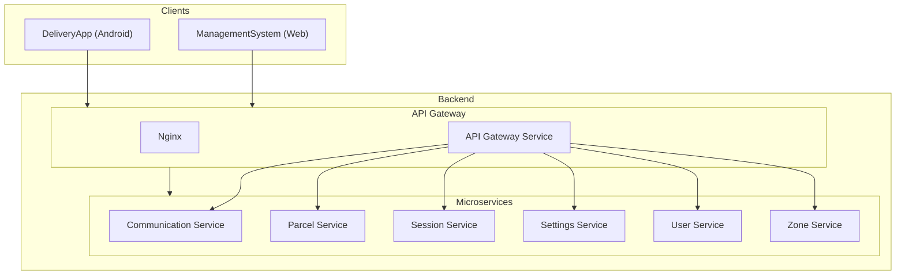
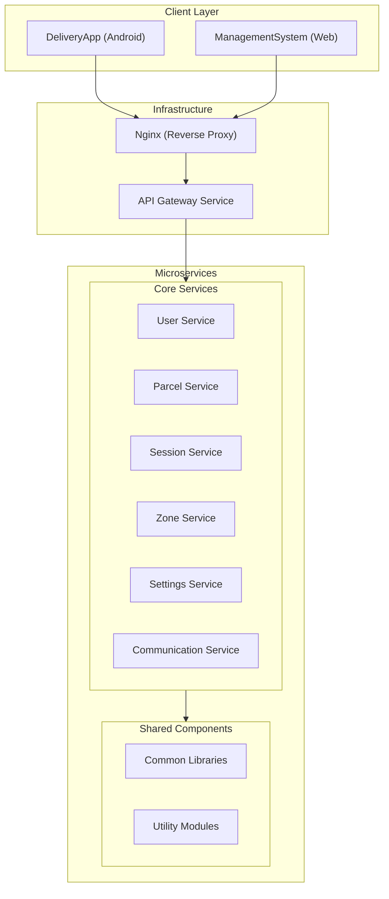
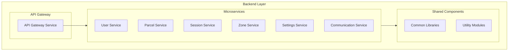

# System Overview

This document provides a high-level overview of the Delivery System architecture, including project structure and system-wide component relationships.

## Table of Contents

- [System Overview](#system-overview)
  - [Table of Contents](#table-of-contents)
  - [System Architecture](#system-architecture)
  - [Layered Architecture View](#layered-architecture-view)
  - [Backend Layer Structure](#backend-layer-structure)
  - [Project Folder Structure](#project-folder-structure)
  - [Related Documentation](#related-documentation)

## System Architecture

The Delivery System follows a microservices architecture pattern with clear separation between client applications, API gateway, and backend services. The following diagram illustrates the overall system structure:



The system consists of two client applications that communicate with backend services through a centralized API Gateway. The API Gateway handles authentication and routes requests to the appropriate microservice. This architecture provides a single entry point for all client requests and simplifies security management.

For detailed information about the API Gateway, see [API Gateway Documentation](2_BACKEND/1_API_GATEWAY.md).

## Layered Architecture View

The system can also be viewed in layers, showing the logical organization from client applications through infrastructure to core services:



This layered view demonstrates how requests flow from client applications through infrastructure components to core business services. The reverse proxy (Nginx) handles initial request routing and load balancing, while the API Gateway Service performs authentication and service routing.

For more information about client applications, see:
- [Management System](1_CLIENTS/1_MANAGEMENT_SYSTEM.md)
- [Delivery App](1_CLIENTS/2_DELIVERY_APP.md)

## Backend Layer Structure

The backend services are organized with the API Gateway routing requests to individual microservices:



Each microservice is responsible for a specific domain of functionality:

- **User Service**: Manages user accounts and delivery personnel profiles. See [User Service Documentation](2_BACKEND/6_USER_SERVICE.md).
- **Parcel Service**: Handles parcel lifecycle from creation to delivery confirmation. See [Parcel Service Documentation](2_BACKEND/3_PARCEL_SERVICE.md).
- **Session Service**: Coordinates delivery sessions and parcel assignments. See [Session Service Documentation](2_BACKEND/4_SESSION_SERVICE.md).
- **Zone Service**: Manages geographic zones and route calculation. See [Zone Service Documentation](2_BACKEND/7_ZONE_SERVICE.md).
- **Settings Service**: Provides centralized configuration management. See [Settings Service Documentation](2_BACKEND/5_SETTINGS_SERVICE.md).
- **Communication Service**: Enables real-time messaging and notifications. See [Communication Service Documentation](2_BACKEND/2_COMMUNICATION_SERVICE.md).

## Project Folder Structure

This section outlines the key directories and files within the project, providing a detailed view of its organization.

```
/mnt/e/graduate/DS/
├───.gitignore
├───.gitleaks.toml
├───.semgrepignore
├───bake.json
├───docker-compose.dev-linux.yml
├───docker-compose.dev.yml
├───docker-compose.prod.yml
├───docker-compose.test.yml
├───docker-compose.yml
├───env.local
├───README.md
├───RESTFUL.md
├───route.md
├───ui.md
├───websocket-test.html
├───.actrc/
│   └───event.json
├───.changelog/
│   └───0511a2211.md
├───.github/
│   └───workflows/
│       ├───android-app-ci-cd.yml
│       ├───backend-ci-cd.yml
│       ├───monitoring.yml
│       └───secret-scan.yml
├───.vscode/
│   ├───launch.json
│   ├───settings.json
│   └───tasks.json
├───BE/
│   ├───.env.example
│   ├───AUDIT_LOGGING_GUIDE.md
│   ├───FILTER_SYSTEM_V0_V1_V2_GUIDE.md
│   ├───QUERY_SYSTEM.md
│   ├───README.md
│   ├───SERVICES_UPDATE_GUIDE.md
│   ├───.docs/
│   │   └───ProjectStructure.md
│   ├───api-gateway/
│   │   ├───Dockerfile
│   │   ├───nginx.conf
│   │   ├───pom.xml
│   │   ├───README.md
│   │   └───src/
│   ├───communication_service/
│   │   ├───Dockerfile
│   │   ├───pom.xml
│   │   └───src/
│   ├───parcel-service/
│   │   ├───Dockerfile
│   │   ├───pom.xml
│   │   └───src/
│   ├───scripts/
│   │   ├───health-check.sh
│   │   └───init-databases.sql
│   ├───session-service/
│   │   ├───Dockerfile
│   │   ├───pom.xml
│   │   └───src/
│   ├───Settings_service/
│   │   ├───Dockerfile
│   │   ├───pom.xml
│   │   ├───README.md
│   │   └───src/
│   ├───User_service/
│   │   ├───Dockerfile
│   │   ├───pom.xml
│   │   ├───README.MD
│   │   └───src/
│   └───zone_service/
│       ├───Dockerfile
│       ├───index.ts
│       ├───package.json
│       ├───prisma.ts
│       ├───README.md
│       ├───tsconfig.json
│       └───src/
├───cloudflared/
│   └───config.yml.example
├───DeliveryApp/
│   ├───build.gradle
│   ├───gradle.properties
│   ├───gradlew
│   ├───gradlew.bat
│   ├───settings.gradle
│   └───app/
├───ManagementSystem/
│   ├───.prettierrc.json
│   ├───Dockerfile
│   ├───eslint.config.ts
│   ├───index.html
│   ├───package.json
│   ├───README.md
│   ├───tsconfig.json
│   ├───vite.config.ts
│   └───src/
├───reports/
│   ├───0_SYSTEM_OVERVIEW.md
│   ├───1_CLIENTS/
│   ├───2_BACKEND/
│   └───3_APIS_AND_FUNCTIONS/
└───scripts/
```

The project is organized into several main directories:

- **BE/**: Contains all backend microservices, each in its own subdirectory with source code, configuration files, and Dockerfiles.
- **DeliveryApp/**: Android mobile application for delivery personnel.
- **ManagementSystem/**: Web-based application for administrators and clients.
- **reports/**: Technical documentation and system analysis reports.
- **scripts/**: Utility scripts for system operations.

Each backend service follows a similar structure with source code organized into application, business, and infrastructure layers. Services are containerized using Docker and can be deployed independently.

## Related Documentation

For more detailed information about specific aspects of the system:

- [System Analysis](SYSTEM_ANALYSIS.md) - Detailed analysis of system components, identified issues, and recommendations
- [API Gateway](2_BACKEND/1_API_GATEWAY.md) - Entry point and routing layer documentation
- [Backend Services](2_BACKEND/) - Complete documentation for all backend microservices
- [Client Applications](1_CLIENTS/) - Documentation for web and mobile applications
- [API Documentation](3_APIS_AND_FUNCTIONS/README.md) - Detailed API endpoint documentation
- [Features Documentation](features/README.md) - Feature workflows organized by user persona
