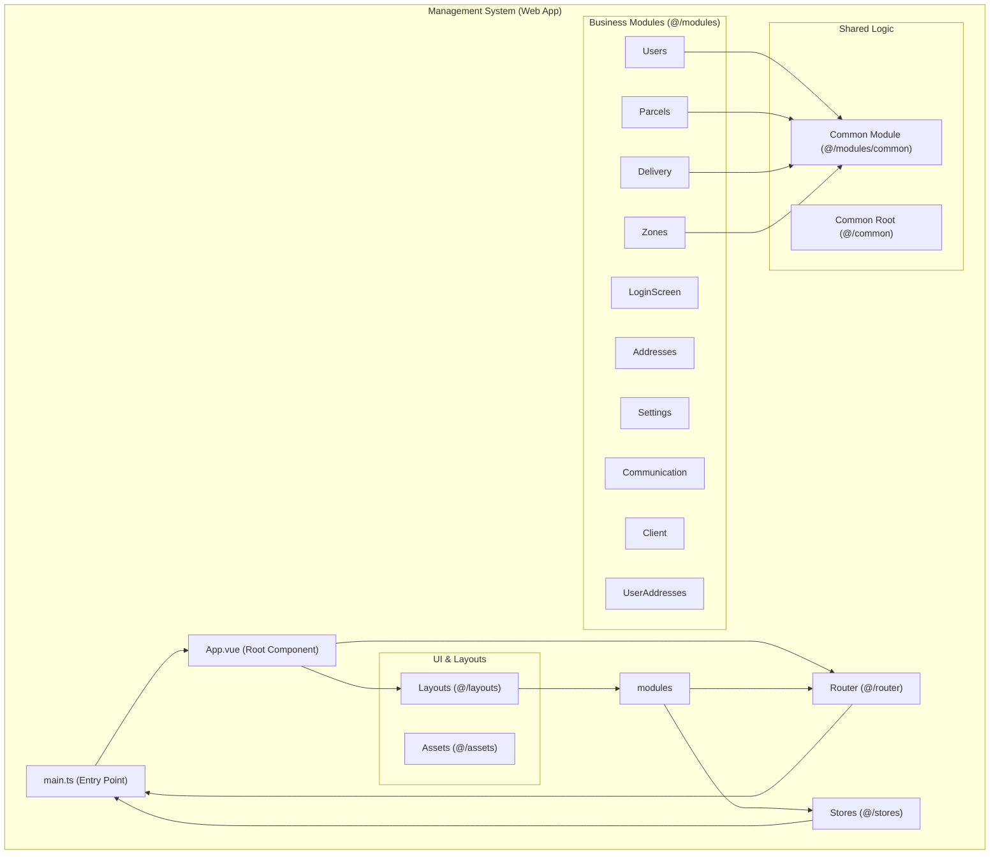

### 1.3. Component Diagram: Management System (Web App)

This diagram shows the internal structure of the `ManagementSystem` Vue.js application.

```mermaid
graph TD
    subgraph "Management System (Web App)"
        direction LR
        main["main.ts (Entry Point)"]
        app_vue["App.vue (Root Component)"]
        router["Router (@/router)"]
        stores["Stores (@/stores)"]

        subgraph "UI & Layouts"
            layouts["Layouts (@/layouts)"]
            assets["Assets (@/assets)"]
        end

        subgraph "Business Modules (@/modules)"
            login["LoginScreen"]
            users["Users"]
            parcels["Parcels"]
            delivery["Delivery"]
            zones["Zones"]
            addresses["Addresses"]
            settings["Settings"]
            communication["Communication"]
            client["Client"]
            user_addresses["UserAddresses"]
        end

        subgraph "Shared Logic"
            common_modules["Common Module (@/modules/common)"]
            common_root["Common Root (@/common)"]
        end

        main --> app_vue
        app_vue --> router
        app_vue --> layouts
        layouts --> modules
        modules --> stores
        modules --> router
        stores --> main
        router --> main

        users --> common_modules
        parcels --> common_modules
        delivery --> common_modules
        zones --> common_modules
    end
```
