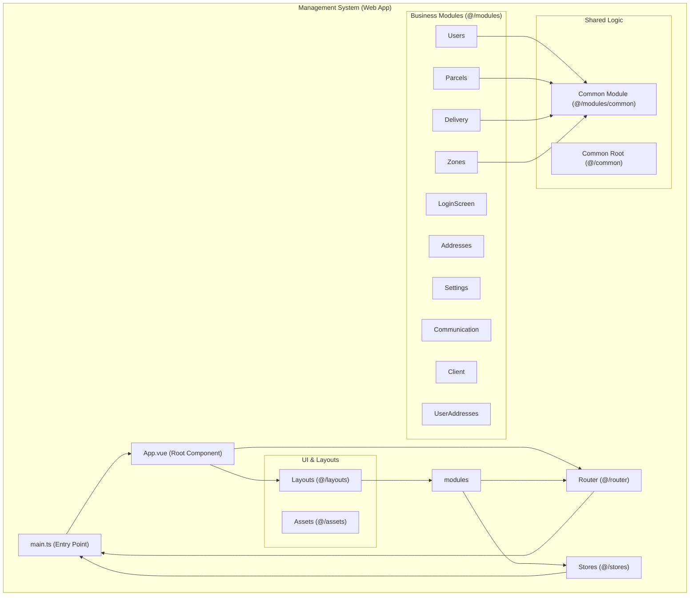
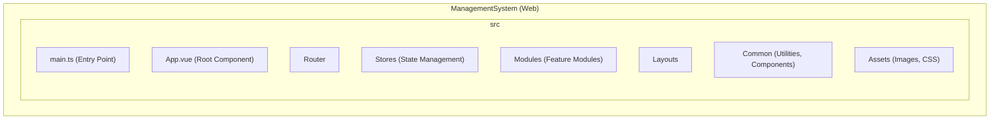

# Management System (Web Application)

This document describes the web-based Management System application used by administrators and clients to manage parcel delivery operations.

## Table of Contents

- [Overview](#overview)
- [Architecture](#architecture)
- [Component Structure](#component-structure)
- [Package Structure](#package-structure)
- [Key Components](#key-components)
- [Functionality](#functionality)
- [Technical Details](#technical-details)
- [Related Documentation](#related-documentation)

## Overview

The Management System is a web-based application built using Vue.js framework with Nuxt UI components. This application serves two primary user roles: system administrators who manage operations, and clients who create and track their parcels.

## Architecture

The application follows a modular architecture where functionality is organized into distinct modules. The entry point initializes the Vue application and sets up routing and state management. The router handles navigation between different sections of the application, while stores manage application-wide state.

## Component Structure

The following diagram illustrates the internal structure of the Management System application:

## Package Structure

The application is organized into the following high-level packages:

## Key Components

**User Interface Layer**: The application uses Vue components organized into layouts and modules. Layouts provide consistent page structure, while modules contain specific business functionality.

**Business Modules**: The application includes modules for user management, parcel operations, delivery session oversight, zone configuration, address management, system settings, real-time communication, and client-specific features.

**Shared Components**: Common functionality is extracted into shared modules to avoid code duplication. This includes utilities, common data models, and reusable UI components.

**State Management**: Application state is managed through centralized stores, allowing different parts of the application to access and update shared data consistently.

## Functionality

**For Administrators**: The system provides interfaces for managing users and their roles, creating and tracking parcels, overseeing delivery sessions, configuring delivery zones, managing system settings, and handling real-time communication with delivery personnel.

**For Clients**: The system allows clients to create parcels, manage their addresses, track parcel delivery status, communicate with delivery personnel through real-time chat, and confirm receipt of delivered parcels.

For detailed feature documentation, see:
- [Admin Features](../features/admin/README.md)
- [Client Features](../features/client/README.md)

## Technical Details

The application communicates with backend services through an API Gateway, which handles authentication and routes requests to appropriate microservices. Real-time updates are received through WebSocket connections to the Communication Service, ensuring that users see status changes immediately without manual page refreshes.

The application uses modern web technologies including Vue 3 composition API, TypeScript for type safety, and responsive design principles to ensure usability across different device sizes.

## Related Documentation

- [API Gateway](../2_BACKEND/1_API_GATEWAY.md) - Backend entry point documentation
- [Communication Service](../2_BACKEND/2_COMMUNICATION_SERVICE.md) - Real-time messaging service
- [Parcel Service](../2_BACKEND/3_PARCEL_SERVICE.md) - Parcel management service
- [Session Service](../2_BACKEND/4_SESSION_SERVICE.md) - Delivery session service
- [API Documentation](../3_APIS_AND_FUNCTIONS/README.md) - Complete API reference
