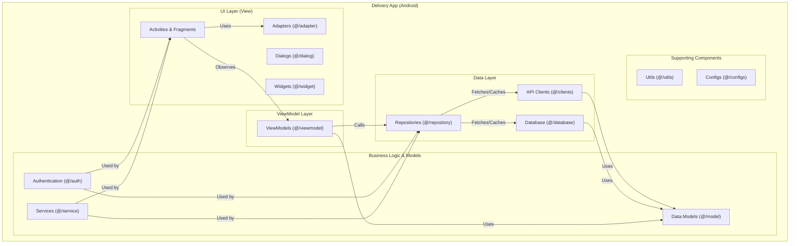

# Delivery App (Android Application)

This document describes the Android mobile application used by delivery personnel to manage delivery operations.

## Table of Contents

- [Delivery App (Android Application)](#delivery-app-android-application)
  - [Table of Contents](#table-of-contents)
  - [Overview](#overview)
  - [Architecture](#architecture)
  - [Component Structure](#component-structure)
  - [Package Structure](#package-structure)
  - [Key Components](#key-components)
  - [Functionality](#functionality)
  - [Technical Details](#technical-details)
  - [Related Documentation](#related-documentation)

## Overview

The Delivery App is an Android mobile application designed for delivery personnel to manage their delivery operations. The application follows the Model-View-ViewModel (MVVM) architecture pattern, which separates user interface logic from business logic and data management.

## Architecture

The MVVM pattern organizes the application into three main layers:

**View Layer**: Consists of Activities and Fragments that display the user interface. Adapters handle list displays, dialogs provide user interactions, and widgets offer reusable UI components.

**ViewModel Layer**: Contains ViewModels that manage UI-related data and handle user interactions. ViewModels observe data changes and update the view accordingly, while remaining independent of Android-specific components.

**Data Layer**: Includes repositories that coordinate data access, API clients that communicate with backend services, and a local database for offline data storage.

## Component Structure

The following diagram illustrates the internal structure of the Delivery App:



## Package Structure

The application is organized into the following high-level packages:

```mermaid
packageDiagram
    package "DeliveryApp" {
        package "app" {
            [Source Code (src)]
            [Build Configuration (build.gradle)]
        }
    }
```

## Key Components

**User Interface**: Activities and Fragments present information to delivery personnel. The main screens include task lists, session management, parcel scanning, map navigation, and chat interfaces.

**Business Logic**: Services handle core functionality such as authentication, data synchronization, and business rule enforcement. Data models represent the structure of information used throughout the application.

**Data Management**: Repositories abstract data sources, allowing the application to switch between network and local storage seamlessly. API clients use Retrofit library to communicate with backend services via REST APIs.

**Authentication**: The application integrates with Keycloak for user authentication, ensuring secure access to backend services.

## Functionality

**Parcel Management**: Delivery personnel can scan QR codes to accept parcels into their delivery sessions, view assigned tasks, and update delivery status.

**Session Management**: The application allows creating, starting, and completing delivery sessions. Each session can contain multiple parcel assignments.

**Navigation**: Integration with routing services provides turn-by-turn directions and route optimization to help delivery personnel plan efficient delivery routes.

**Communication**: Real-time chat functionality enables communication with administrators and clients. Interactive proposals allow requesting delivery postponements or handling other coordination needs.

**Status Updates**: The application tracks and updates parcel delivery status, capturing delivery proof such as photos and route metrics when available.

For detailed feature documentation, see [Shipper Features](../../features/shipper/README.md).

## Technical Details

The application uses Android Jetpack libraries including Room for local database storage, Retrofit for network communication, and WebSocket support for real-time messaging. The application is designed to work offline when network connectivity is unavailable, queuing updates for synchronization when connection is restored.

## Related Documentation

- [API Gateway](../2_BACKEND/1_API_GATEWAY.md) - Backend entry point documentation
- [Session Service](../2_BACKEND/4_SESSION_SERVICE.md) - Delivery session service
- [Communication Service](../2_BACKEND/2_COMMUNICATION_SERVICE.md) - Real-time messaging service
- [Zone Service](../2_BACKEND/7_ZONE_SERVICE.md) - Route calculation service
- [API Documentation](../3_APIS_AND_FUNCTIONS/README.md) - Complete API reference
