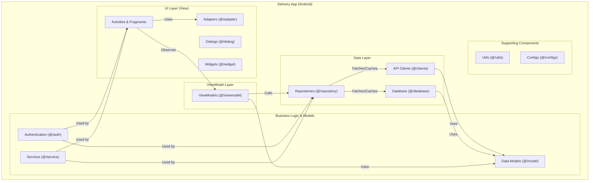

### 1.4. Component Diagram: Delivery App (Android)

This diagram shows the internal structure of the `DeliveryApp` Android application, which follows an MVVM architecture.

```mermaid
graph TD
    subgraph "Delivery App (Android)"
        direction LR

        subgraph "UI Layer (View)"
            direction TB
            activities["Activities & Fragments"]
            adapters["Adapters (@/adapter)"]
            dialogs["Dialogs (@/dialog)"]
            widgets["Widgets (@/widget)"]
        end

        subgraph "ViewModel Layer"
            direction TB
            viewmodels["ViewModels (@/viewmodel)"]
        end

        subgraph "Data Layer"
            direction TB
            repositories["Repositories (@/repository)"]
            api_clients["API Clients (@/clients)"]
            database["Database (@/database)"]
        end

        subgraph "Business Logic & Models"
            direction TB
            services["Services (@/service)"]
            auth["Authentication (@/auth)"]
            models["Data Models (@/model)"]
        end

        subgraph "Supporting Components"
            direction TB
            utils["Utils (@/utils)"]
            configs["Configs (@/configs)"]
        end

        activities -- "Observes" --> viewmodels
        viewmodels -- "Calls" --> repositories
        repositories -- "Fetches/Caches" --> api_clients
        repositories -- "Fetches/Caches" --> database
        
        api_clients -- "Uses" --> models
        database -- "Uses" --> models
        viewmodels -- "Uses" --> models
        activities -- "Uses" --> adapters

        auth -- "Used by" --> activities
        auth -- "Used by" --> repositories

        services -- "Used by" --> repositories
        services -- "Used by" --> activities
    end
```
