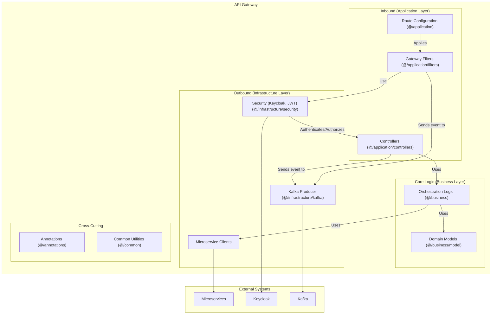

# API Gateway

This document describes the API Gateway service, which serves as the single entry point for all client requests to the Delivery System.

## Table of Contents

- [Overview](#overview)
- [Architecture](#architecture)
- [Component Structure](#component-structure)
- [Package Structure](#package-structure)
- [Key Components](#key-components)
- [Functionality](#functionality)
- [Technical Details](#technical-details)
- [Related Documentation](#related-documentation)

## Overview

The API Gateway serves as the single entry point for all client requests to the Delivery System. It handles authentication, request routing, and provides a unified interface to the various backend microservices.

## Architecture

The gateway follows a hexagonal architecture pattern, separating inbound request handling from outbound service communication. This design allows the gateway to remain independent of specific client or service implementations.

## Component Structure

The following diagram illustrates the internal structure of the API Gateway:



## Package Structure

The gateway service is organized into the following packages:

```mermaid
packageDiagram
    package "API Gateway" {
        [Nginx Configuration (nginx.conf)]
        [Spring Boot Application (src, pom.xml)]
        [Dockerfile]
    }
```

## Key Components

**Request Handling**: Controllers receive incoming requests and apply routing rules to determine which backend service should process each request. Gateway filters perform preprocessing tasks such as authentication validation and request transformation.

**Security**: The gateway integrates with Keycloak for user authentication and authorization. It validates JSON Web Tokens (JWT) and extracts user identity information to forward to backend services.

**Service Communication**: The gateway uses HTTP clients to forward requests to appropriate microservices. It can also perform orchestration when a single client request requires coordination between multiple services.

**Event Publishing**: The gateway can publish events to Kafka when certain actions occur, enabling event-driven communication patterns across the system.

## Functionality

**Authentication**: All requests are authenticated through Keycloak before being forwarded to backend services. The gateway validates tokens and ensures users have appropriate permissions.

**Routing**: The gateway routes requests to the correct microservice based on URL patterns and request types. This centralizes routing logic and simplifies client applications.

**Request Transformation**: The gateway can modify requests before forwarding them, such as adding user identity headers or transforming request formats.

**Response Aggregation**: For complex operations requiring data from multiple services, the gateway can aggregate responses before returning to clients.

## Technical Details

The gateway is built using Spring Boot and Spring Cloud Gateway. It maintains route configurations that map URL patterns to backend services. Security filters ensure that only authenticated and authorized requests reach backend services. The gateway runs on port 21500 and serves as the primary interface for both web and mobile applications.

For detailed API endpoint documentation, see [API Gateway API Documentation](../3_APIS_AND_FUNCTIONS/apis/api-gateway/README.md).

## Related Documentation

- [System Overview](../0_SYSTEM_OVERVIEW.md) - High-level system architecture
- [System Analysis](../SYSTEM_ANALYSIS.md) - System analysis and technical assessment
- [User Service](6_USER_SERVICE.md) - User management service
- [Parcel Service](3_PARCEL_SERVICE.md) - Parcel management service
- [Session Service](4_SESSION_SERVICE.md) - Delivery session service
- [Communication Service](2_COMMUNICATION_SERVICE.md) - Real-time messaging service
- [Settings Service](5_SETTINGS_SERVICE.md) - Configuration management service
- [Zone Service](7_ZONE_SERVICE.md) - Geographic zones and routing service
