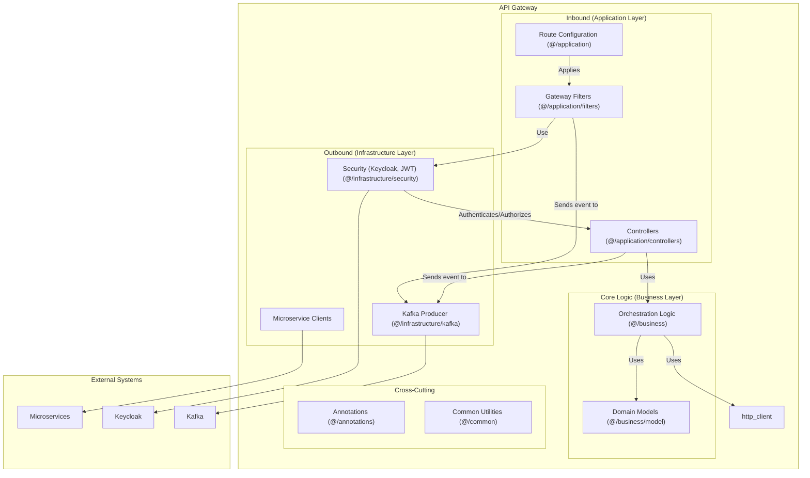

### 1.5. Component Diagram: API Gateway

This diagram shows the internal structure of the `api-gateway` service. It acts as a reverse proxy, handling security, routing, and some orchestration. It appears to follow a hexagonal architecture.

