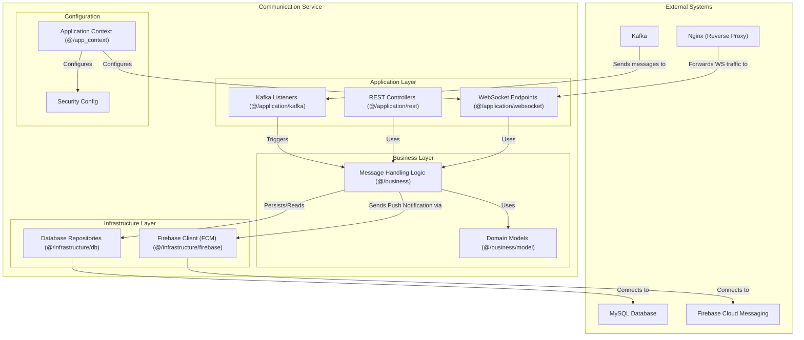

### 1.6. Component Diagram: Communication Service

This diagram shows the internal structure of the `communication_service`. It handles real-time communication via WebSockets, sends push notifications, and persists messages.

