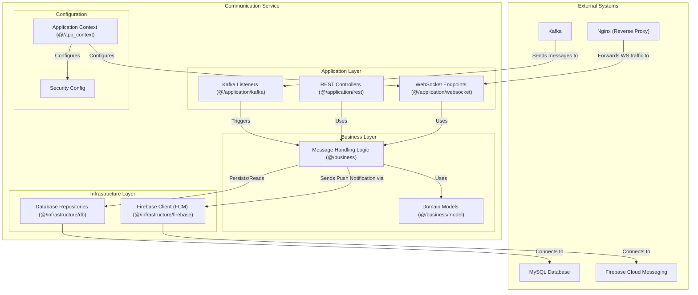

# Communication Service

This document describes the Communication Service, which provides real-time messaging capabilities for the Delivery System.

## Table of Contents

- [Overview](#overview)
- [Architecture](#architecture)
- [Component Structure](#component-structure)
- [Package Structure](#package-structure)
- [Key Components](#key-components)
- [Functionality](#functionality)
- [Technical Details](#technical-details)
- [Related Documentation](#related-documentation)

## Overview

The Communication Service provides real-time messaging capabilities for the Delivery System. It enables instant communication between administrators, delivery personnel, and clients through WebSocket connections and also handles push notifications for mobile devices.

## Architecture

The service is organized into layers that separate request handling from business logic and data persistence. WebSocket endpoints maintain persistent connections with clients, while REST controllers handle HTTP-based operations such as message history retrieval.

## Component Structure

The following diagram illustrates the internal structure of the Communication Service:



## Package Structure

The service is organized into the following packages:

```mermaid
packageDiagram
    package "Communication Service" {
        [Spring Boot Application (src, pom.xml)]
        [Dockerfile]
    }
```

## Key Components

**Real-time Communication**: WebSocket endpoints maintain persistent connections with clients, allowing bidirectional communication without the overhead of repeated HTTP requests. This enables instant message delivery and status updates.

**Message Handling**: Business logic processes incoming messages, validates content, stores messages in the database, and forwards messages to appropriate recipients through WebSocket connections.

**Push Notifications**: The service integrates with Firebase Cloud Messaging (FCM) to send push notifications to mobile devices when users are not actively using the application.

**Event Integration**: Kafka listeners monitor system events and can trigger notifications or messages when relevant events occur, such as parcel status changes or delivery completions.

## Functionality

**Real-time Messaging**: Users can send and receive messages instantly through WebSocket connections. Messages are stored in the database for history retrieval.

**Interactive Proposals**: The service supports interactive proposals that allow users to request actions (such as postponing a delivery) and receive responses. This enables structured communication beyond simple text messages.

**Notification Management**: The service manages notification delivery, ensuring users receive important updates even when not actively using the application.

**Conversation Management**: The service maintains conversation threads between users, organizing messages by context such as specific parcels or delivery sessions.

## Technical Details

The service uses Spring Boot with WebSocket support. Messages are persisted in a MySQL database, and the service integrates with Kafka for event-driven notifications. WebSocket connections are managed through Nginx as a reverse proxy, which handles connection upgrades and load balancing. The service supports both WebSocket and HTTP-based APIs for maximum compatibility.

For detailed API endpoint documentation, see [Communication Service API Documentation](../../3_APIS_AND_FUNCTIONS/apis/communication-service/README.md).

## Related Documentation

- [System Overview](../0_SYSTEM_OVERVIEW.md) - High-level system architecture
- [API Gateway](1_API_GATEWAY.md) - Entry point and routing layer
- [Session Service](4_SESSION_SERVICE.md) - Delivery session service
- [Parcel Service](3_PARCEL_SERVICE.md) - Parcel management service
- [Features Documentation](../../features/README.md) - Feature workflows with communication examples
