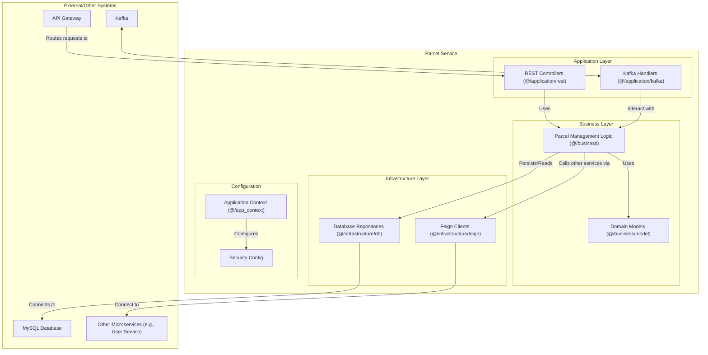
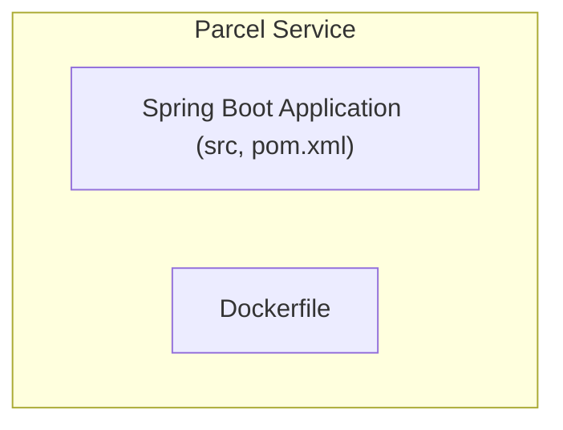
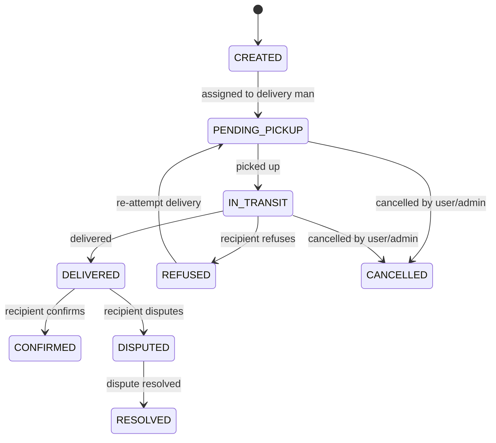

# Parcel Service

This document describes the Parcel Service, which manages the complete lifecycle of parcels from creation through final delivery confirmation.

## Table of Contents

- [Overview](#overview)
- [Architecture](#architecture)
- [Component Structure](#component-structure)
- [Package Structure](#package-structure)
- [Key Components](#key-components)
- [Functionality](#functionality)
- [Technical Details](#technical-details)
- [Related Documentation](#related-documentation)

## Overview

The Parcel Service manages the complete lifecycle of parcels from creation through final delivery confirmation. It coordinates with other services to maintain accurate parcel information and status tracking.

## Architecture

The service follows a layered architecture with REST controllers handling HTTP requests, business logic processing parcel operations, and infrastructure components managing data persistence and inter-service communication.

## Component Structure

The following diagram illustrates the internal structure of the Parcel Service:

## Package Structure

The service is organized into the following packages:

## Key Components

**Parcel Management**: Business logic handles parcel creation, status updates, and lifecycle transitions. The service validates parcel data and enforces business rules such as status transition constraints.

**Status Tracking**: The service tracks parcel status through various stages including creation, assignment to delivery sessions, in-transit, delivery completion, and final confirmation. The following diagram illustrates the parcel state lifecycle:

**Cross-Service Coordination**: The service communicates with other services using Feign clients, a declarative HTTP client library. It queries User Service for customer information, Zone Service for routing data, and Session Service for delivery assignments.

**Event Publishing**: When parcel status changes, the service publishes events to Kafka. Other services subscribe to these events to update their own data and notify users.

## Functionality

**Parcel Creation**: Administrators and clients can create parcels with sender and receiver information. The service validates addresses and determines appropriate delivery zones.

**Status Management**: The service manages parcel status transitions, ensuring valid state changes and maintaining audit trails of status history.

**Confirmation Workflows**: The service supports confirmation workflows where administrators or clients can confirm receipt after delivery personnel mark parcels as delivered.

**Query and Filtering**: The service provides endpoints for querying parcels with various filters, supporting both simple queries and advanced filtering through version 2 API endpoints.

For detailed parcel workflows, see [Parcel Workflows Documentation](../../3_APIS_AND_FUNCTIONS/diagrams/parcel_workflows.md).

## Technical Details

The service is built using Spring Boot and uses JPA (Java Persistence API) for database operations. It integrates with Kafka for event publishing and uses Feign for inter-service communication. The service maintains its own database for parcel data while coordinating with other services for related information. Database migrations are managed using Flyway to ensure schema consistency.

For detailed API endpoint documentation, see [Parcel Service API Documentation](../../3_APIS_AND_FUNCTIONS/apis/parcel-service/README.md).

## Related Documentation

- [System Overview](../0_SYSTEM_OVERVIEW.md) - High-level system architecture
- [API Gateway](1_API_GATEWAY.md) - Entry point and routing layer
- [Session Service](4_SESSION_SERVICE.md) - Delivery session service
- [User Service](6_USER_SERVICE.md) - User management service
- [Zone Service](7_ZONE_SERVICE.md) - Geographic zones and routing service
- [Features Documentation](../../features/README.md) - Feature workflows with parcel operations
