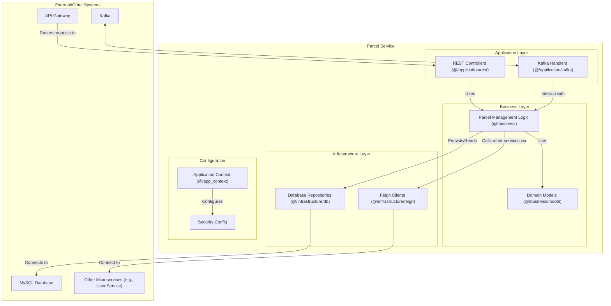

### 1.7. Component Diagram: Parcel Service

This diagram shows the internal structure of the `parcel-service`. It is responsible for managing parcel data and communicates with other services.

```mermaid
graph TD
    subgraph "Parcel Service"
        direction LR

        subgraph "Application Layer"
            direction TB
            rest_controllers["REST Controllers (@/application/rest)"]
            kafka_handlers["Kafka Handlers (@/application/kafka)"]
        end

        subgraph "Business Layer"
            direction TB
            parcel_logic["Parcel Management Logic (@/business)"]
            domain_models["Domain Models (@/business/model)"]
        end

        subgraph "Infrastructure Layer"
            direction TB
            db_repositories["Database Repositories (@/infrastructure/db)"]
            feign_clients["Feign Clients (@/infrastructure/feign)"]
        end

        subgraph "Configuration"
            direction TB
            app_context["Application Context (@/app_context)"]
            security_config["Security Config"]
        end

        %% Connections
        rest_controllers -- "Uses" --> parcel_logic
        kafka_handlers -- "Interact with" --> parcel_logic

        parcel_logic -- "Persists/Reads" --> db_repositories
        parcel_logic -- "Calls other services via" --> feign_clients
        parcel_logic -- "Uses" --> domain_models

        app_context -- "Configures" --> security_config
    end

    subgraph "External/Other Systems"
        api_gateway["API Gateway"]
        kafka["Kafka"]
        database["MySQL Database"]
        other_services["Other Microservices (e.g., User Service)"]
    end

    api_gateway -- "Routes requests to" --> rest_controllers
    kafka <--> kafka_handlers
    db_repositories -- "Connects to" --> database
    feign_clients -- "Connect to" --> other_services
```
