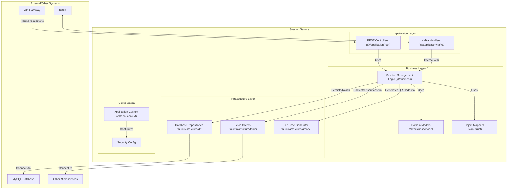

### 1.8. Component Diagram: Session Service

This diagram shows the internal structure of the `session-service`. It manages delivery sessions, including features like QR code generation.

```mermaid
graph TD
    subgraph "Session Service"
        direction LR

        subgraph "Application Layer"
            direction TB
            rest_controllers["REST Controllers (@/application/rest)"]
            kafka_handlers["Kafka Handlers (@/application/kafka)"]
        end

        subgraph "Business Layer"
            direction TB
            session_logic["Session Management Logic (@/business)"]
            domain_models["Domain Models (@/business/model)"]
            mappers["Object Mappers (MapStruct)"]
        end

        subgraph "Infrastructure Layer"
            direction TB
            db_repositories["Database Repositories (@/infrastructure/db)"]
            feign_clients["Feign Clients (@/infrastructure/feign)"]
            qr_code_generator["QR Code Generator (@/infrastructure/qrcode)"]
        end

        subgraph "Configuration"
            direction TB
            app_context["Application Context (@/app_context)"]
            security_config["Security Config"]
        end

        %% Connections
        rest_controllers -- "Uses" --> session_logic
        kafka_handlers -- "Interact with" --> session_logic

        session_logic -- "Uses" --> mappers
        session_logic -- "Persists/Reads" --> db_repositories
        session_logic -- "Calls other services via" --> feign_clients
        session_logic -- "Generates QR Code via" --> qr_code_generator
        session_logic -- "Uses" --> domain_models

        app_context -- "Configures" --> security_config
    end

    subgraph "External/Other Systems"
        api_gateway["API Gateway"]
        kafka["Kafka"]
        database["MySQL Database"]
        other_services["Other Microservices"]
    end

    api_gateway -- "Routes requests to" --> rest_controllers
    kafka <--> kafka_handlers
    db_repositories -- "Connects to" --> database
    feign_clients -- "Connect to" --> other_services
```
