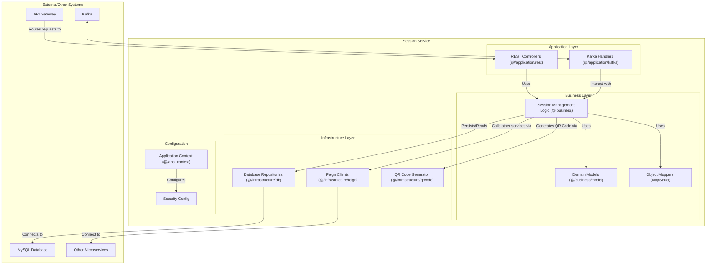
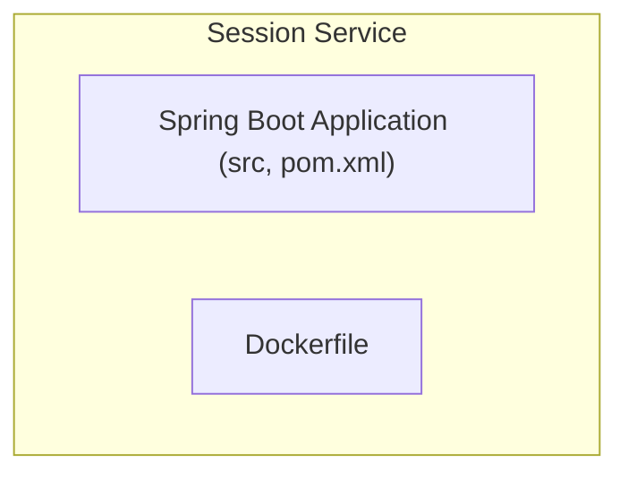
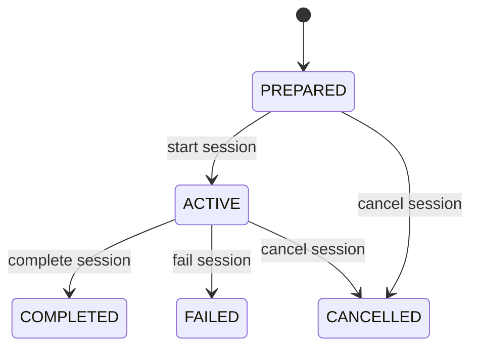

# Session Service

This document describes the Session Service, which coordinates delivery sessions and parcel assignments for delivery personnel.

## Table of Contents

- [Overview](#overview)
- [Architecture](#architecture)
- [Component Structure](#component-structure)
- [Package Structure](#package-structure)
- [Key Components](#key-components)
- [Functionality](#functionality)
- [Technical Details](#technical-details)
- [Related Documentation](#related-documentation)

## Overview

The Session Service coordinates delivery sessions, which are collections of parcel assignments given to delivery personnel. It manages session creation, assignment tracking, and status updates throughout the delivery process.

## Architecture

The service uses a layered architecture with REST controllers for API endpoints, business logic for session management, and infrastructure components for data persistence and QR code generation.

## Component Structure

The following diagram illustrates the internal structure of the Session Service:

## Package Structure

The service is organized into the following packages:

## Key Components

**Session Management**: Business logic handles session creation, starting, completion, and failure scenarios. Sessions can be created by administrators or by delivery personnel themselves. The following diagram illustrates the session state lifecycle:

**Assignment Tracking**: The service tracks individual parcel assignments within sessions, maintaining status for each assignment and coordinating with the Parcel Service to update parcel status accordingly.

**QR Code Generation**: The service generates QR codes for parcels, which delivery personnel can scan using the mobile application to quickly accept parcels into their sessions.

**Event Publishing**: Status changes for sessions and assignments are published to Kafka, allowing other services to react to delivery progress updates.

## Functionality

**Session Lifecycle**: The service manages sessions through their complete lifecycle from creation through completion or failure. Sessions can be prepared in advance or created on-demand when delivery personnel accept their first parcel.

**Assignment Management**: Parcels are assigned to sessions, and the service tracks the status of each assignment. Delivery personnel can update assignment status as they progress through their delivery route.

**Status Coordination**: When assignments are completed or fail, the service coordinates with the Parcel Service to update parcel status accordingly, ensuring data consistency across services.

**Query Capabilities**: The service provides endpoints for querying sessions and assignments, supporting filters for active sessions, historical sessions, and assignments by delivery personnel.

For detailed session workflows, see [Session Workflows Documentation](../3_APIS_AND_FUNCTIONS/diagrams/session_workflows.md).

## Technical Details

The service is built using Spring Boot with JPA for database operations. It uses MapStruct for object mapping between different data representations. QR code generation is handled through a dedicated infrastructure component. The service publishes events to Kafka when sessions or assignments change status, enabling event-driven updates across the system. Database migrations are managed using Flyway.

For detailed API endpoint documentation, see [Session Service API Documentation](../3_APIS_AND_FUNCTIONS/apis/session-service/README.md).

## Related Documentation

- [System Overview](../0_SYSTEM_OVERVIEW.md) - High-level system architecture
- [API Gateway](1_API_GATEWAY.md) - Entry point and routing layer
- [Parcel Service](3_PARCEL_SERVICE.md) - Parcel management service
- [Communication Service](2_COMMUNICATION_SERVICE.md) - Real-time messaging service
- [Features Documentation](../features/README.md) - Feature workflows with session operations
