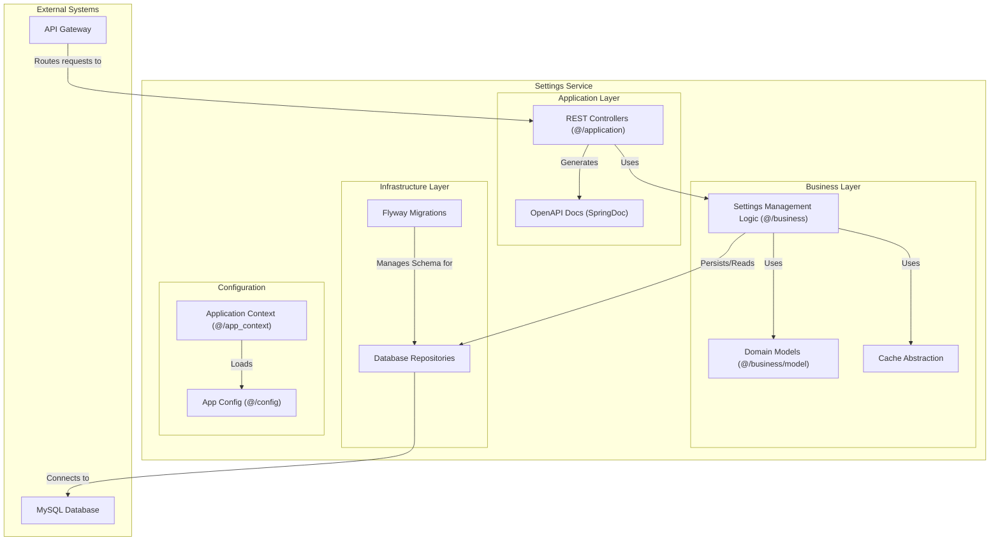

### 1.9. Component Diagram: Settings Service

This diagram shows the internal structure of the `Settings_service`. It is a CRUD service for managing application settings, with support for caching and database migrations.

