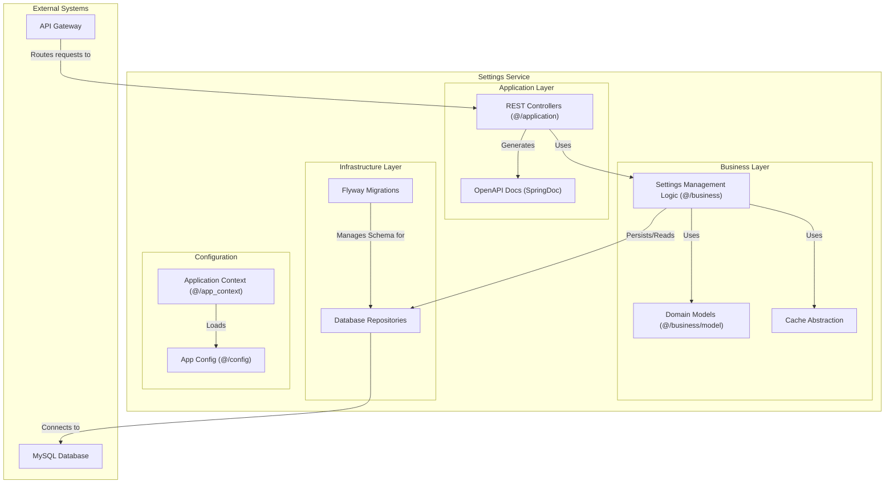
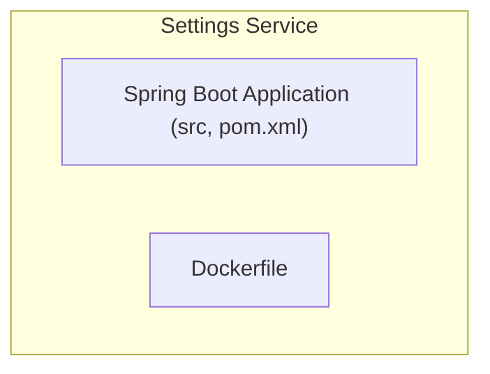

# Settings Service

This document describes the Settings Service, which provides centralized configuration management for the Delivery System.

## Table of Contents

- [Overview](#overview)
- [Architecture](#architecture)
- [Component Structure](#component-structure)
- [Package Structure](#package-structure)
- [Key Components](#key-components)
- [Functionality](#functionality)
- [Technical Details](#technical-details)
- [Related Documentation](#related-documentation)

## Overview

The Settings Service provides centralized configuration management for the Delivery System. It allows administrators to update system settings without modifying individual service configurations or restarting services.

## Architecture

The service follows a simple CRUD (Create, Read, Update, Delete) pattern with REST controllers handling API requests and business logic managing setting storage and retrieval.

## Component Structure

The following diagram illustrates the internal structure of the Settings Service:

## Package Structure

The service is organized into the following packages:

## Key Components

**Settings Management**: Business logic handles setting creation, retrieval, updates, and deletion. Settings are organized into groups and identified by keys within those groups.

**Caching**: The service uses caching to improve performance for frequently accessed settings, reducing database load and response times.

**Database Migrations**: Schema changes are managed through Flyway migrations, ensuring consistent database structure across deployments.

**API Documentation**: The service generates OpenAPI documentation automatically, providing clear API specifications for integration.

## Functionality

**Setting Storage**: Settings are stored in a database with support for grouping and hierarchical organization. This allows logical organization of related settings.

**Bulk Operations**: The service supports bulk updates, allowing administrators to update multiple settings in a single operation for efficiency.

**Value Retrieval**: Settings can be retrieved individually by group and key, or as complete groups. This flexibility supports different access patterns.

**Health Monitoring**: The service provides health check endpoints that can be used by monitoring systems to verify service availability.

## Technical Details

The service is built using Spring Boot with JPA for database operations. Caching is implemented using Spring Cache abstraction, which can be configured to use various caching providers. The service uses SpringDoc to automatically generate OpenAPI documentation from code annotations. Database migrations are managed using Flyway to ensure schema consistency across environments.

For detailed API endpoint documentation, see [Settings Service API Documentation](../../3_APIS_AND_FUNCTIONS/apis/settings-service/README.md).

## Related Documentation

- [System Overview](../0_SYSTEM_OVERVIEW.md) - High-level system architecture
- [API Gateway](1_API_GATEWAY.md) - Entry point and routing layer
- [System Analysis](../SYSTEM_ANALYSIS.md) - System analysis and technical assessment
