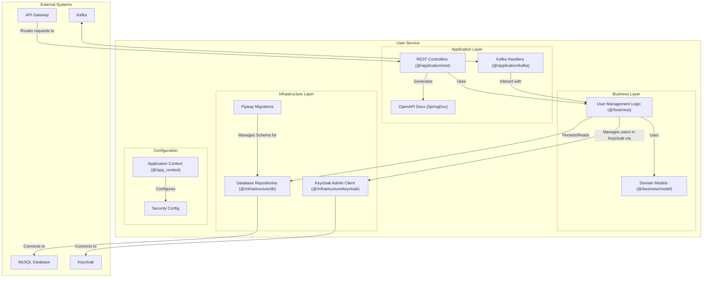
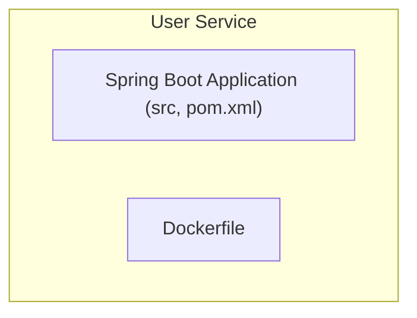

# User Service

This document describes the User Service, which manages user accounts, delivery personnel profiles, and user addresses.

## Table of Contents

- [Overview](#overview)
- [Architecture](#architecture)
- [Component Structure](#component-structure)
- [Package Structure](#package-structure)
- [Key Components](#key-components)
- [Functionality](#functionality)
- [Technical Details](#technical-details)
- [Related Documentation](#related-documentation)

## Overview

The User Service manages user accounts, delivery personnel profiles, and user addresses. It synchronizes user data with Keycloak, the identity and access management system, ensuring consistent user information across authentication and application data.

## Architecture

The service uses a layered architecture with REST controllers handling API requests, business logic managing user operations, and infrastructure components for database persistence and Keycloak integration.

## Component Structure

The following diagram illustrates the internal structure of the User Service:

## Package Structure

The service is organized into the following packages:

## Key Components

**User Management**: Business logic handles user creation, updates, and retrieval. The service maintains user profiles including basic information and role assignments.

**Keycloak Synchronization**: The service integrates with Keycloak to create and update user accounts in the identity provider. This ensures that authentication and application user data remain synchronized.

**Address Management**: The service manages user addresses, supporting multiple addresses per user with the ability to designate primary addresses for delivery purposes.

**Delivery Personnel Profiles**: The service maintains specialized profiles for delivery personnel, including information relevant to delivery operations.

**Event Handling**: The service listens to Kafka events and can react to system-wide changes that affect user data.

## Functionality

**User Account Management**: Administrators can create, update, and manage user accounts. The service handles both regular users and delivery personnel with appropriate profile information.

**Address Management**: Users can maintain multiple addresses, set primary addresses, and update address information. This supports flexible delivery address management.

**Keycloak Integration**: When users are created or updated, the service synchronizes changes with Keycloak to ensure authentication systems have current user information.

**User Queries**: The service provides endpoints for querying users by various criteria, supporting both simple lookups and advanced filtering through version 2 API endpoints.

## Technical Details

The service is built using Spring Boot with JPA for database operations. It uses the Keycloak Admin Client to interact with the identity provider. Database migrations are managed using Flyway. The service publishes and subscribes to Kafka events for user-related operations. OpenAPI documentation is automatically generated using SpringDoc.

For detailed API endpoint documentation, see [User Service API Documentation](../../3_APIS_AND_FUNCTIONS/apis/user-service/README.md).

## Related Documentation

- [System Overview](../0_SYSTEM_OVERVIEW.md) - High-level system architecture
- [API Gateway](1_API_GATEWAY.md) - Entry point and routing layer
- [Parcel Service](3_PARCEL_SERVICE.md) - Parcel management service
- [Session Service](4_SESSION_SERVICE.md) - Delivery session service
- [Features Documentation](../../features/README.md) - Feature workflows with user operations
