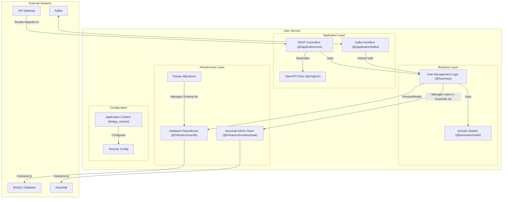

### 1.10. Component Diagram: User Service

This diagram shows the internal structure of the `User_service`. It is responsible for all user-related operations, including management in both its local database and the Keycloak identity provider.

