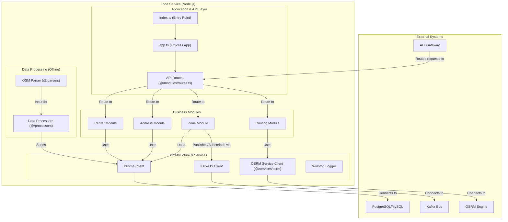
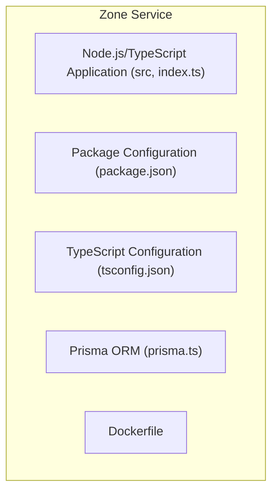
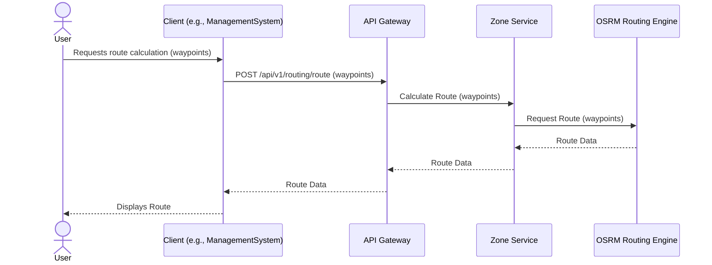

# Zone Service

This document describes the Zone Service, which handles geographic data, delivery zone definitions, and route calculation.

## Table of Contents

- [Overview](#overview)
- [Architecture](#architecture)
- [Component Structure](#component-structure)
- [Package Structure](#package-structure)
- [Key Components](#key-components)
- [Functionality](#functionality)
- [Technical Details](#technical-details)
- [Related Documentation](#related-documentation)

## Overview

The Zone Service handles geographic data, delivery zone definitions, and route calculation for the Delivery System. It is built using Node.js and integrates with OSRM (Open Source Routing Machine) for optimal route calculation.

## Architecture

The service is built with Node.js and Express framework, using TypeScript for type safety. It organizes functionality into modules for zones, addresses, routing, and delivery centers.

## Component Structure

The following diagram illustrates the internal structure of the Zone Service:

## Package Structure

The service is organized into the following packages:

## Key Components

**Zone Management**: The service manages delivery zones, which are geographic areas used to organize delivery operations. Zones help optimize delivery routes and assign deliveries to appropriate personnel.

**Address Processing**: The service processes and validates addresses, converting them to geographic coordinates and associating them with appropriate zones.

**Route Calculation**: The service integrates with OSRM to calculate optimal delivery routes. It can compute routes between multiple points, optimizing for distance, time, or other factors. The following diagram illustrates the route calculation workflow:

For more detailed routing workflows, see [Routing Workflows Documentation](../../3_APIS_AND_FUNCTIONS/diagrams/routing_workflows.md).

**Data Processing**: The service includes offline data processing capabilities for importing geographic data from OpenStreetMap (OSM) format and processing it for use in the system.

## Functionality

**Zone Operations**: Administrators can create, update, and manage delivery zones. The service validates zone boundaries and associates addresses with appropriate zones.

**Route Optimization**: The service calculates optimal routes for delivery personnel, considering multiple delivery locations and optimizing for efficiency.

**Address Validation**: The service validates addresses and converts them to coordinates, ensuring accurate delivery location information.

**Geographic Queries**: The service provides endpoints for querying zones, addresses, and routing information based on geographic criteria.

## Technical Details

The service uses Prisma as an Object-Relational Mapping (ORM) tool for database operations, supporting both PostgreSQL and MySQL databases. It uses KafkaJS for event publishing and subscription. The service integrates with external OSRM engines for route calculation. Winston is used for logging. The service can process OpenStreetMap data offline to populate geographic information for the system.

For detailed API endpoint documentation, see [Zone Service API Documentation](../../3_APIS_AND_FUNCTIONS/apis/zone-service/README.md).

## Related Documentation

- [System Overview](../0_SYSTEM_OVERVIEW.md) - High-level system architecture
- [API Gateway](1_API_GATEWAY.md) - Entry point and routing layer
- [Session Service](4_SESSION_SERVICE.md) - Delivery session service
- [Parcel Service](3_PARCEL_SERVICE.md) - Parcel management service
- [Features Documentation](../../features/README.md) - Feature workflows with routing examples
