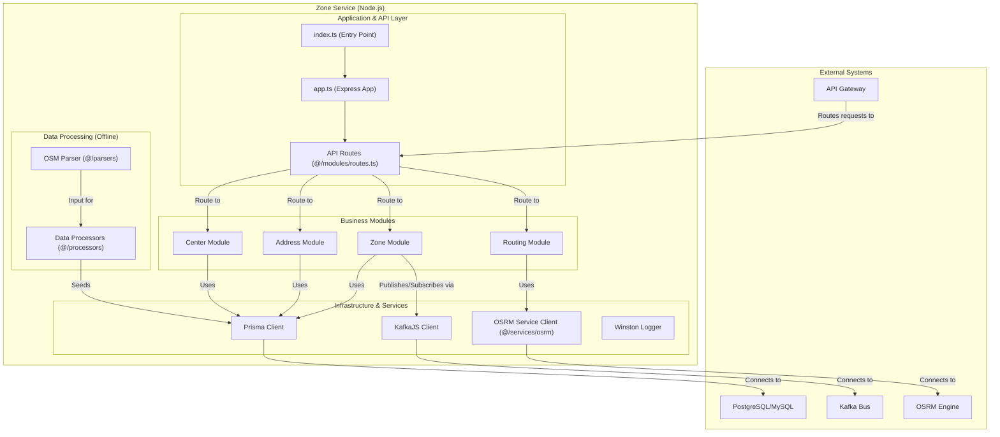

### 1.11. Component Diagram: Zone Service

This diagram shows the internal structure of the `zone_service`. It is a specialized geospatial microservice built with Node.js, Express, and TypeScript. It handles zone management, routing via OSRM, and processes geospatial data.

