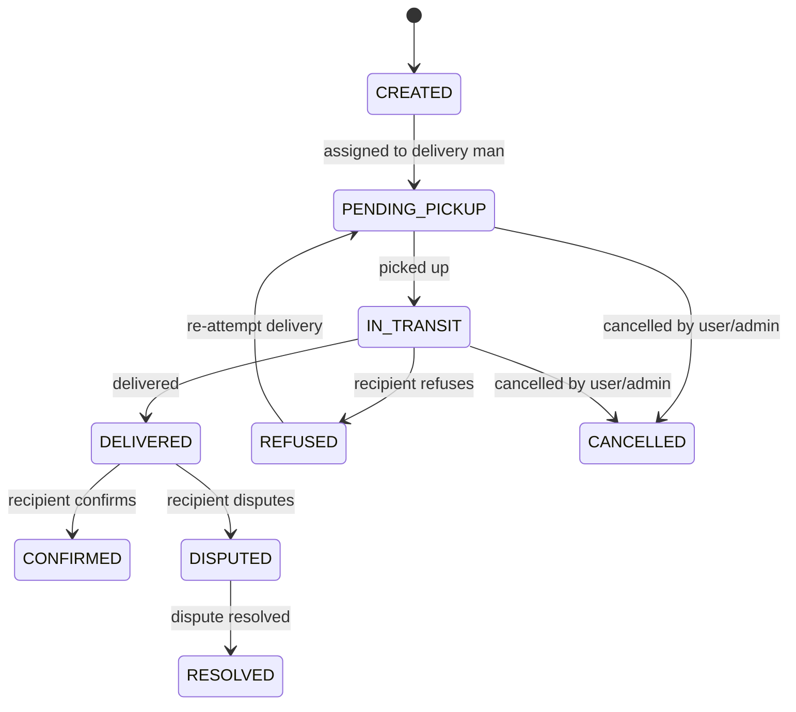
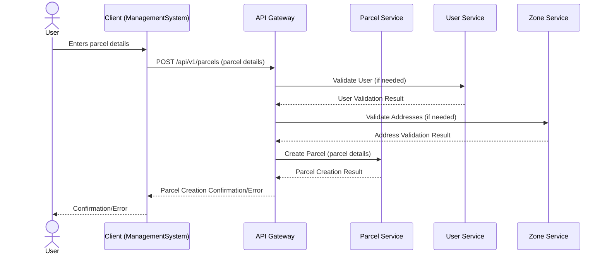
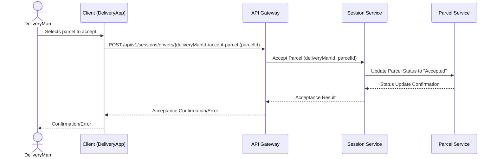
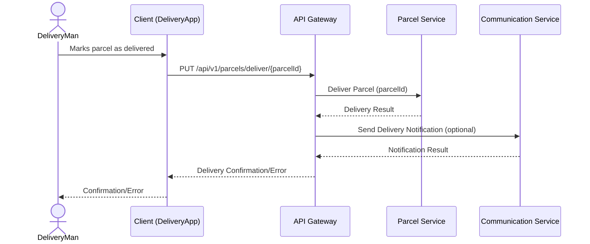
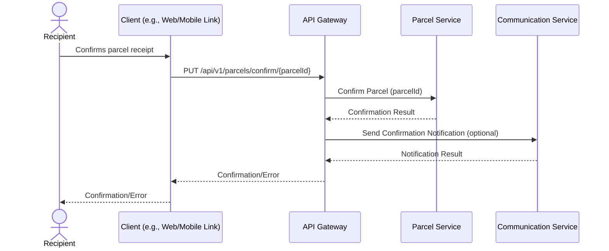
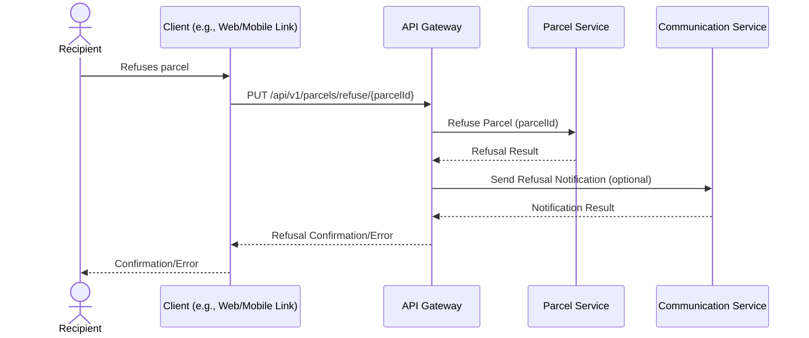
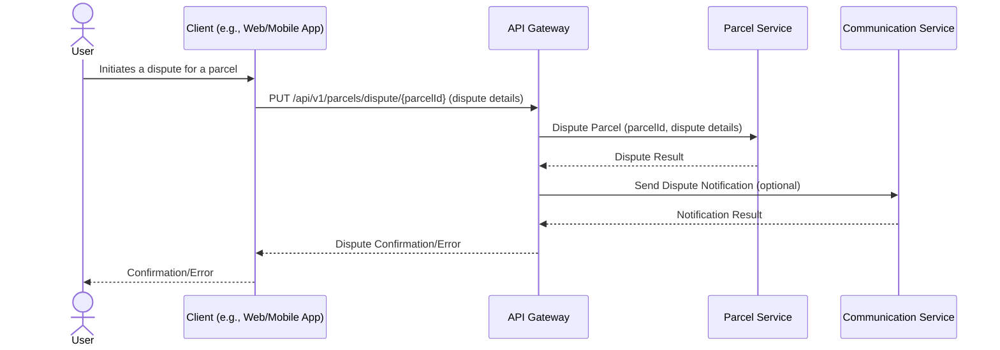
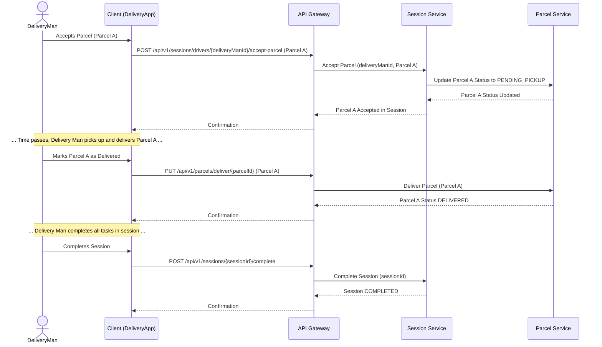

# Parcel Workflows

This document contains sequence diagrams and state diagrams for all parcel-related operations in the Delivery System.

## Parcel State Lifecycle

The following diagram illustrates the complete lifecycle and state transitions of a Parcel entity:

## Create Parcel

This diagram illustrates the sequence of interactions for creating a new parcel in the system.

## Delivery Man Accepts Parcel

This diagram illustrates the sequence of interactions when a Delivery Man accepts a parcel.

## Deliver Parcel

This diagram illustrates the sequence of interactions when a Delivery Man delivers a parcel.

## Confirm Parcel

This diagram illustrates the sequence of interactions when a Recipient confirms the receipt of a parcel.

## Refuse Parcel

This diagram illustrates the sequence of interactions when a Recipient refuses a parcel.

## Dispute Parcel

This diagram illustrates the sequence of interactions when a User initiates a dispute for a parcel.

## Parcel and Session State Interaction

This diagram illustrates how the states of a Parcel and a Session interact during the acceptance and delivery process by a Delivery Man.

