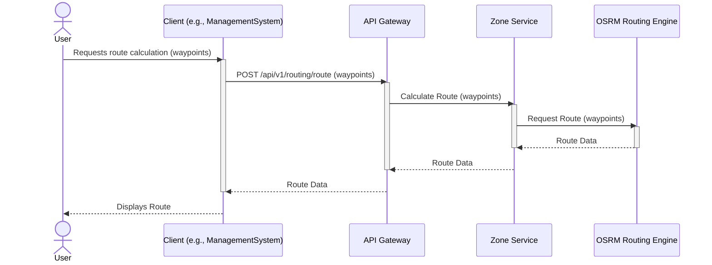
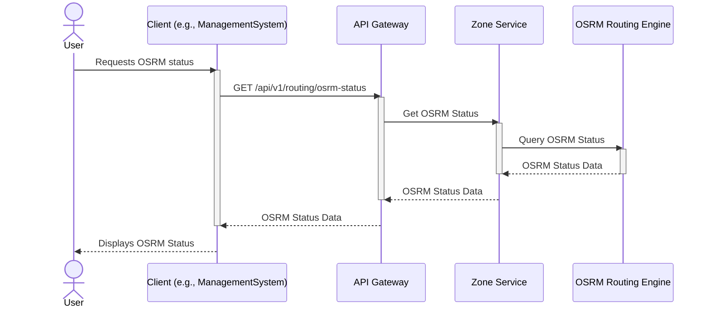

# Routing Workflows

This document contains sequence diagrams for all routing and geographic operations in the Delivery System.

## Calculate Route

This diagram illustrates the sequence of interactions for calculating a route.



## Get OSRM Status

This diagram illustrates the sequence of interactions for retrieving the OSRM routing engine status.



## Detailed Routing Creation

This diagram illustrates the detailed sequence of interactions for calculating a route via the `/api/v1/routing/route` endpoint.

```mermaid
sequenceDiagram
    actor User
    participant Client as Client (e.g., ManagementSystem)
    participant APIGateway as API Gateway
    participant ZoneService as Zone Service
    participant OSRM as OSRM Routing Engine
    participant Database as Zone Service Database

    User->>Client: Requests route calculation (origin, destination, waypoints)
    activate Client
    Client->>APIGateway: POST /api/v1/routing/route (requestBody)
    activate APIGateway
    APIGateway->>ZoneService: Forward Request (requestBody)

    activate ZoneService
    ZoneService->>ZoneService: Validate input (origin, destination, waypoints)
    alt Input Valid
        ZoneService->>Database: Retrieve relevant zone/address data (e.g., speed profiles)
        activate Database
        Database-->>ZoneService: Zone/Address Data
        deactivate Database
        ZoneService->>OSRM: Prepare OSRM request (coordinates, options)
        activate OSRM
        OSRM-->>ZoneService: OSRM Route Response (geometry, duration, distance)
        deactivate OSRM
        ZoneService->>ZoneService: Process OSRM response (e.g., error handling, format)
        deactivate ZoneService
        ZoneService-->>APIGateway: Formatted Route Data
    else Input Invalid
        deactivate ZoneService
        ZoneService-->>APIGateway: Error Response (e.g., 400 Bad Request)
    end

    deactivate APIGateway
    APIGateway-->>Client: Route Data / Error Response
    deactivate Client
    Client-->>User: Displays Route / Error Message
```
