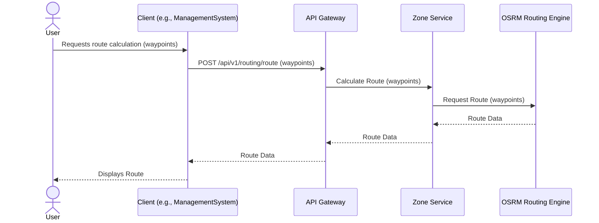
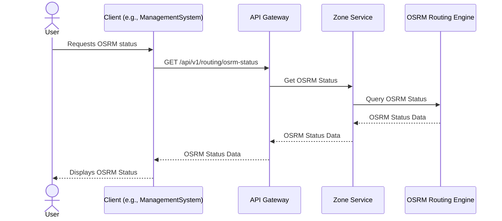
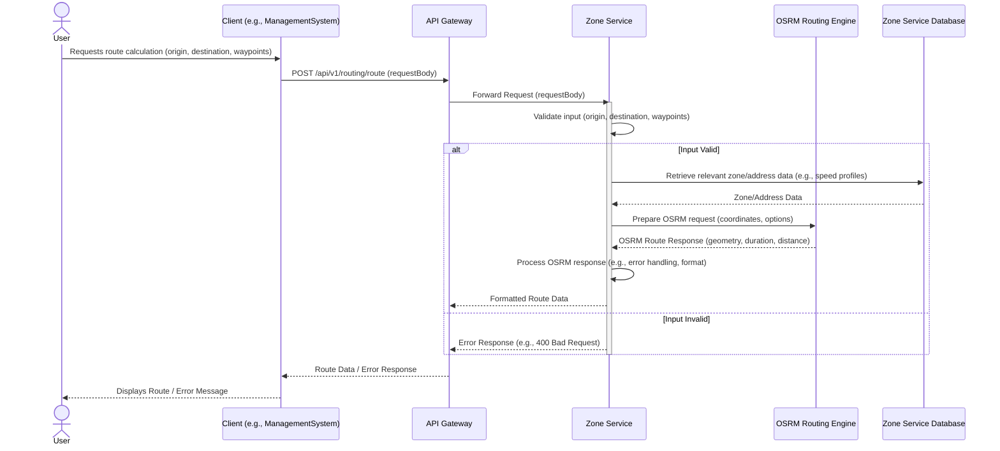

# Routing Workflows

This document contains sequence diagrams for all routing and geographic operations in the Delivery System.

## Calculate Route

This diagram illustrates the sequence of interactions for calculating a route.

## Get OSRM Status

This diagram illustrates the sequence of interactions for retrieving the OSRM routing engine status.

## Detailed Routing Creation

This diagram illustrates the detailed sequence of interactions for calculating a route via the `/api/v1/routing/route` endpoint.

