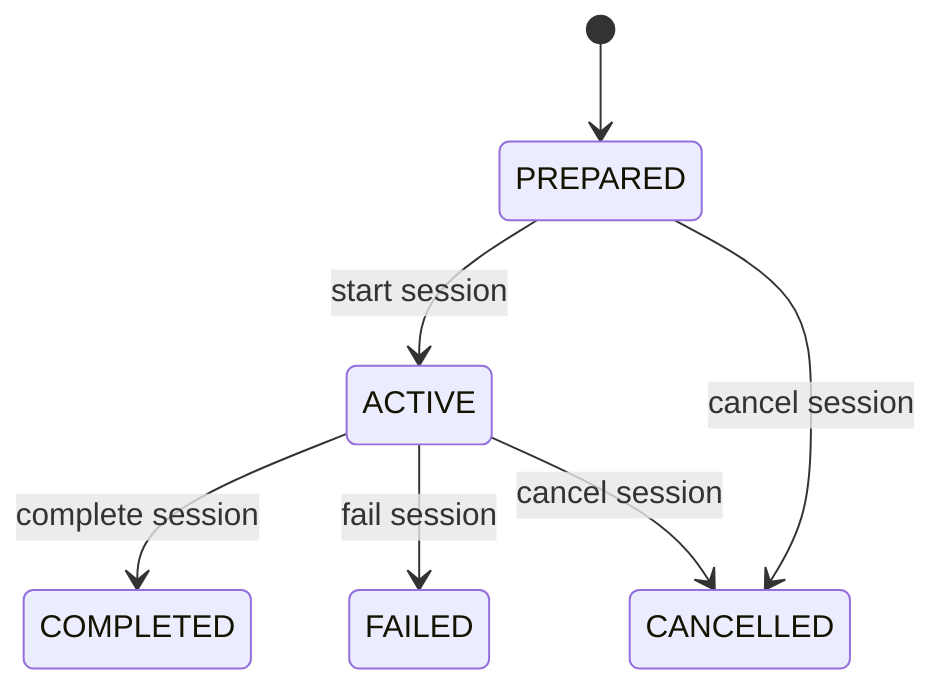
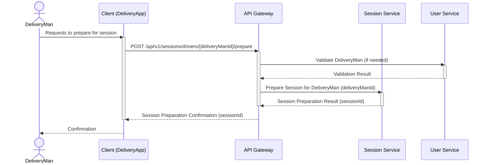
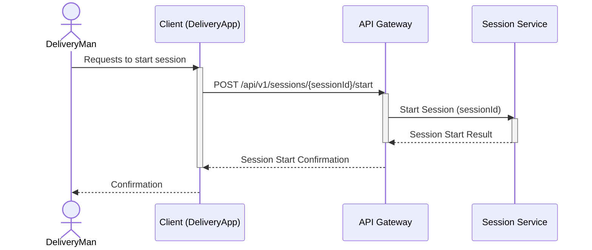
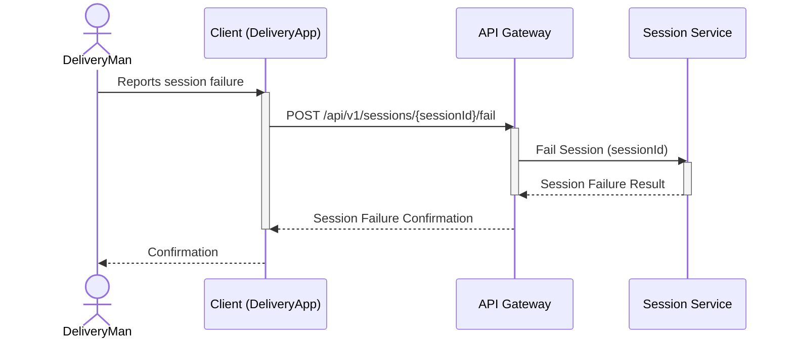

# Session Workflows

This document contains sequence diagrams and state diagrams for all delivery session-related operations in the Delivery System.

## Session State Lifecycle

The following diagram illustrates the complete lifecycle and state transitions of a Session entity:

## Prepare Session

This diagram illustrates the sequence of interactions when a Delivery Man prepares for a session.

## Start Session

This diagram illustrates the sequence of interactions when a Delivery Man starts a session.

## Complete Session

This diagram illustrates the sequence of interactions when a Delivery Man completes a session.

## Fail Session

This diagram illustrates the sequence of interactions when a Delivery Man reports a session failure.

