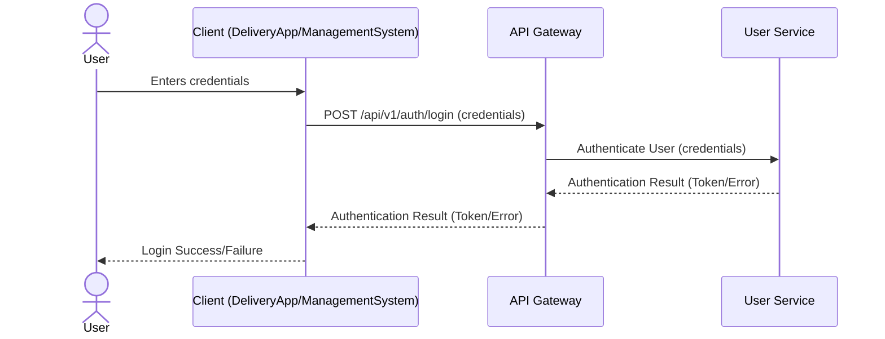
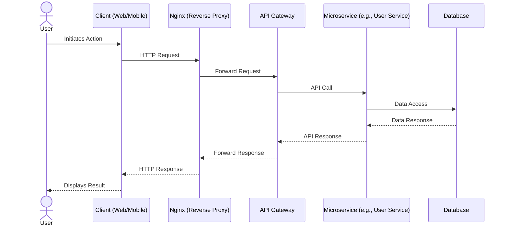

# System Architecture Flows

This document contains sequence diagrams for system-level operations including authentication and data flow patterns.

## User Login

This diagram illustrates the sequence of interactions for a user logging into the system.

## High-Level Layer Data Flow

This diagram illustrates the typical data flow between the main architectural layers of the system for a user-initiated action.

