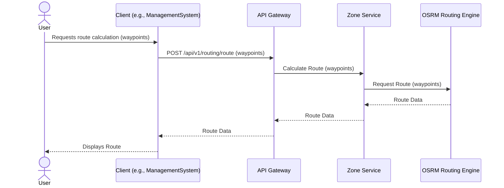

# Sequence Diagram: Calculate Route

This diagram illustrates the sequence of interactions for calculating a route.

```mermaid
sequenceDiagram
    actor User
    participant Client as Client (e.g., ManagementSystem)
    participant APIGateway as API Gateway
    participant ZoneService as Zone Service
    participant OSRM as OSRM Routing Engine

    User->>Client: Requests route calculation (waypoints)
    Client->>APIGateway: POST /api/v1/routing/route (waypoints)
    APIGateway->>ZoneService: Calculate Route (waypoints)
    ZoneService->>OSRM: Request Route (waypoints)
    OSRM-->>ZoneService: Route Data
    ZoneService-->>APIGateway: Route Data
    APIGateway-->>Client: Route Data
    Client-->>User: Displays Route
```