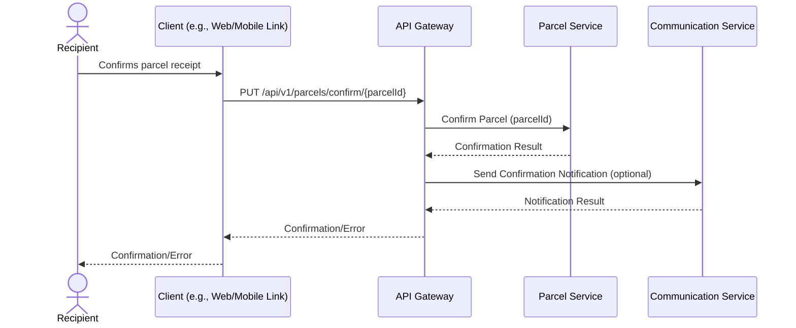

# Sequence Diagram: Confirm Parcel

This diagram illustrates the sequence of interactions when a Recipient confirms the receipt of a parcel.

```mermaid
sequenceDiagram
    actor Recipient
    participant Client as Client (e.g., Web/Mobile Link)
    participant APIGateway as API Gateway
    participant ParcelService as Parcel Service
    participant CommunicationService as Communication Service

    Recipient->>Client: Confirms parcel receipt
    Client->>APIGateway: PUT /api/v1/parcels/confirm/{parcelId}
    APIGateway->>ParcelService: Confirm Parcel (parcelId)
    ParcelService-->>APIGateway: Confirmation Result
    APIGateway->>CommunicationService: Send Confirmation Notification (optional)
    CommunicationService-->>APIGateway: Notification Result
    APIGateway-->>Client: Confirmation/Error
    Client-->>Recipient: Confirmation/Error
```