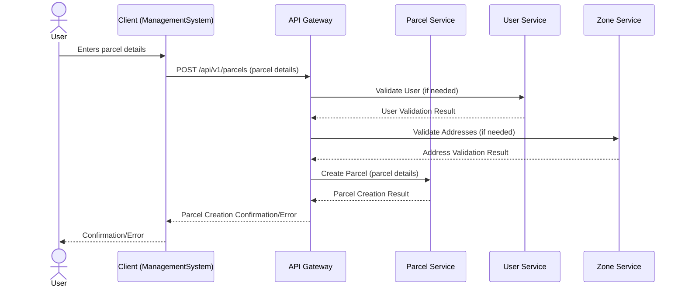

# Sequence Diagram: Create Parcel

This diagram illustrates the sequence of interactions for creating a new parcel in the system.

```mermaid
sequenceDiagram
    actor User
    participant Client as Client (ManagementSystem)
    participant APIGateway as API Gateway
    participant ParcelService as Parcel Service
    participant UserService as User Service
    participant ZoneService as Zone Service

    User->>Client: Enters parcel details
    Client->>APIGateway: POST /api/v1/parcels (parcel details)
    APIGateway->>UserService: Validate User (if needed)
    UserService-->>APIGateway: User Validation Result
    APIGateway->>ZoneService: Validate Addresses (if needed)
    ZoneService-->>APIGateway: Address Validation Result
    APIGateway->>ParcelService: Create Parcel (parcel details)
    ParcelService-->>APIGateway: Parcel Creation Result
    APIGateway-->>Client: Parcel Creation Confirmation/Error
    Client-->>User: Confirmation/Error
```