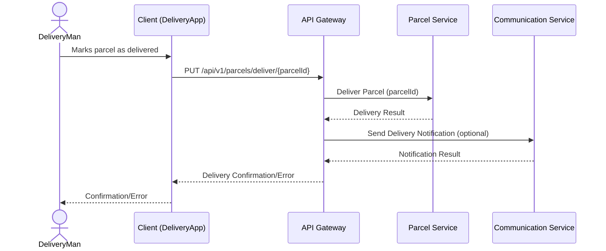

# Sequence Diagram: Deliver Parcel

This diagram illustrates the sequence of interactions when a Delivery Man delivers a parcel.

```mermaid
sequenceDiagram
    actor DeliveryMan
    participant Client as Client (DeliveryApp)
    participant APIGateway as API Gateway
    participant ParcelService as Parcel Service
    participant CommunicationService as Communication Service

    DeliveryMan->>Client: Marks parcel as delivered
    Client->>APIGateway: PUT /api/v1/parcels/deliver/{parcelId}
    APIGateway->>ParcelService: Deliver Parcel (parcelId)
    ParcelService-->>APIGateway: Delivery Result
    APIGateway->>CommunicationService: Send Delivery Notification (optional)
    CommunicationService-->>APIGateway: Notification Result
    APIGateway-->>Client: Delivery Confirmation/Error
    Client-->>DeliveryMan: Confirmation/Error
```