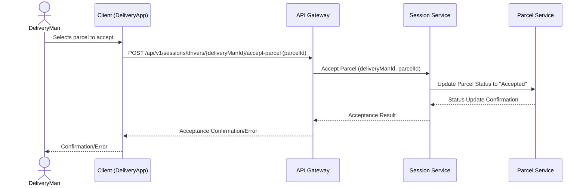

# Sequence Diagram: Delivery Man Accepts Parcel

This diagram illustrates the sequence of interactions when a Delivery Man accepts a parcel.

```mermaid
sequenceDiagram
    actor DeliveryMan
    participant Client as Client (DeliveryApp)
    participant APIGateway as API Gateway
    participant SessionService as Session Service
    participant ParcelService as Parcel Service

    DeliveryMan->>Client: Selects parcel to accept
    Client->>APIGateway: POST /api/v1/sessions/drivers/{deliveryManId}/accept-parcel (parcelId)
    APIGateway->>SessionService: Accept Parcel (deliveryManId, parcelId)
    SessionService->>ParcelService: Update Parcel Status to "Accepted"
    ParcelService-->>SessionService: Status Update Confirmation
    SessionService-->>APIGateway: Acceptance Result
    APIGateway-->>Client: Acceptance Confirmation/Error
    Client-->>DeliveryMan: Confirmation/Error
```