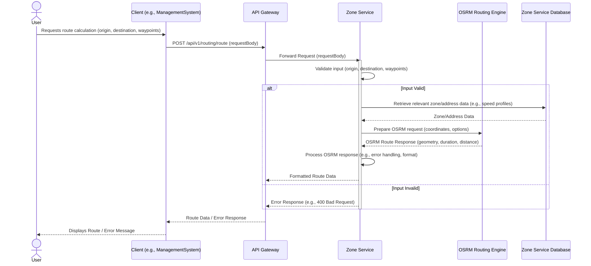

# Sequence Diagram: Detailed Routing Creation

This diagram illustrates the detailed sequence of interactions for calculating a route via the `/api/v1/routing/route` endpoint.

```mermaid
sequenceDiagram
    actor User
    participant Client as Client (e.g., ManagementSystem)
    participant APIGateway as API Gateway
    participant ZoneService as Zone Service
    participant OSRM as OSRM Routing Engine
    participant Database as Zone Service Database

    User->>Client: Requests route calculation (origin, destination, waypoints)
    Client->>APIGateway: POST /api/v1/routing/route (requestBody)
    APIGateway->>ZoneService: Forward Request (requestBody)

    activate ZoneService
    ZoneService->>ZoneService: Validate input (origin, destination, waypoints)
    alt Input Valid
        ZoneService->>Database: Retrieve relevant zone/address data (e.g., speed profiles)
        Database-->>ZoneService: Zone/Address Data
        ZoneService->>OSRM: Prepare OSRM request (coordinates, options)
        OSRM-->>ZoneService: OSRM Route Response (geometry, duration, distance)
        ZoneService->>ZoneService: Process OSRM response (e.g., error handling, format)
        ZoneService-->>APIGateway: Formatted Route Data
    else Input Invalid
        ZoneService-->>APIGateway: Error Response (e.g., 400 Bad Request)
    end
    deactivate ZoneService

    APIGateway-->>Client: Route Data / Error Response
    Client-->>User: Displays Route / Error Message
```