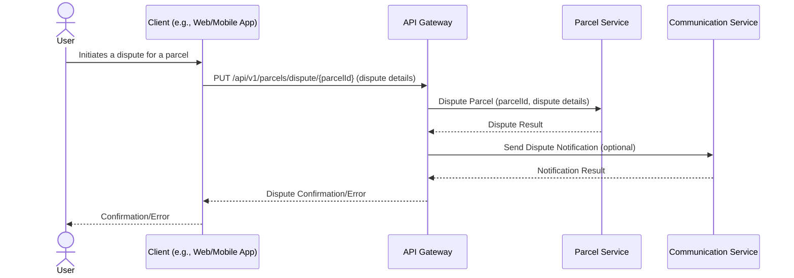

# Sequence Diagram: Dispute Parcel

This diagram illustrates the sequence of interactions when a User initiates a dispute for a parcel.

```mermaid
sequenceDiagram
    actor User
    participant Client as Client (e.g., Web/Mobile App)
    participant APIGateway as API Gateway
    participant ParcelService as Parcel Service
    participant CommunicationService as Communication Service

    User->>Client: Initiates a dispute for a parcel
    Client->>APIGateway: PUT /api/v1/parcels/dispute/{parcelId} (dispute details)
    APIGateway->>ParcelService: Dispute Parcel (parcelId, dispute details)
    ParcelService-->>APIGateway: Dispute Result
    APIGateway->>CommunicationService: Send Dispute Notification (optional)
    CommunicationService-->>APIGateway: Notification Result
    APIGateway-->>Client: Dispute Confirmation/Error
    Client-->>User: Confirmation/Error
```