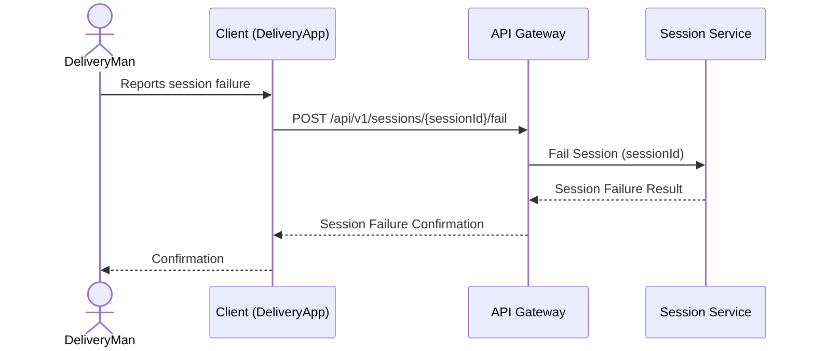

# Sequence Diagram: Fail Session

This diagram illustrates the sequence of interactions when a Delivery Man reports a session failure.

```mermaid
sequenceDiagram
    actor DeliveryMan
    participant Client as Client (DeliveryApp)
    participant APIGateway as API Gateway
    participant SessionService as Session Service

    DeliveryMan->>Client: Reports session failure
    Client->>APIGateway: POST /api/v1/sessions/{sessionId}/fail
    APIGateway->>SessionService: Fail Session (sessionId)
    SessionService-->>APIGateway: Session Failure Result
    APIGateway-->>Client: Session Failure Confirmation
    Client-->>DeliveryMan: Confirmation
```