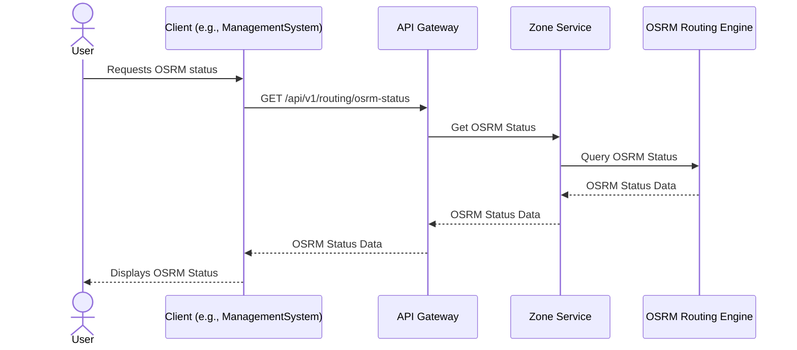

# Sequence Diagram: Get OSRM Status

This diagram illustrates the sequence of interactions for retrieving the OSRM routing engine status.

```mermaid
sequenceDiagram
    actor User
    participant Client as Client (e.g., ManagementSystem)
    participant APIGateway as API Gateway
    participant ZoneService as Zone Service
    participant OSRM as OSRM Routing Engine

    User->>Client: Requests OSRM status
    Client->>APIGateway: GET /api/v1/routing/osrm-status
    APIGateway->>ZoneService: Get OSRM Status
    ZoneService->>OSRM: Query OSRM Status
    OSRM-->>ZoneService: OSRM Status Data
    ZoneService-->>APIGateway: OSRM Status Data
    APIGateway-->>Client: OSRM Status Data
    Client-->>User: Displays OSRM Status
```