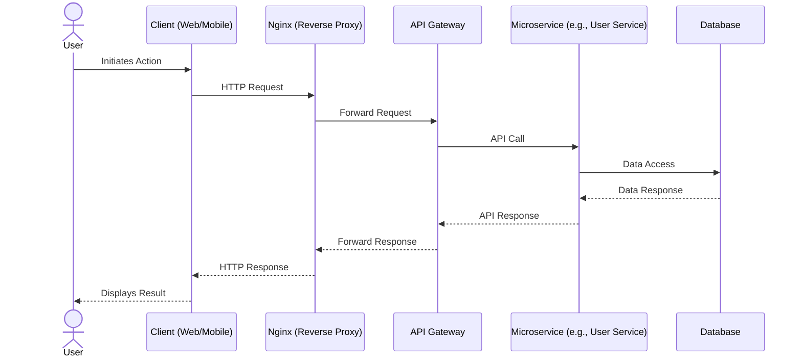

# Sequence Diagram: High-Level Layer Data Flow

This diagram illustrates the typical data flow between the main architectural layers of the system for a user-initiated action.

```mermaid
sequenceDiagram
    actor User
    participant Client as Client (Web/Mobile)
    participant Nginx as Nginx (Reverse Proxy)
    participant APIGateway as API Gateway
    participant Microservice as Microservice (e.g., User Service)
    participant Database as Database

    User->>Client: Initiates Action
    Client->>Nginx: HTTP Request
    Nginx->>APIGateway: Forward Request
    APIGateway->>Microservice: API Call
    Microservice->>Database: Data Access
    Database-->>Microservice: Data Response
    Microservice-->>APIGateway: API Response
    APIGateway-->>Nginx: Forward Response
    Nginx-->>Client: HTTP Response
    Client-->>User: Displays Result
```