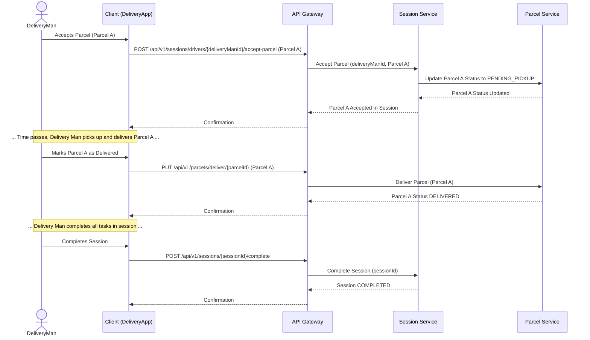

# Sequence Diagram: Parcel and Session State Interaction (Accept & Deliver)

This diagram illustrates how the states of a Parcel and a Session interact during the acceptance and delivery process by a Delivery Man.

