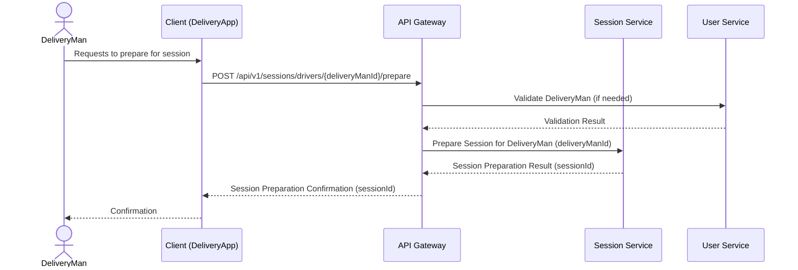

# Sequence Diagram: Prepare Session

This diagram illustrates the sequence of interactions when a Delivery Man prepares for a session.

```mermaid
sequenceDiagram
    actor DeliveryMan
    participant Client as Client (DeliveryApp)
    participant APIGateway as API Gateway
    participant SessionService as Session Service
    participant UserService as User Service

    DeliveryMan->>Client: Requests to prepare for session
    Client->>APIGateway: POST /api/v1/sessions/drivers/{deliveryManId}/prepare
    APIGateway->>UserService: Validate DeliveryMan (if needed)
    UserService-->>APIGateway: Validation Result
    APIGateway->>SessionService: Prepare Session for DeliveryMan (deliveryManId)
    SessionService-->>APIGateway: Session Preparation Result (sessionId)
    APIGateway-->>Client: Session Preparation Confirmation (sessionId)
    Client-->>DeliveryMan: Confirmation
```