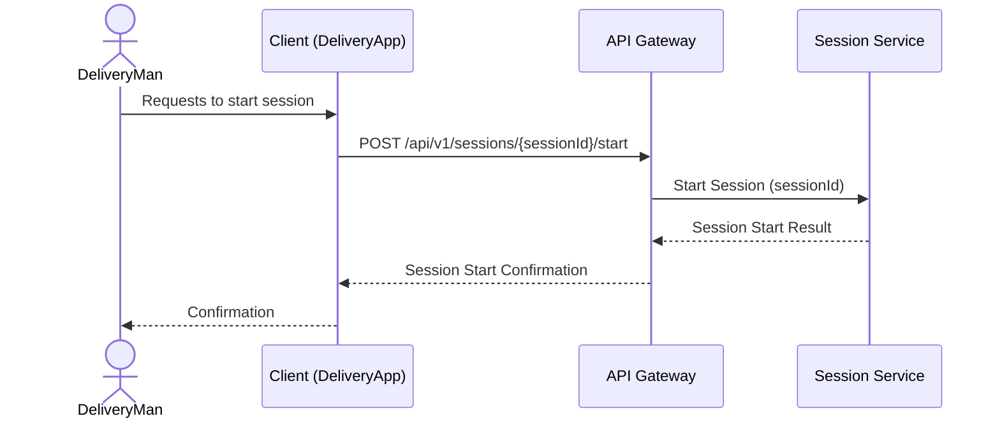

# Sequence Diagram: Start Session

This diagram illustrates the sequence of interactions when a Delivery Man starts a session.

```mermaid
sequenceDiagram
    actor DeliveryMan
    participant Client as Client (DeliveryApp)
    participant APIGateway as API Gateway
    participant SessionService as Session Service

    DeliveryMan->>Client: Requests to start session
    Client->>APIGateway: POST /api/v1/sessions/{sessionId}/start
    APIGateway->>SessionService: Start Session (sessionId)
    SessionService-->>APIGateway: Session Start Result
    APIGateway-->>Client: Session Start Confirmation
    Client-->>DeliveryMan: Confirmation
```