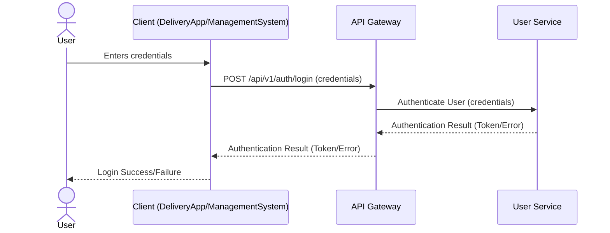

# Sequence Diagram: User Login

This diagram illustrates the sequence of interactions for a user logging into the system.

```mermaid
sequenceDiagram
    actor User
    participant Client as Client (DeliveryApp/ManagementSystem)
    participant APIGateway as API Gateway
    participant UserService as User Service

    User->>Client: Enters credentials
    Client->>APIGateway: POST /api/v1/auth/login (credentials)
    APIGateway->>UserService: Authenticate User (credentials)
    UserService-->>APIGateway: Authentication Result (Token/Error)
    APIGateway-->>Client: Authentication Result (Token/Error)
    Client-->>User: Login Success/Failure
```