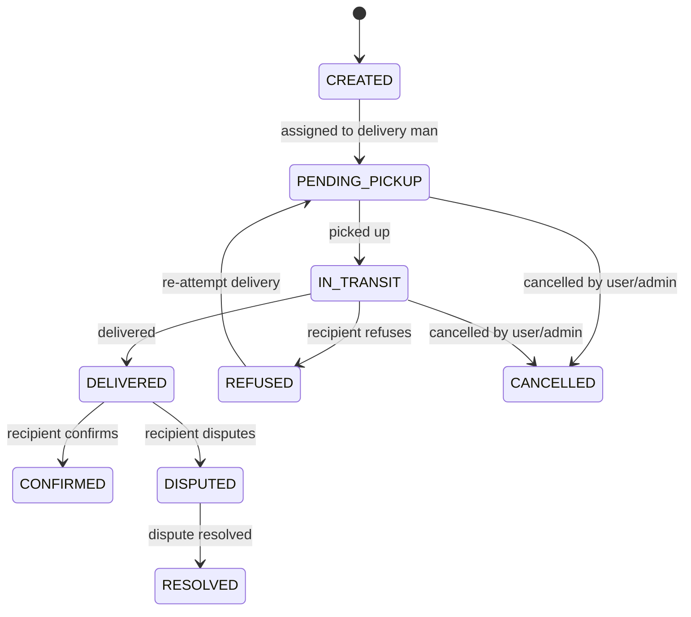

# State Diagram: Parcel Entity

This diagram illustrates the lifecycle and state transitions of a Parcel entity.

```mermaid
stateDiagram-v2
    [*] --> CREATED
    CREATED --> PENDING_PICKUP: assigned to delivery man
    PENDING_PICKUP --> IN_TRANSIT: picked up
    IN_TRANSIT --> DELIVERED: delivered
    DELIVERED --> CONFIRMED: recipient confirms
    DELIVERED --> DISPUTED: recipient disputes
    IN_TRANSIT --> REFUSED: recipient refuses
    PENDING_PICKUP --> CANCELLED: cancelled by user/admin
    IN_TRANSIT --> CANCELLED: cancelled by user/admin
    REFUSED --> PENDING_PICKUP: re-attempt delivery
    DISPUTED --> RESOLVED: dispute resolved
```